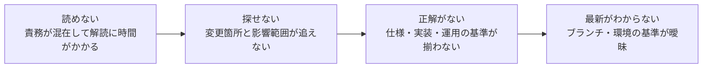
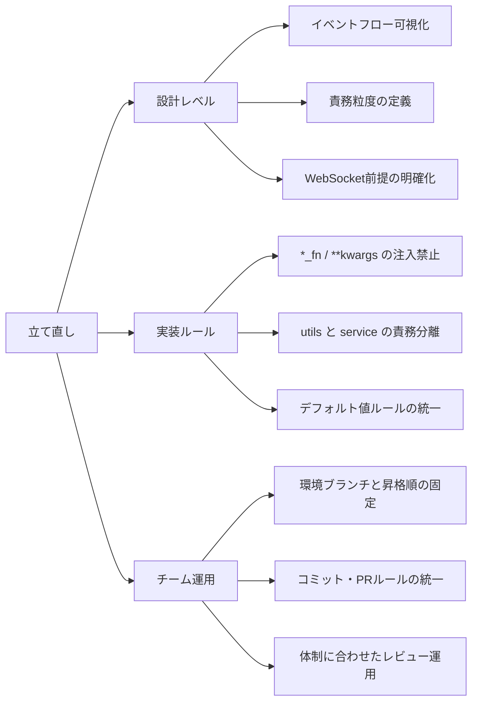

# 設計なしバイブコーディングの末路: 読めない・探せない・正解がない案件を再建した話

※本記事はリリース前プロジェクトの再構築過程をもとに、公開可能な範囲で構成を再編して記載しています。

## はじめに

こんにちは、ぐみです。

AIバイブコーディング案件を引き継いだとき、最初に感じたのは「1ファイルに機能と責務が多すぎる」でした。
そこでAIにファイル分割をさせてみたのですが、今度は「うーん、読みづらい……」という状態になりました。
何をしている処理なのか、どこに影響するのかが追いにくく、importしていないファイルまで関数変更の影響を受けていて、「なんやこれ！」となったのを覚えています。

この記事では、そういう状態を引き継いだときに、私がどう整理して立て直したかを体験ベースで共有します。

## プロジェクトの前提と複雑さ

対象のプロジェクトは、アプリとサーバーがWebSocketで常時つながるリアルタイム対話型のプロダクトでした。
ユーザー入力に応じてAIの応答ロジックが分岐する構成で、対話そのものはWebSocketで進行します。HTTP APIは、対話前のユーザー情報確認や対話用セッション作成に使っていました。

状態管理は重く、WebSocketのセッション制御・AIロジック分岐・フェーズ制御が同時に走っていました。
しかも「データは絶対に届く」「ネットワーク切断は起きない」という前提で組まれていて、再送や復旧の扱いが曖昧でした。
この時点で、責務分離が甘いとすぐ破綻する条件がそろっていたと思います。

## 地獄ポイント: 読めない、探せない、正解がない、最新がわからない



地獄ポイントは独立ではなく、連鎖して悪化していきました。

### 読めない: 1つの関数に責務が混ざっている

当時つらかったのは、関数名やファイル名を見ても「この処理が何担当なのか」がすぐにはわからないことでした。
オーケストレーション（処理順序の制御）と業務ロジック（何を判定するか）と副作用（通知・保存）が、同じ関数に混ざっていたからです。

実際には、次のような状態になりがちでした。

- 関数の引数にコールバックが増え続ける
- `handle_*` という名前の関数が多く、関数名だけでは何をしているのか説明になっていない
- 似た名前のヘルパーが複数あり、違いがコードを開かないとわからない
- 1つの関数が「検証」「計算」「更新」「通知」を全部やる
- 実行処理が平たく並んだ結果、多層の `if` 分岐になっていて読み解きづらい

結果として、変更前の読解コストが毎回高くなります。
「どこを直すか」より先に「これ何してるんだっけ」を解読する時間が必要でした。
しかも読みづらいだけでなく、意図しない巻き込み修正でデグレ（既存機能の劣化）も起きやすい状態でした。

### 探せない: 変更箇所と影響範囲がたどれない

次にしんどかったのは、変更箇所と影響範囲を探すことでした。
コールバック注入中心の構成だと、実行時に渡される関数で挙動が変わるため、コードを読んだだけでは全体像が見えません。
加えて、1つのファイルに責務が詰め込まれていたので、「どの変更がどの意図なのか」自体も判別しづらい状態でした。

体感として、こういう事故が起きます。

- ある関数を修正したら、別ドメインの処理が壊れる
- importしていないファイルなのに、実行経路のどこかで影響を受ける
- 呼び出し元を全部たどっても、最終的にどの処理が走るか断言しづらい

依存関係が「importグラフ」ではなく「実行時の注入関係」に隠れていたのが原因でした。
この状態だと、レビューでもテスト設計でも見落としが増えます。

そもそも、ドメイン責務の処理までutilsフォルダに押し込まれていたので、ファイル名や配置から責務を推測できませんでした。
「この変更ならここを見る」が成立しないので、毎回探索から始まるのが重かったです。

### 正解がない: 判断基準になる仕様がない

さらに厳しかったのは、正しい仕様がどこにもないことでした。
仕様書、テスト、実装のどれを基準にすべきかが曖昧で、「正しい挙動」が判断できない状態です。

要件の書類や、開発会社に共有されていたイベント一覧は一応ありましたが、口頭やSlackで途中変更された情報が反映されていないうえに、そもそもお願いしたかった挙動のイベント自体が要件に書かれていないものもありました。

- 画面の見た目が動いていても、業務的に正しいかを確認できない
- バグ修正のつもりが仕様変更になってしまう
- レビューでも「何をもって正」とするかで議論が止まる

この状態では、実装を直すより先に「仕様の置き場」と「判断基準」を決める必要がありました。

### 最新がわからない: ブランチ運用が曖昧で基準がない

ブランチルールが曖昧だったので、似た名前のブランチが大量にありました。
その結果、「どれが最新なのか」「どれをベースに修正すべきか」がすぐに判断できない状態でした。

- 挙動テスト用にCloud Run環境が増殖していて、どの環境が最新の検証結果なのか追えない
- ステージング・開発・本番といった区別と結びつかない環境名が多く、用途を即判断できない
- 途中作業ブランチとマージ対象ブランチの区別がつかない

コード以前に、変更の起点を探すところで時間を使ってしまうのがしんどかったです。

## 立て直しでやったこと

ここからは、私が実際にやったことだけ書きます！



立て直しは「設計」「実装」「チーム運用」のどれか1つではなく、3層を同時に揃えたのが効きました。

### 設計レベルで決めたこと

最初に、実装を読む前提としてシステム全体のフロー図を作りました。
サーバーとアプリの間で、「どのイベントが今どんな処理をしているか」「その時点の状態がどうなっているか」「処理がどの順番で進むか」まで可視化しました。
あわせて、WebSocketのイベントフローとHTTPのフローを分けて整理し、影響範囲を議論できる土台を先に作りました。

- どの粒度で責務を分離するかを先に決めました
- `service` ディレクトリはドメイン責務ごとに分ける方針にしました
- WebSocketは「届く前提」で組まないようにし、到達確認・再送・接続確認を前提設計にしました

技術分類ではなく、業務責務でディレクトリを切ったイメージはこんな感じです（実際の構成そのままではなく、説明用に簡略化した抜粋で、実構成とは一部名称を変更しています）。

```text
backend/app/
  services/
    session/
      lifecycle/
      routing/
      recovery/
    websocket_gateway/
      application/
      infra/
    chat/
      messaging/
      loop/
      greeting_builders/
      conversation_builders/
    agents/
      pipelines/
      prompt_contents/
  utils/
...
```

これで「どこを見ればいいか」がだいぶ明確になりました。

### 実装ルールとして縛ったこと

- 関数引数による引き継ぎ（`*_fn` / `**kwargs`）は禁止
- 関数引数で処理を引き回すのをやめ、必要な処理はimportして明示的に呼ぶ構成にした
- `utils` は純粋ヘルパー関数のみ、ドメイン処理・業務ロジックは `service` に寄せる
- DBに保存するユーザーデータのデフォルト値を定義し、「未入力」と「未選択」を区別する

- イベントごとに受信確認（ACK）を返す
- 一定時間ACKが来ないものは再送する
- 接続状態を監視し、切断時の復帰手順を決める

粒度としては、到達確認・再送はイベント単位、接続確認はハートビートによるセッション単位で扱いました。
また、API上の値は「未入力=`null`」「未選択=`NOT_SELECTED`」で明確に区別しました。

```python
# NG寄り: 実行時注入で何でも差し込める
process(order, validate_fn=..., reserve_fn=..., notify_fn=..., **_fn)

# OK寄り: 役割を固定して明示的に呼ぶ
order_orchestrator.execute(order)
```

### チーム運用としてGitHubルールも定義した

再崩壊を防ぐために、設計と実装だけでなく、GitHubの運用ルールもセットで決めました。

- 昇格フロー運用: まず開発環境へデプロイし、検証後にSTG、最終確認後にMAINへ格上げする
- 環境ブランチ命名: `main=本番環境`、`staging=ステージング環境`、`dev=開発環境` に固定する
- ブランチ運用: `feature/*` / `fix/*` / `refactor/*` を使い分け、1ブランチ1目的を徹底する
- コミット運用: Conventional Commits、1コミット1意図、仕様変更とリファクタを混ぜない
- PR→マージ運用: PRタイトルと本文で変更内容・意図を明確化する
- PR作成後にレビューを開始し、テスト通過確認と変更内容確認はメインエンジニアのレビュー作業に含める

体制としては、メインエンジニア1名とバイブコーディングのAIプロンプトエンジニアで進めていたため、テスト通過確認と変更内容の確認はメインエンジニアのレビュー作業に含める形にしました。
また、スピードを優先するため、レビューは実施しつつ修正実装はメインエンジニアがまとめて行う運用にしました。

## まとめ

この案件でしんどかったのは、単にコードが読みにくいことだけではありませんでした。
読めない、探せない、正解がない、最新がわからない。  
この4つが同時に起きると、修正そのものより「何を信じて直すか」を決める作業に時間を取られます。

立て直しで効いたのは、次の3層をセットで整えたことです。

- 設計レベル: イベントフロー可視化、責務粒度の定義、WebSocket前提（到達確認・再送・接続確認）の明確化
- 実装ルール: `*_fn` / `**kwargs` の注入禁止、`utils` と `service` の責務分離、デフォルト値の定義
- チーム運用: ブランチ/コミット/PR→マージのルール化と、体制に合わせたレビュー運用

AIバイブコーディングの皆様。局所最適で進んでいくと、やばいです！
だからこそ、速度を落とさず進めるためにも、最初に「設計・実装ルール・運用ルール」の3点だけは先に固定しておくのがおすすめです。

そもそも、バイブコーディングだけで製品レベルのものを作り切るのは難しいです。設計と変更管理ルールの支えがないと、どこかで破綻します。
