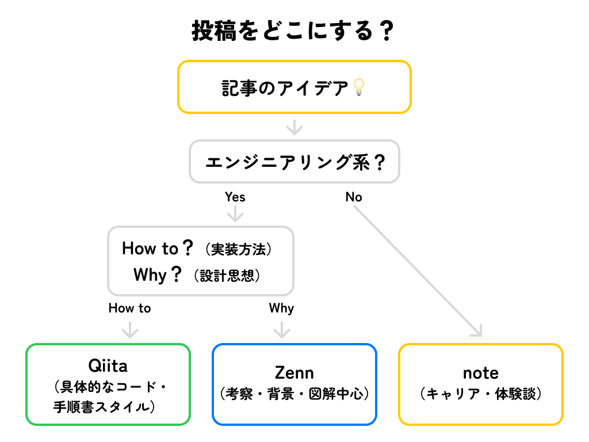

# 投稿媒体の使い分けを考えることで、発信しやすくしようと思った話

## はじめに

はじめまして！PM や WEB エンジニアとして働いている ぐみ です。
この記事が私の初めての投稿になります！

普段は複雑な情報を**手書きの図解**で整理することが好きで、仕事でもチーム内の議論を図解でまとめたり、企画書に手書きの図を入れたりしています。「複雑なことを分かりやすく伝える」ことに情熱を注いでいる、そんな人間です 📝

「記事を書いてみたい」と思いながらも、なかなか踏み出せずにいた私が、実際に書き始めるきっかけとなったのは退職でした。

それまでも技術記事やノウハウ記事を公開している人たちを見て「私もいつか書いてみたいなぁ」って思っていたんですが、仕事で自社アプリの広報記事を書くくらいで、個人で記事を書いたことはありませんでした。

転職活動中で時間に余裕があったので「何か新しいことを始めてみよう！」と思い立ち、思い切ってオフ会の開催にも挑戦してみたんです。そうしているうちに、自分の経歴やスキル、強みを整理していく中で「今までのノウハウを文章にまとめてみたいな」って気持ちが湧いてきました。

でも、いざ書こうとすると「そもそもどこに投稿すればいいんだろう？」って悩んじゃって。というのも、私は PM や WEB エンジニア、UIUX デザイナーとして働いてきただけでなく、広報活動や CS、法務（利用規約や契約書の作成）まで、本当にいろんな業務を経験してきたんです。

技術面でも、Web アプリ作ったり、フロントエンドやバックエンド、Wordpress、JS フレームワーク触ったり、GAS で効率化したり、CLI で自動化したり...とにかく幅広くやってきました。

だから「これは Qiita かな？」「これは Zenn かな？」「これは note かな？」って考えれば考えるほど迷子になっちゃって、結局記事を書くのを後回しにしてました 😅

そんな時に「各プラットフォームの特徴を整理して、自分なりのルールを作ってみよう！」って思いついたんです。この記事では、私なりに考えた投稿先の使い分けについて、みなさんにシェアしていきたいと思います！

## 私が使い分けようと思ったサービス

私が記事を投稿しようと考えたのは、主に以下の 3 つのプラットフォームです：

### 🟢 Qiita

老舗の技術記事投稿プラットフォーム。
初学者向けの記事が多く、入門的な内容や基礎的なチュートリアルが中心。
近年は記事の質にばらつきがあり、玉石混交の状態という声も。

### 🔵 Zenn

比較的新しい技術記事プラットフォーム。
Qiitaの課題を受けて立ち上がった経緯もあり、相対的に質の高い記事を目指す傾向。
中級者以上の開発者による深い考察や技術選定の背景などが多め。

### 🟡 note

一般ユーザー向けの幅広い投稿プラットフォーム。
技術に限らず、キャリアや働き方、ビジネス、ライフスタイルなど多様なトピックを扱える。
エンジニア以外の読者にもリーチしやすい。

これらのプラットフォームは、それぞれ特徴的な読者層や投稿される内容の傾向があります。
そこで、私は各プラットフォームの特性を活かした使い分けを考えることにしました。

## 私なりの使い分けルール

まず、大きな分類として「エンジニアリング系の話題」と「非エンジニアリング系の話題」で分けることにしました。

エンジニアリング系の話題は、さらに「How to」と「Why」で分けて、Qiita と Zenn を使い分けます。
一方、非エンジニアリング系の話題は note に集約することで、読者層に合わせた発信ができると考えました。

### 🔄 投稿先判断フローチャート

具体的には：

**エンジニアリング系**

- Qiita：実装方法やコードベースの「How to」
- Zenn：設計思想や選定理由などの「Why」

**非エンジニアリング系**

- note：キャリアやチームビルディングなど

このように整理することで、記事を書く際の迷いが減り、各プラットフォームの特性を活かした発信ができるようになりました。

### 🟢 Qiita：「How to」に特化

**投稿する内容**

- 具体的な実装手順とコード
- 再現性の高い技術的解決策
- トラブルシューティング

**記事の特徴**

- コードブロックが中心
- 手順書のような構成
- 「〜の作り方」「〜の使い方」

### 🔵 Zenn：「Why」を掘り下げる

**投稿する内容**

- 技術選定の理由
- アーキテクチャの検討過程
- 改善施策の背景

**記事の特徴**

- 図解や表を多用
- 考察が中心の構成
- 「なぜ〜したのか」「どう考えたか」

### 🟡 note：エンジニアリング外の話題

**投稿する内容**

- 企画・設計の経験談
- 企画プロセスの工夫
- チーム運営の知見

**記事の特徴**

- 読み物としての文章構成
- 経験に基づくストーリー展開
- 具体的なエピソードを交えた語り口
- 共感を呼ぶ体験談スタイル

### 🎯 プラットフォーム別ガイドラインの効果（予想）

**1. 迷いの軽減**

- 「この内容はどこに投稿すべきか」の判断基準ができる
- 各プラットフォームの特性を意識した企画が立てやすい

**2. 執筆効率の向上**

- 想定読者が明確なため、文章の tone & manner が定まる
- プラットフォームごとの記事構成パターンができる

**3. モチベーションの維持**

- 「とりあえず Qiita に投稿」のような曖昧さがなくなる
- 記事の方向性が定まることで、執筆への心理的ハードルが下がる

## 実践のための Tips

### 💡 AI を活用した投稿先の判断

プラットフォーム別のガイドラインを md ファイルにまとめておくと、ChatGPT などの AI ツールに相談できます。

「こんな内容を書きたいんだけど、どのプラットフォームに投稿するのがいいかな？」と尋ねれば、各プラットフォームの特徴を踏まえたアドバイスをくれるはず。

**相談例**：
- 「React のカスタムフックの実装方法について書きたい」→ 🟢 Qiita
- 「技術選定でなぜ TypeScript を選んだかの考察」→ 🔵 Zenn  
- 「リモートワークでのチーム運営の体験談」→ 🟡 note

## まとめ

というわけで、各プラットフォームの特性を活かした「私なりの投稿ルール」を決めてみました！

これから実際に運用しながら、効果を検証していく予定です。きっと...

- 「あれ、この記事どこに書こうかな？」という迷いが減る
- 読者層に合わせた発信がしやすくなる
- 記事の方向性が決まって書きやすくなる
- 投稿のハードルがグッと下がる

...といった良いことがありそう！😊

実際にやってみて、どんな効果があったのか、また報告させてください！

今後は記事の中で**手書きの図解**をたくさん使って、「複雑なことを分かりやすく伝える」ことを実践していきたいと思います。皆さんにとって理解しやすい記事作りを心がけていきますので、どうぞよろしくお願いします！ ✍️

---

## 📝 更新履歴

- **2025/05/26**: 初回投稿
- **2025/06/27**
  - プラットフォームの説明を変更
  - 図解による視覚的説明を追加