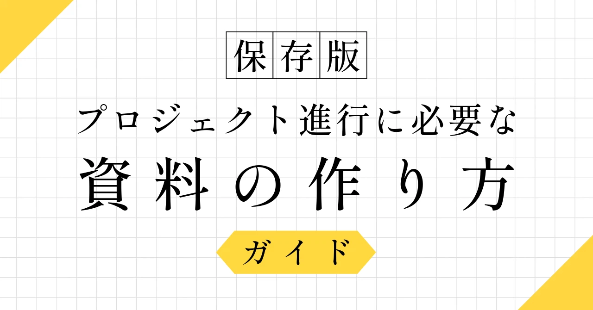
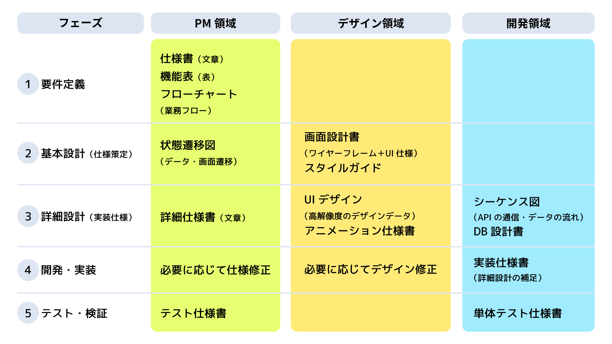

# 【保存版】プロジェクト進行に必要な資料の作り方ガイド：ディレクター初心者向け完全マニュアル

こんにちは、**ディレクターとしてプロジェクトを進行している ぐみ** です。

私がマネジメントを始めた頃、こんな疑問で頭がいっぱいでした。

> 「どのタイミングで、どんな資料を作ればいいの？」
> 「ディレクターは何を用意すればいいの？」
> 「デザイナーや開発者が必要な資料は？」

特に初めてのプロジェクトでは、必要な資料の種類がわからなくて、ネットで調べては「こういうのが必要なのかな？」って手探りで片っ端から作ってみてたんです。
また、クライアントから「この資料はいつ提出できるの？」って聞かれて初めて、必要な資料の存在を知ることもありました。

この記事では、**私がマネジメント初心者の頃に知りたかった「プロジェクト進行に必要な資料の作り方」** をシェアします。
特に、**ディレクション初心者の方** や、**システム開発の流れを知りたい方** に向けた内容なので、参考にしてもらえたら嬉しいです。

なお、この記事では説明を分かりやすくするために、EC サイトを例として使ってます。
実際のプロジェクトでは、プロジェクトの規模や性質に応じて、必要な資料は変わってくるので、その点はご了承くださいね。

<!-- TOC -->

## プロジェクト進行フェーズごとの資料作成一覧

まずは、プロジェクトのフェーズごとに、各領域で必要な資料を整理してみました！

## 一般的なプロジェクト資料の一覧

プロジェクトでよく使う資料を「誰と共有して何の目的で作るか」という視点で整理してみました！

### PM 領域の資料

| **資料名** | **誰に見せるか** | **使用目的** |
|-----------|------------|---------|
| **要件定義書** | 開発チーム（システムエンジニア、プログラマー）、プロジェクトマネージャー、プロダクトオーナー、依頼部門（事業部門、企画部門）の担当者 | **開発の基準**: 開発チームが「何を、どこまで作るべきか」を理解し、開発の指針とするため **認識の統一**: 依頼側と開発側で、システムやサービスが満たすべき機能や性能について認識のズレがないか確認し、合意形成するため **テストの基準**: 完成したシステムが要件を満たしているかを確認するテスト計画やテスト項目を作成する際の基準とするため |
| **機能一覧表** | クライアント・ステークホルダー、開発チーム、プロジェクトマネージャー | **作業量の把握**: 開発チームが工数見積もりや開発計画を立てるため **優先順位の決定**: 限られた予算・期間の中で、どの機能を優先的に実装するかを決めるため **進捗管理**: 各機能の完成状況を追跡し、プロジェクト全体の進捗を把握するため |
| **業務フロー図** | クライアント・ステークホルダー、開発チーム、UI/UXデザイナー | **業務理解**: 開発チームが既存の業務プロセスや理想的な業務フローを理解するため **改善点の特定**: 現状の課題や非効率な部分を可視化し、システム化による改善効果を明確にするため **設計の基準**: UI設計や画面遷移設計の土台として活用するため |
| **ユースケース図** | 開発チーム全体、UI/UXデザイナー、QAエンジニア | **役割の明確化**: システムを利用する各ユーザーの役割と、それぞれが実行できる操作を整理するため **権限設計**: ユーザーごとのアクセス権限や機能制限を設計するため **テスト設計**: 各ユーザー役割でのテストシナリオを作成する際の基準とするため |
| **状態遷移図** | 開発チーム、UI/UXデザイナー、QAエンジニア | **データ設計**: データベースの状態管理やビジネスロジック設計の基準とするため **画面設計**: 各状態に応じた画面表示や操作可能なアクションを設計するため **エラーハンドリング**: 異常な状態遷移や想定外のケースに対する対応方法を検討するため |
| **詳細仕様書** | バックエンド開発者、プロジェクトマネージャー | **実装の詳細化**: 要件定義書では表現しきれない技術的な詳細や制約事項を明確にするため **品質の統一**: 複数の開発者が関わる場合に、実装方針やコーディング規約を統一するため **変更管理**: 仕様変更が発生した際の影響範囲を把握し、適切な対応を検討するため |
| **アクティビティ図** | バックエンド開発者、UI/UXデザイナー、QAエンジニア | **処理フローの可視化**: 複雑なビジネスロジックや処理の流れを図式化し、理解しやすくするため **並行処理の設計**: 複数のアクターが同時に動く処理の設計や、待機・同期が必要な箇所を特定するため **例外処理の設計**: エラーが発生した場合の処理フローや復旧手順を明確にするため |

### UI/UX 領域の資料

| **資料名** | **誰に見せるか** | **使用目的** |
|-----------|------------|---------|
| **画面遷移図** | 開発チーム全体、UI/UXデザイナー、プロジェクトマネージャー、クライアント | **ユーザビリティの検証**: ユーザーが目的を達成するまでの画面の流れが適切かを確認するため **開発の効率化**: フロントエンド開発者が画面間の連携や必要なデータの受け渡しを理解するため **テスト設計**: 画面遷移に関するテストシナリオを作成する際の基準とするため |
| **ワイヤーフレーム** | UI/UXデザイナー、フロントエンド開発者、プロジェクトマネージャー、クライアント | **レイアウトの合意**: 詳細なデザインに入る前に、情報配置や画面構成についてステークホルダーと合意形成するため **工数見積もり**: フロントエンド開発者が実装に必要な時間や技術的な検討事項を把握するため **ユーザビリティ検証**: 早い段階でユーザーの使いやすさを検証し、大きな手戻りを防ぐため |
| **画面設計書（ワイヤーフレーム＋UI仕様）** | フロントエンド開発者、UI/UXデザイナー、QAエンジニア | **実装の詳細化**: ワイヤーフレームだけでは伝わらない操作性や動作についての詳細を明確にするため **品質の統一**: 複数の開発者が画面開発を行う際に、操作感や表示ルールを統一するため **テスト項目の策定**: 画面操作に関するテスト項目を具体的に策定するため |
| **UIデザイン（高解像度のデザインデータ）** | フロントエンド開発者、UI/UXデザイナー | **ピクセルパーフェクトな実装**: 開発者がデザイナーの意図を正確に再現するため **素材の提供**: 実装に必要な画像、アイコン、フォント等の素材を開発者に提供するため **ブランド表現の統一**: 企業やサービスのブランドイメージを正確に表現するため |
| **デザインシステム（UI仕様書＋スタイルガイド）** | フロントエンド開発者、UI/UXデザイナー、QAエンジニア、マーケティングチーム | **デザインの一貫性と効率化**: 再利用可能なコンポーネント、カラーパレット、タイポグラフィ、アイコンなどを体系化し、開発効率を向上させるため **インタラクションの統一**: ボタンのホバー効果、フォーム入力時の動作、エラー表示等の動的な仕様を全体で統一するため **ブランド表現の管理**: 企業やサービスのビジュアルアイデンティティを社内外で一貫して管理し、ブランド価値を向上させるため **保守性の確保**: 将来的なデザイン変更や新機能追加の際に、既存のルールとの整合性を保ち、効率的に対応するため |
| **アニメーション仕様書** | フロントエンド開発者、UI/UXデザイナー | **ユーザー体験の向上**: 画面遷移やフィードバックアニメーションによって、直感的で気持ちの良い操作感を実現するため **技術実装の指針**: アニメーションの種類、速度、タイミング等を具体的に指定し、開発者が適切に実装できるようにするため **パフォーマンス管理**: アニメーションがシステム負荷に与える影響を考慮し、適切な実装方法を選択するため |

### 開発領域の資料

| **資料名** | **誰に見せるか** | **使用目的** |
|-----------|------------|---------|
| **シーケンス図** | バックエンド開発者、フロントエンド開発者、インフラエンジニア | **処理の流れの可視化**: 複数のシステムやコンポーネント間でのデータのやり取りや処理順序を明確にするため **API設計の基準**: フロントエンドとバックエンド間、または外部システムとの連携仕様を設計するため **パフォーマンス最適化**: 処理のボトルネックや非効率な部分を特定し、システム性能を向上させるため |
| **DB設計書** | バックエンド開発者、インフラエンジニア、プロジェクトマネージャー | **データ構造の標準化**: 開発チーム全体でデータベースの構造や制約を統一して理解するため **実装の効率化**: プログラマーが適切なSQL文やORM設定を行うための詳細情報を提供するため **保守性の確保**: 将来的なデータ移行やスキーマ変更の際に、影響範囲を正確に把握するため |
| **ER図** | バックエンド開発者、インフラエンジニア、データアナリスト | **データ関連の可視化**: テーブル間の関係性を図式化し、複雑なデータ構造を理解しやすくするため **整合性の確保**: データベース設計時に論理的な矛盾や不整合を事前に発見するため **クエリ最適化**: 効率的なJOIN文や索引設計を行うための基準とするため |
| **API仕様書** | フロントエンド開発者、バックエンド開発者、外部連携先、QAエンジニア | **インターフェースの標準化**: フロントエンドとバックエンドの開発を並行して進めるための契約を明確にするため **外部連携の促進**: 他のシステムやサービスとの連携を円滑に行うための技術情報を提供するため **テスト自動化**: APIテストの自動化を行う際の仕様確認やテストケース作成の基準とするため |
| **クラス図** | バックエンド開発者、アーキテクト | **システム構造の設計**: オブジェクト指向プログラミングにおけるクラス間の関係性や責務を明確にするため **コードの保守性向上**: 新機能追加や既存機能の修正を行う際に、影響範囲を把握しやすくするため **チーム開発の効率化**: 複数の開発者が異なるクラスを担当する際に、インターフェースや依存関係を明確にするため |
| **実装仕様書** | バックエンド開発者、フロントエンド開発者、QAエンジニア | **実装の詳細化**: 設計書では表現しきれない実装レベルの技術的な詳細や制約事項を明確にするため **品質の統一**: 複数の開発者が関わる場合に、コーディング規約やパフォーマンス要件を統一するため **レビューの効率化**: コードレビュー時に、実装方針や技術選択の背景を理解しやすくするため |

### テスト領域の資料

| **資料名** | **誰に見せるか** | **使用目的** |
|-----------|------------|---------|
| **テスト計画書** | QAエンジニア、開発チーム、プロジェクトマネージャー、クライアント | **テスト戦略の明確化**: どの範囲をどの程度の深さでテストするかを事前に合意形成するため **リソース管理**: テストに必要な人員、期間、環境、ツールを計画し、適切にリソースを確保するため **品質基準の設定**: プロジェクトで求められる品質レベルやリリース判定基準を明確にするため |
| **テスト仕様書** | QAエンジニア、開発者、プロジェクトマネージャー | **テスト内容の標準化**: 誰がテストを実行しても同じ結果が得られるよう、テスト手順や期待結果を具体的に定義するため **テスト効率の向上**: 重要度の高い機能や障害の影響が大きい部分を優先的にテストできるよう項目を整理するため **回帰テストの自動化**: 将来的にテスト自動化を行う際の仕様書として活用するため |
| **単体テスト仕様書** | 開発者、QAエンジニア、アーキテクト | **コード品質の保証**: 個別の関数やメソッドが正しく動作することを保証するため **デバッグの効率化**: 不具合が発生した際に、問題の所在を素早く特定できるようにするため **リファクタリングの安全性**: コードの改善や機能追加を行う際に、既存機能への影響がないことを確認するため |
| **テスト結果報告書** | プロジェクトマネージャー、クライアント、開発チーム、経営層 | **品質状況の可視化**: システムの現在の品質状況や残存する問題を関係者に明確に伝えるため **リリース判定**: システムを本番環境に移行しても問題ないかを判断するための情報を提供するため **改善活動の促進**: テスト結果から得られた課題や改善点を次回のプロジェクトに活かすため |

### 進捗管理領域の資料

| **資料名** | **誰に見せるか** | **使用目的** |
|-----------|------------|---------|
| **プロジェクト計画書** | 経営層、クライアント・ステークホルダー、プロジェクトマネージャー、チームリーダー | **承認・意思決定**: プロジェクトの立ち上げや重要なマイルストーンでの承認を得るため **期待値の設定**: 関係者がプロジェクトの成果物、期間、コスト、品質について共通の理解を持つため **リソース確保**: 必要な人員、予算、設備の確保について経営層や関係部署と調整するため |
| **変更管理表** | プロジェクトマネージャー、クライアント・ステークホルダー、開発チーム、経営層 | **変更の透明性**: 仕様変更や追加要求による影響（コスト、期間、品質）を明確に可視化するため **意思決定の支援**: 変更要求の承認・却下を適切に判断するための情報を提供するため **トレーサビリティ**: 変更の履歴を記録し、後でなぜその判断がなされたかを追跡可能にするため |
| **進捗管理表** | プロジェクトマネージャー、チームリーダー、開発チーム、クライアント | **進捗の可視化**: プロジェクト全体の進捗状況や各タスクの完了状況をリアルタイムで把握するため **ボトルネックの特定**: 遅延が発生している作業や問題のある箇所を早期に発見し、対策を講じるため **チーム調整**: メンバー間の作業分担や依存関係を管理し、効率的なチーム運営を行うため |

## プロジェクト規模別の資料選び方

### 🚀 小規模プロジェクト（3人以下・1ヶ月以内）

**こんなプロジェクト**: MVP開発、機能追加、簡単なLP制作

**必須資料（まずはこれだけ！）**
- ✅ 要件定義書（簡易版）
- ✅ ワイヤーフレーム

**あると良い資料**
- 📝 機能一覧表
- 📝 業務フロー図（簡易版）

### 🏗️ 中規模プロジェクト（4〜10人・1〜3ヶ月）

**こんなプロジェクト**: 企業サイトリニューアル、社内システム開発、ECサイト構築

**必須資料（チーム連携のために必要）**
- ✅ 要件定義書（詳細版）
- ✅ 機能一覧表
- ✅ ワイヤーフレーム
- ✅ 業務フロー図

**推奨資料（品質向上のために）**
- 🔧 状態遷移図
- 🔧 画面設計書（UI仕様含む）
- 🔧 シーケンス図（主要機能）
- 🔧 テスト仕様書（基本版）

**任意資料（余裕があれば）**
- 💡 API仕様書
- 💡 進捗管理表

### 🏢 大規模プロジェクト（10人以上・半年以上）

**こんなプロジェクト**: 基幹システム開発、大型Webサービス、複数システム連携

**必須資料（プロジェクト成功のために絶対必要）**
- ✅ 要件定義書（詳細版）
- ✅ 機能一覧表
- ✅ 業務フロー図
- ✅ 状態遷移図
- ✅ 画面設計書（詳細版）
- ✅ シーケンス図
- ✅ DB設計書・ER図
- ✅ API仕様書
- ✅ テスト計画書・テスト仕様書
- ✅ プロジェクト計画書

**推奨資料（品質・効率向上のために）**
- 🔧 ユースケース図
- 🔧 クラス図
- 🔧 実装仕様書
- 🔧 デザインシステム
- 🔧 変更管理表
- 🔧 進捗管理表

**任意資料（さらなる向上のために）**
- 💡 アクティビティ図
- 💡 アニメーション仕様書
- 💡 単体テスト仕様書
- 💡 テスト結果報告書

## 資料作りのポイント

### 1. 仕様書は「完璧」を目指さない

マネジメント初心者の頃、私は仕様書を完璧にしようとしすぎて、なかなか完成させることができませんでした。
「もっと詳しく書かなきゃ」「この部分も追加しなきゃ」って、どんどん仕様書が肥大化していって、結局完成しないまま...。
クライアントから「仕様書の提出期限は？」って聞かれて、慌てて作成を始めることもありました。

**あの頃の私に教えてあげたいこと：**

- 仕様書は「完璧」じゃなくて「十分」を目指せばいいんだよ
- 大切なのは、チームメンバーが理解できること
- 分からないことは、その都度確認しながら進めればOK
- クライアントとの資料提出スケジュールは事前に確認しておこう
- 完璧を目指しすぎると、いつまで経っても完成しないよ

### 2. プロジェクト規模に応じて資料を選ぶ

マネジメント初心者の頃、ネットで調べると大規模プロジェクト向けの資料の説明が多かったんです。それで、小規模プロジェクトなのに、大規模プロジェクト向けのテンプレートをそのまま使おうとしちゃってました。
「このテンプレートを使えば大丈夫かな？」「この資料フォーマットが一般的なのかな？」って、ネットで見つけた資料をそのまま真似しようとしてたんです。
その結果、「そもそも何を書けばいいのかわからない...」「この資料は本当に必要なのかな...」って悩みながら作業を進めることになって、かえって時間がかかっちゃいました。今思えば、プロジェクトの規模に合わない重たい資料を作ろうとしてたことが原因でした。

**あの頃の私に教えてあげたいこと：**

- 小規模（3 人以下、1 ヶ月以内）は最低限の資料で OK だよ
- 中規模（10 人以下、1〜3 ヶ月）は必要に応じて資料を追加すればいい
- 大規模（10 人以上、半年以上）は全ての資料をしっかり作成しよう
- クライアントとの資料の範囲と提出スケジュールは、プロジェクト開始時に明確にしておこう
- ネットで調べて片っ端から資料を作るんじゃなくて、プロジェクトの規模に応じて必要な資料を選ぼう

## まとめ：資料作りで大切なこと

1. **「完璧」より「十分」を目指そう**

   - チームメンバーが理解できることが一番大切
   - 分からないことは、その都度確認しながら進めればOK
   - 完璧を目指しすぎると、いつまで経っても完成しない

2. **プロジェクト規模に応じて資料を選ぼう**

   - 小規模：必要最小限の資料に絞る
   - 中規模：チームの規模に応じた資料を用意
   - 大規模：全ての資料をしっかり作成

3. **「ドキュメントを作ること」が目的じゃない**

   - プロジェクトをスムーズに進めることが目的
   - チームメンバーが効率的に作業できる環境を整える
   - クライアントとのコミュニケーションを円滑にする

4. **資料作成のコツ**
   - テンプレートを活用しよう（ただし、プロジェクトに合わせてカスタマイズしてね）
   - チームメンバーと資料の内容を確認しながら進めよう
   - 必要に応じて資料を更新しよう（一度作ったら終わりじゃないよ）

私の経験が、マネジメントを始めたばかりのあなたの参考になったら嬉しいです。
資料作りで悩んだときは、ぜひこの記事を思い出してくださいね！

それでは、素敵なプロジェクトライフを！

---

## 更新履歴

### 2025年05月28日

- **初版公開**: プロジェクト進行に必要な資料の作り方ガイドを公開

### 2025年07月01日

- **文体統一**: 記事全体を親しみやすいカジュアルな文体に統一
- **資料追加**: 図表との整合性を図り、以下の資料の説明を追加
  - PM領域：状態遷移図、詳細仕様書
  - UI/UX領域：画面設計書、UIデザイン、アニメーション仕様書
  - 開発領域：実装仕様書
  - テスト領域：単体テスト仕様書
- **表形式への改善**: 「誰に見せるか」「使用目的」の観点で資料を整理し、領域別に分割
- **詳細度の向上**: より実践的で具体的な内容に改善し、初心者でも活用しやすいレベルに調整
- **デザインシステム統合**: UI仕様書とスタイルガイドを現代的なデザインシステムとして統合
- **内容精査**: 初心者向けとしてリスク管理表を削除し、より基本的で実用的な資料に焦点を絞る
