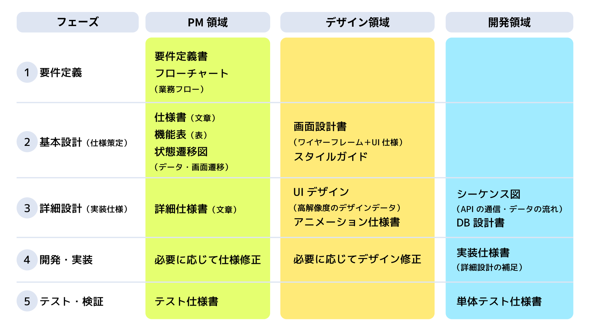

# 【保存版】プロジェクト進行に必要な資料の作り方ガイド：ディレクター初心者向け完全マニュアル

こんにちは、**ディレクターとしてプロジェクトを進行している ぐみ** です。

私がマネジメントを始めた頃、こんな疑問で頭がいっぱいでした。

> 「どのタイミングで、どんな資料を作ればいいの？」
> 「ディレクターは何を用意すればいいの？」
> 「デザイナーや開発者が必要な資料は？」

特に初めてのプロジェクトでは、必要な資料の種類がわからず、ネットで調べては「こういうのが必要なのかな？」と手探りで片っ端から作ってみていました。
また、クライアントから「この資料はいつ提出できるの？」と聞かれて初めて、必要な資料の存在を知ることもありました。

この記事では、**私がマネジメント初心者の頃に知りたかった「プロジェクト進行に必要な資料の作り方」** を共有します。
特に、**ディレクション初心者の方** や、**システム開発の流れを知りたい方** に向けた内容です。

なお、この記事では説明を分かりやすくするために、ECサイトを例として使用しています。
実際のプロジェクトでは、プロジェクトの規模や性質に応じて、必要な資料は変わってきます。

## 目次
1. [プロジェクト進行フェーズごとの資料作成一覧](#-プロジェクト進行フェーズごとの資料作成一覧)
2. [一般的なプロジェクト資料の一覧](#-一般的なプロジェクト資料の一覧)
3. [プロジェクト規模別の資料選び方](#-プロジェクト規模別の資料選び方)
4. [資料作りのポイント](#-資料作りのポイント)
5. [まとめ：資料作りで大切なこと](#-まとめ資料作りで大切なこと)

## プロジェクト進行フェーズごとの資料作成一覧

まずは、プロジェクトのフェーズごとに、各領域で必要な資料を整理しましょう。

<!-- | **フェーズ** | **PM領域** | **UI/UX領域** | **開発領域** |
|-------------|------------------|------------------|------------------|
| **① 要件定義** | 仕様書（文章）、機能表（表）、フローチャート（業務フロー） | - | - |
| **② 基本設計（仕様策定）** | 状態遷移図（データ・画面遷移） | 画面設計書（ワイヤーフレーム＋UI仕様）、スタイルガイド | - |
| **③ 詳細設計（実装仕様）** | 詳細仕様書（文章） | UIデザイン（高解像度のデザインデータ）、アニメーション仕様書 | シーケンス図（APIの通信・データの流れ）、DB設計書 |
| **④ 開発・実装** | 必要に応じて仕様修正 | 必要に応じてデザイン修正 | 実装仕様書（詳細設計の補足） |
| **⑤ テスト・検証** | テスト仕様書 | - | 単体テスト仕様書 | -->

## 一般的なプロジェクト資料の一覧

プロジェクトでよく使用される資料の種類と目的をまとめました。

### PM領域の資料
- **要件定義書**：プロジェクトの目的、範囲、制約条件を明確にした文書。例えば「ECサイト構築」では、「ユーザーが商品を購入できる」「管理者が商品を登録・編集できる」などの要件を記述する
- **機能一覧表**：実装する機能を一覧化した表。例えば「商品管理機能」では、「商品の登録」「商品の編集」「商品の削除」「在庫管理」などの機能を一覧化する
- **業務フロー図**：ユーザーの操作や業務の流れを図式化したもの。例えば「商品購入フロー」では、「商品選択→カート追加→購入情報入力→決済→完了」という流れを図式化する
- **ユースケース図**：システムの機能とユーザーの関係を図式化したもの。例えば「商品管理」では、「一般ユーザーは商品を閲覧できる」「管理者は商品を登録・編集できる」などの関係を図式化する
- **アクティビティ図**：ユーザー、管理者、システムなどの役割ごとに、時系列で処理の流れを図式化したもの。例えば「商品購入フロー」では、ユーザーの操作、管理者の承認、システムの処理などを時系列で表現する

### UI/UX領域の資料
- **画面遷移図**：画面間の遷移関係を図式化したもの。例えば「商品詳細ページ」から「カートページ」へ遷移する際の条件（在庫あり/なし）や、遷移後の表示内容を図式化する
- **ワイヤーフレーム**：画面のレイアウトを簡易的に表現した図。例えば「商品一覧ページ」では、商品画像、商品名、価格、在庫状態などの配置を簡易的に表現する
- **UI仕様書**：画面のデザインや操作性に関する仕様を記述した文書。例えば「ボタンのデザイン」では、通常時・ホバー時・クリック時の色や形状の変化を定義する
- **スタイルガイド**：デザインの一貫性を保つためのルール集。例えば「カラーパレット」では、メインカラー、アクセントカラー、背景色などの使用ルールを定義する

### 開発領域の資料
- **シーケンス図**：ユーザー、管理者、システムなどの役割ごとに、時系列でメッセージのやり取りを図式化したもの。例えば「ログイン処理」では、ユーザーの入力、システムの認証、データベースへの問い合わせなどを時系列で表現する
- **クラス図**：システムの構造を図式化したもの。例えば「商品管理システム」では、「商品クラス」「在庫クラス」「注文クラス」などの関係性を図式化する
- **API仕様書**：APIのインターフェースを定義した文書。例えば「商品検索API」では、リクエストパラメータ（キーワード、カテゴリ、価格範囲など）とレスポンス形式を定義する
- **DB設計書**：データベースの構造を定義した文書。例えば「商品テーブル」では、カラム名（商品ID、商品名、価格、在庫数など）とデータ型、制約条件を定義する
- **ER図**：データベースのテーブル間の関連を図式化したもの。例えば「商品テーブル」と「在庫テーブル」の関連（1対多）や、「ユーザーテーブル」と「注文テーブル」の関連（1対多）を図式化する

### テスト領域の資料
- **テスト計画書**：テストの進め方を定義した文書。例えば「商品購入機能のテスト」では、テスト環境、テスト期間、テスト担当者、テスト項目の優先順位などを定義する
- **テスト仕様書**：テスト項目と期待結果を定義した文書。例えば「商品検索機能」では、「キーワード検索」「カテゴリ検索」「価格範囲検索」などのテスト項目と、それぞれの期待結果を定義する
- **テスト結果報告書**：テストの結果をまとめた文書。例えば「商品管理機能のテスト」では、テスト項目ごとの結果（OK/NG）、発見された不具合、修正状況などをまとめる

### 進捗管理領域の資料
- **プロジェクト計画書**：プロジェクトの全体計画を記述した文書。例えば「ECサイト構築」では、要件定義、設計、開発、テストの各フェーズの期間とマイルストーンを定義する
- **リスク管理表**：プロジェクトのリスクと対策をまとめた表。例えば「在庫管理システムの障害」というリスクに対して、「バックアップシステムの構築」「復旧手順の整備」などの対策を記述する
- **変更管理表**：仕様変更の履歴を管理する表。例えば「商品検索機能の追加」という変更に対して、変更内容、変更理由、影響範囲、承認状況などを記録する
- **進捗管理表**：タスクの進捗状況を管理する表。例えば「商品管理機能の開発」では、各タスクの担当者、開始日、完了予定日、現在の進捗状況などを管理する

## プロジェクト規模別の資料選び方

### 小規模プロジェクト（3人以下、期間：1ヶ月以内）

**特徴：** 少人数でスピーディーに進めるため、必要最小限の資料に絞る

✅ **必要な資料**
- 仕様書・機能表（最低限、要件の共有は必要）
- フローチャート（開発者と共通認識を持つ）
- ワイヤーフレーム（UIの基本構成は整理する）

### 中規模プロジェクト（10人以下、期間：1〜3ヶ月）

**特徴：** チームメンバーが増えるため、ある程度のドキュメントが必要

✅ **必要な資料**
- 仕様書・機能表（各メンバーが仕様を正確に理解するため）
- 状態遷移図（データや画面の状態を明確にする）
- ワイヤーフレーム＋UI仕様（開発とデザインの連携をスムーズにするため）
- シーケンス図（主要な機能の処理フローを明確にする）

### 大規模プロジェクト（10人以上、期間：半年以上）

**特徴：** 関係者が多くなるため、すべての資料をしっかり作成しないと混乱する

✅ **必要な資料**
- 仕様書（詳細）（開発者・デザイナー・QAが迷わないよう、明確に記述）
- 状態遷移図（画面やデータの遷移を整理する）
- 画面設計書（詳細版）（開発者が理解しやすいよう、デザインシステムを整理する）
- シーケンス図（各APIのリクエスト・レスポンスの流れを明確にする）
- ER図（データベースの構造を明確にする）
- テスト仕様書（テスト項目と期待結果を明確にする）
- プロジェクト計画書（全体のスケジュールとマイルストーンを明確にする）

## 資料作りのポイント

### 1. 仕様書は「完璧」を目指さない

マネジメント初心者の頃、私は仕様書を完璧にしようとしすぎて、なかなか完成させることができませんでした。
「もっと詳しく書かなきゃ」「この部分も追加しなきゃ」と、どんどん仕様書が肥大化していき、結局完成しないまま...。
また、クライアントから「仕様書の提出期限は？」と聞かれて、慌てて作成を始めることも。

**初心者の頃の私に教えたいこと：**
- 仕様書は「完璧」ではなく「十分」を目指す
- 重要なのは、チームメンバーが理解できること
- 不明点は、その都度確認しながら進める
- クライアントとの資料提出スケジュールは事前に確認しておく
- 完璧を目指しすぎると、いつまで経っても完成しない

### 2. プロジェクト規模に応じて資料を選ぶ

マネジメント初心者の頃、私はネットで調べると大規模プロジェクト向けの資料の説明が多かったため、小規模プロジェクトなのに、大規模プロジェクト向けのテンプレートをそのまま使おうとしてしまいました。
「このテンプレートを使えば大丈夫かな？」「この資料フォーマットが一般的なのかな？」と、ネットで見つけた資料をそのまま真似しようとしていました。
その結果、「そもそも何を書けばいいのかわからない...」「この資料は本当に必要なのかな...」と悩みながら作業を進めることになり、かえって時間がかかってしまいました。今思えば、プロジェクトの規模に合わない重たい資料を作ろうとしていたことが原因でした。

**初心者の頃の私に教えたいこと：**
- 小規模（3人以下、1ヶ月以内）は最低限の資料でOK
- 中規模（10人以下、1〜3ヶ月）は必要に応じて資料を追加
- 大規模（10人以上、半年以上）は全ての資料をしっかり作成
- クライアントとの資料の範囲と提出スケジュールは、プロジェクト開始時に明確にしておく
- ネットで調べて片っ端から資料を作るのではなく、プロジェクトの規模に応じて必要な資料を選ぶ

## まとめ：資料作りで大切なこと

1. **「完璧」より「十分」を目指す**
   - チームメンバーが理解できることが大切
   - 不明点は、その都度確認しながら進める
   - 完璧を目指しすぎると、いつまで経っても完成しない

2. **プロジェクト規模に応じて資料を選ぶ**
   - 小規模：必要最小限の資料に絞る
   - 中規模：チームの規模に応じた資料を用意
   - 大規模：全ての資料をしっかり作成

3. **「ドキュメントを作ること」が目的ではない**
   - プロジェクトをスムーズに進めることが目的
   - チームメンバーが効率的に作業できる環境を整える
   - クライアントとのコミュニケーションを円滑にする

4. **資料作成のコツ**
   - テンプレートを活用する（ただし、プロジェクトに合わせてカスタマイズする）
   - チームメンバーと資料の内容を確認しながら進める
   - 必要に応じて資料を更新する（一度作ったら終わりではない）

私の経験が、マネジメントを始めたばかりのあなたの参考になれば嬉しいです。
資料作りで悩んだときは、ぜひこの記事を思い出してください！

それでは、素敵なプロジェクトライフを！🚀 