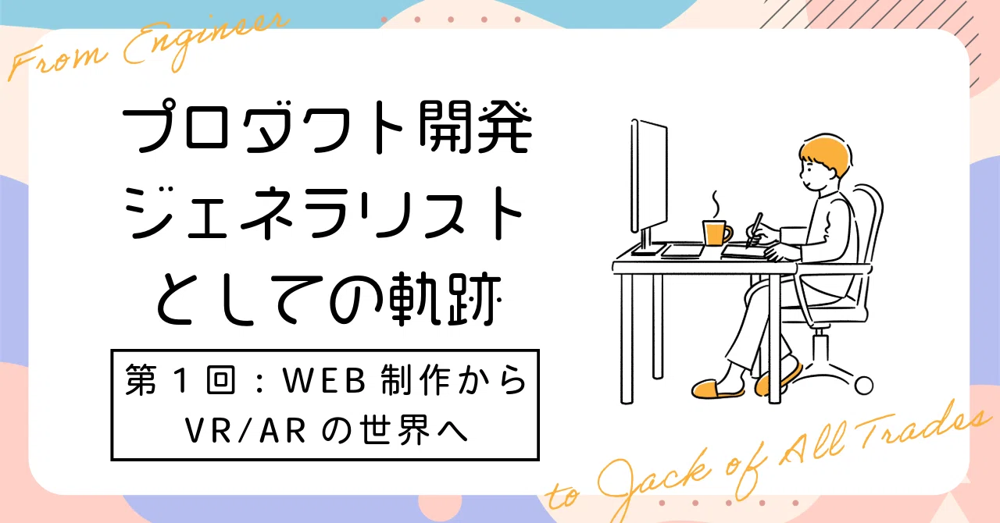

# プロダクト開発のジェネラリストとしての軌跡〜第1回：WEB制作からVR/ARの世界へ〜

## はじめに

### あなたは誰ですか？

初めましての人は初めまして。すでに私の記事を見ていただいたことがある人はこんにちは。  
プロダクト開発ジェネラリストのぐみです。

### 今回はどんな記事なの？

前回の第0回プロローグでは、私が「プロダクト開発のジェネラリスト」らしいということをAIに言われたという話でした！

今回は私がWEBエンジニアとしてキャリアをスタートした経緯と、  
AR/VRの世界との出会いまでを詳しく振り返ってみたいと思います。

## 中学〜大学：WEBとの出会いと学習

PCメーカーに勤めていた父の影響で、  
小学校の頃からWindows98時代のPCを触れる環境でした。  
絵を描くのが好きだったので、ペインターでお絵描きをしていました。

中学生になって、  
「WEBサイトを作って書いた絵をアップしたら？」と父から勧められて、  
それは面白そうだ！と思ってWEBサイト作りを始めたんです。

テーブルレイアウトの時代で、  
キリ番カウンターや隠しリンク、タグで文字装飾……とっても懐かしいですね。  
そこからCSSが台頭してきて、マークアップとデザインを分ける思想に衝撃を受けました。

高校では部活と学業に専念してPCで遊ぶ機会は少なくなっていましたが、  
大学選択の時に「昔WEBサイト作るの楽しかったし、これを仕事にできたら楽しいかも」と思うように。

「WEBを自分のお仕事にするぞ！」という決意でデジタルハリウッド大学に入学しました。  
デジタルコンテンツ全般を学べる環境で、  
WEB制作・デザイン・プログラミングを体系的に学ぶことができました。

## アルバイト経験：実践を通じた成長

大学では「技術を活かしたアルバイトをするぞ！」と決めて、  
WEB制作会社でのアルバイトを始めました。

とにかくたくさんの仕事をこなして成長したかったので、  
作業が終わると「お仕事くださーい」と書いたうちわを掲げてアピールする、なんてこともしていました。  
周りの方の集中を邪魔せずにアピールできる合理的な方法だ！と思っていたのですが、  
友人には「ちょっと変わってるね」と笑われました。

また、ただ仕事をこなすだけでなく、開発のやり方にも目を向けていました。  
当時はバージョン管理がフォルダのコピーで行われていて、  
デグレード（先祖返り）が頻繁に発生していたんです。  
これを改善したくてGitHubの導入を提案したところ、  
チームに採用してもらうことができました。

### 技術的な学びとデザインへの理解

コーダー業務を通じて、  
レスポンシブデザインの実装、クロスブラウザ対応、パフォーマンス最適化、JavaScript開発など、多くの技術スキルを学べました。  
Vue.jsフレームワークを使用した開発経験も積みました。

WEB制作会社では、大学時代に合計3年間もお世話になりました。  
途中で「バックエンドも経験してみたい！」と思って一度辞めたんですが、  
そのバイト先が事業終了でなくなっちゃって…。  
そんな時に快く「戻っておいでよ」と再雇用してもらえて、  
めちゃくちゃ嬉しかったのを覚えています。

WEB制作をやっていくうちに、  
デザインはただ綺麗にするだけじゃなく、  
「何かを伝えるための手段」なんだなって気づいたんです。  
見出しの装飾で情報の階層を伝える、  
色や配置でユーザーの視線を導く、  
全体で一貫した操作感をつくる、  
といったセオリーを実装を通して体感的に理解していきました。

デザインをもっと深く理解したくて、  
デジタル色彩検定を取ったり、  
大学の授業で有名なデザイナーの先生から直接教えてもらう機会もありました。

また、WEB制作の世界は技術の進化が速いので、置いていかれないように、  
`coliss`や`Webクリエイターボックス`などの業界ブログで最新情報をキャッチしたり、`ドットインストール`で体系的に学ぶのが習慣でした。

この経験のおかげで、WEBサイトの実装技術はかなり上達して、  
どんなデザインでもだいたい実装できるぞ！ってレベルまで成長できました。

## キャリアの転換点とVR/AR出会い

アルバイトを続けるうちに、  
WIXやJimdoみたいなノーコードツールがどんどん出てきて。  
「このままじゃ、自分の仕事がなくなるんじゃないか…？」と、  
WEBコーダーとしての将来に不安を感じるようになったんです。

このままじゃダメだ、何か新しい武器を身につけなきゃって、本気で思いました。  
ただコードを書くだけの実装者でいることに限界を感じ、  
もっと企画や設計といった上流工程に関わりたいと思っても、  
まだ若くて視野が狭く、どうすればいいか分からなかったんです。

そんなふうにキャリアの方向性に迷っていた、まさにその時。  
偶然にもVR/ARという新しい分野と出会ったんです。

きっかけは、友達にVRゴーグルを体験させてもらったこと。  
その没入感に「なんだこれ！？」ととんでもない衝撃を受けました。  
ちょうどVTuberののじゃろりさんやキズナアイさんが出てきた頃で、  
バーチャルと現実が混ざり合う新しいコンテンツに、すごく興味を惹かれたんです。

当時のWEBVR/ARはまだ黎明期で、技術情報もほとんどありませんでした。  
でも、だからこそ新しい技術を学んで、  
自分の知見を広げるチャンスだと思ったんです。  
エンタメや教育、ビジネスにも広がる可能性に、大きな魅力を感じました。

「これだ！」と思った僕は、  
VR/ARを研究している教授に猛アピールして、前職の会社を紹介してもらいました。  
最初はVTuberのTV番組で、設営アシスタントからスタートしました。

この仕事を通して、  
VR/ARの技術はもちろん、テレビ業界の制作プロセスや、  
新しい技術を使ったコンテンツの作り方など、たくさんのことを学べました。  
その後、番組で使う3Dスタジオステージの制作管理を任せてもらえて。  
そこで頑張りが認められて、正社員として入社できたんです。

この出会いが、私のキャリアを大きく変えるきっかけになりました。

## おわりに

ここまで、私のキャリアの始まりからVR/AR業界と出会うまでを振り返ってみました。

学生時代のWEB制作から始まって、実装者としての限界を感じていた私が、  
VR/ARという新しい世界に出会うまでのお話でした。

次回は、VR/AR業界での具体的な経験と、  
そこからどうやってプロダクト開発ジェネラリストとして成長していったのか、詳しくお話ししますね。

読んでくれてありがとうございました。次回もぜひ、お楽しみに！
