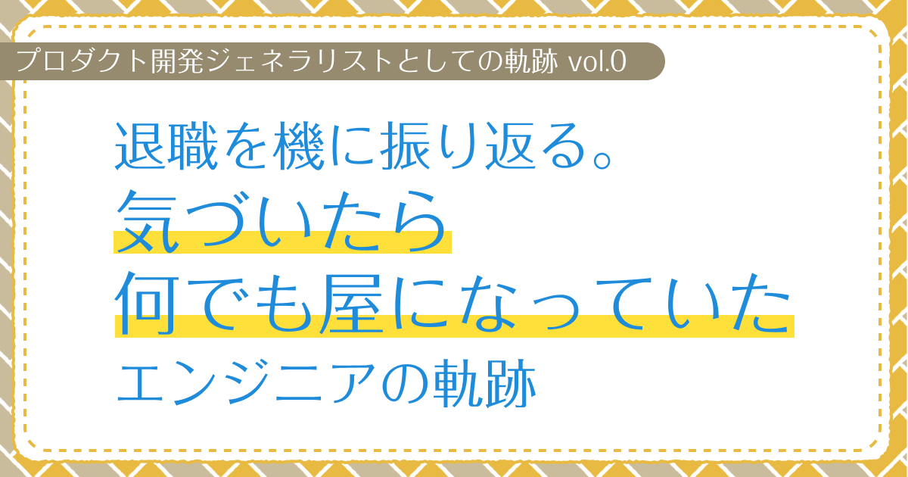

# 退職を機に振り返る。気づいたら何でも屋になっていたエンジニアの軌跡　【プロダクト開発ジェネラリストの軌跡 第0回】

## はじめに

### あなたは誰ですか？

初めましての人は初めまして。すでに私の記事を見ていただいたことがある人はこんにちは。  
プロダクト開発ジェネラリストのぐみです。

え？プロダクト開発ジェネラリストって何かって？

私も良くわかりません。  
今までやってきた経験と分野をAIに食べさせたら「プロダクト開発のジェネラリスト」って言われたんですもん。  
文句があればChatGPTにお願いします。

### 今回はどんな記事なの？

私は今まで自社プロダクトの（実質）プロダクトマネージャーや受託開発のプロジェクトマネージャーとして管理っぽいものから、  
WEBエンジニア兼WEBデザイナー兼UIデザイナーとして制作実装人員として様々なプロジェクトに関わってきました。

この記事では会社を退職した記念として、なぜ「プロダクト開発のジェネラリスト」になってしまったのかを振り返りつつ、  
これまでの経験を通じて得た知見や学び、そして上手く行かなかったことなどを反省したいと思います。

<!-- TOC -->

## プロローグ（本編はまだまだ先だよ）

### わたしのいる業界はどんな所？

まずは私の働いている業界について説明します。
私がいる業界は、IT業界の中でも特にWEB制作・アプリケーション開発の分野です。

特に私が関わってきたのは、

- 自社プロダクトの開発・運用
- 受託開発案件
- デジタルコンテンツ制作（WEB AR、3Dアバター、VTuber関連）

といった領域です。

#### プロジェクトに関わる主要な職種

これらの領域の会社では、様々な職種の人々が協力し合って仕事を進めていきます。

**マネジメント系**
- プロジェクトマネージャー：プロジェクト全体の進行管理（主に受託開発で活躍）
- プロダクトマネージャー：プロダクトの方向性や要件の決定（主に自社プロダクトで活躍）

**制作・開発系**
- ディレクター：制作物の品質管理や方向性の決定
- エンジニア：システムの設計・実装
- デザイナー：UI/UXデザイン、ビジュアルデザイン

**ビジネス・サポート系**
- マーケター：プロモーション施策の立案・実行
- カスタマーサポート：ユーザーからの問い合わせ対応、フィードバックの収集と分析
- 広報担当：プレスリリース作成、メディア対応
- 法務担当：契約書作成、コンプライアンス対応
- 経理担当：予算管理、決算対応
- 営業担当：新規顧客の開拓、既存顧客との関係構築、提案活動

沢山の人たちが協力し合うことでプロダクトはみんなの元に届くわけなんですね。

### プロダクト開発のジェネラリストってなに？

私がプロダクト開発のジェネラリストとAIに言われた経験と分野がこちらです。

```
最初はWEB制作実装のエンジニアとしてキャリアをスタートしましたが、紆余曲折ありマネジメントの役割も担うことになりました。

具体的には、企画段階から運用段階まで幅広い業務を担当しました。  
要件定義、構成設計、DB設計、システム設計といった上流工程から、  
バックエンド開発、WEBフロントエンド開発、UIデザインなどの実装工程まで、多岐にわたる業務を経験しました。

さらに、展示会チラシデザインや展示会ディレクション、バナーデザインなどのプロモーション施策も担当。  
プレスリリースの作成・配信、利用規約・契約書の作成確認、カスタマーサポート、SNS運用、ユーザーコミュニティ形成まで、  
プロダクトやプロジェクトに関わる様々な側面を経験しました。

また、受託案件として、GASを活用した業務効率化アプリケーションの開発や、  
WEBディレクション、WEB ARコンテンツ制作、  
3Dアバターの制作ディレクション、VTuber配信・撮影の裏方、VTuber動画の台本作成・編集なども担当しました。
```

#### 兼任していた役割

先ほどの職種説明で言うと

**マネジメント系**
- プロジェクトマネージャー
- プロダクトマネージャー

**制作・開発系**
- エンジニア
- デザイナー
- ディレクター

**ビジネス・サポート系**
- マーケター
- 広報担当
- 法務担当
- カスタマーサポート

を兼任していたということになります。

#### ジェネラリストとしての実感

自分一人で全てを行なってきたわけではないと言うことはお伝えしておきます。  
ただ、ここに並べている領域のほどんどでメイン戦力でした。

………あなたは何屋さんなんですか？という状態です。

私も自分が何屋さんなのかわからないんです。
一応技術屋さんとしてはWEB制作・アプリ実装が一番得意ではあるんですが、  
その他の経験していることが多すぎて、技術的にもジェネラリスト。経験もジェネラリスト。  
なんでも屋さんすぎて、何屋さんでもないという状況になってしまった…。

#### ジェネラリストとしての強み

でも、こんなに色んな経験をさせてもらえたおかげで

- 技術とビジネスの両方の視点を持ち、プロダクト全体を俯瞰できる
- 企画から実装、運用まで一貫して関われる
- チーム内の様々な役割（エンジニア、デザイナー、プロジェクトマネージャー等）の立場や課題を理解している
- 必要に応じて柔軟に役割を切り替えられる

というような柔軟な人材になれました。

これは専門分野の方とも協力しながらプロダクト・プロジェクトの成功に向けて  
エンジニアと非エンジニアの間の調整役になれたり、プロジェクトを主導することができるということでもあります。  
また、相手の立場や知識レベルに応じて、適切な説明の仕方を選べるようになりました。

### なんでこんなに色んなことやることになったの？

こんなに色んなことをやることになった理由は

- 前職の会社の人数が少ない
- なのに社長の興味分野が非常に広い
- 開発以外のことに柔軟に対応できたりする人材がいない
- 受注開発も自社プロダクト開発も両方やっていた
- 私が様々な業務に柔軟に対応できたため

といった事情があると多います。

#### 悔しい気づき

「未経験の分野だけど、必要だから」って思って色んな仕事を引き受けてきたおかげで、たくさんの経験はできたんですが、  
会社に専門のエキスパートがいない環境で、一人で色んな役割をこなそうとした結果、やっぱり一人じゃ限界があって、  
思うような成果が出せなかったんですよね。

全部の分野のエキスパートを雇う必要はなかったと思うけど、一人で全部完璧にこなすのって無理ですよ！  
時間も能力も限られてるし、理想通りにはできなくて、中途半端な結果になっちゃうことも多かったです。

転職活動してる時に色んなことを思い出して、  
一人じゃ限界があってプロダクトの成長に対して全力を出しきれなかったこととか、  
もっと一緒に考えてくれる仲間がいればできたこととか、  
考えちゃって、悔しくて涙が出ちゃいました。

そんな自分の気持ちを整理して、前に進むために、今までのことを振り返る記事を書くことにしたんです。

## 次回予告

次回以降は、私がWEBエンジニアとしてキャリアをスタートした経緯と、  
なぜプロダクト開発のジェネラリストという道を歩むことになったのか、  
その背景について詳しくお話ししたいと思います。

お楽しみに！
