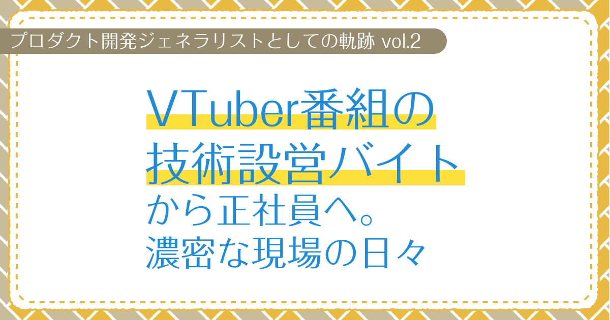

# VTuber番組の技術設営バイトから正社員へ。ロケ弁が楽しみだった濃密な現場の日々　【プロダクト開発ジェネラリストの軌跡 第2回】

## はじめに

### あなたは誰ですか？

初めましての人は初めまして。すでに私の記事を見ていただいたことがある人はこんにちは。  
プロダクト開発ジェネラリストのぐみです。

### 今回はどんな記事なの？

前回は私がWEBエンジニアとしてキャリアをスタートした経緯と、VR/ARの世界との出会いまでをお話ししました。

今回は、VTuberのTV番組での技術設営スタッフとしての経験と、  
そこから正社員としてのキャリアをスタートするまでの道のりを詳しく振り返ってみたいと思います。

<!-- TOC -->

## VTuber番組での技術設営スタッフとしての経験

VTuberのTV番組「にじさんじのくじじゅうじ」の技術設営スタッフとして、アルバイトからスタートしました。

### 過酷な現場での日々

番組本番は21時〜22時なんですが、設営作業は朝10時から始まるんですよね。  
毎回空っぽのスタジオで機材を一から組み立てて、番組終了後には全部撤収するという、  
まさに「朝から夜まで」の仕事でした。基本的に終電での帰宅が日常でした。

撮影体制は、バーチャルキャストで撮影する演者9人、カメラマン4人の計13人がバーチャル空間に入る大規模なもの。  
当時のVR機材の性能を考えると、これだけの人数が同時にバーチャル空間に入るのは結構な負荷がかかっていました。  

この番組の仕事での1番の楽しみはお昼のロケ弁！  
こんなにロケ弁の感想をもらうのは初めてだと言われるほど毎回美味しいロケ弁の感想を調達担当の方に伝えていました笑

### 効率化への取り組みと技術スキルの拡大

でも、この大変な現場を乗り越えるために、様々な工夫を重ねていきましたね。  
演者の名前を印刷してラミネート加工したものをPCに貼り付けたり、番組で使う書き割り画像（背景や小道具として使った2D画像のこと）をサーバーにアップロードしてバーチャルキャスト内で使えるように設定したり。さらには画像URLの200チェック用のGAS（Google Apps Script）まで自作して、作業効率を上げていきました。

番組準備の段階では、FBXの3DモデルからVRMへの変換作業や、アセットストアの環境モデルをスタジオとして活用するための調整、新しいバーチャルスタジオの3D制作ディレクションまで、技術的な業務の幅を広げていきましたね。

そうやって現場で様々な課題に取り組み、改善を重ねていくうちに、いつの間にか現場リーダー的な立場になっていたんです。そして、その頑張りが認められて、正社員として雇用されることになりました。

## VTuberの技術裏方としての経験

「にじさんじのくじじゅうじ」のTV番組制作のではTV制作会社さんと一緒にやってたから、配線とかは向こう側でやってくれて、私たちは映像出力までを担当するって感じでした。

正社員として入った後、TV以外の収録や配信の仕事もどんどん増えてきて。  
これが大変だったのが、配線から全部自分で考えないといけなくて。映像・音声の配線とかケーブルとかスイッチャーとか、機材のことを一から勉強する感じでしたね〜。  
インターネットと本が基本的に頼りだったのですがたまにリアル系配信のプロの現場をお手伝いする機会があって色々聞くことができました。

仕事の分担としては、トラッキングのセンサーとPCの設定はUnityエンジニアさんにお願いして、私は配線全体と配信の準備、あと当日の現場の采配をとる感じになりました。

そうやって経験を積んでいくうちに、自分なりの配線図の描き方も決まってきたんです。  
私の場合は、入力と出力を両端に書いた配線図を作って、それとは別に機材の配置図も作るっていうやり方にしたんですよね。  
これがすごく便利で、ゴチャゴチャした配線でも分かりやすく整理できるようになったんです！

## こばなし：生放送と収録の違い

TV番組制作の現場で経験した、生放送と収録の違いについて少し。

生放送と収録では現場の雰囲気がまったく違っていました。生放送のときは、みんな緊張感MAXでピリピリ。  
放送時間は絶対に遅らせられないので、放送30秒前までVR機材が動かなくてヒヤヒヤしたり。  
あるときは放送中にPCがおかしくなって大ピンチでしたが、カメラマンさんがそのキャラがうつらないように咄嗟に対応してくれて、本当に助かりました。

一方、収録のときは和やかな雰囲気。スタッフみんなリラックスしてました。  
トラブルが起きても「じゃあもう一度撮り直しましょう」って対応できるから、自然と肩の力が抜けるんですよね。  
「収録の日はスタッフさんたち、いつもより随分リラックスしてますね〜」って言われることも（笑）

## VTuber技術を活かしたプロジェクト

そうした生放送や収録の経験を積んでいく中で、新しい挑戦の機会もいただきましたね。ペットフードのメーカー様のYouTubeチャンネルで、VTuber風の飼い方動画を作ることになったんです。

実はこのプロジェクト、台本作成も動画編集も業務としては初めての経験でした。台本作成にあたっては、まず先方のHPに掲載されている「猫の飼い方」情報を確認しましたが、予定しているエピソード回数に対して内容が足りていないことに気づきました。そこで、自分でも猫の飼い方について書籍やWebでリサーチし、不足分を補う形で台本を作成しましたね。どんな流れにすれば分かりやすいか、どんなセリフ回しが自然かを考えながら、何度も書き直しました。

動画編集についても、以前趣味でAdobe Premiereの基本操作を少し触ったことがあったものの、業務レベルで仕上げるのは初めてでした。最初は「どんな構成にすれば見やすいか」「どこまで凝った編集をすればいいのか」など悩むことも多かったです。分からないことが出てきたらYouTubeでチュートリアル動画を見て学んだり、ネットの情報を頼りに試行錯誤したりしながら、少しずつ編集スキルを磨いていきました。

編集作業では、全てのエピソードに統一感を持たせるため、レイアウトやテロップ、効果音のパターンをあらかじめ決めておきました。これにより、どの回を見ても「同じシリーズ」として分かりやすく、視聴者にも安心感を持ってもらえるよう工夫しました。また、限られた時間の中で複数本の動画を仕上げる必要があったため、テンプレート化や素材の使い回しなど「省エネ編集」も意識。無駄な作業を減らしつつ、クオリティは落とさないように心がけましたね。

最初は思うようにいかず何度もやり直しましたが、最終的にはクライアントにも「分かりやすくて楽しい動画になった」と喜んでいただけたんです。

## おわりに

VTuberの技術スタッフとしての経験は、私のキャリアの中でも特に濃い時期でした。
朝から夜まで続く過酷な現場で、技術的なスキルだけでなく、現場マネジメントやコミュニケーション能力も磨かれました。

次回は、この経験を活かしてどのように次のステップに進んでいったのか、
そしてプロダクト開発のジェネラリストとしての視点がどのように形成されていったのかについてお話ししたいと思います。

読んでくれてありがとうございました。次回もぜひ、お楽しみに！
