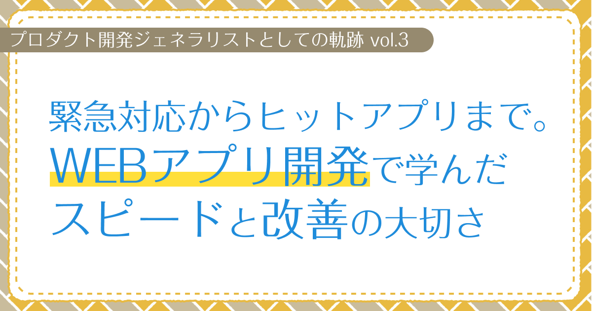

# 緊急対応からヒットアプリまで。WEBアプリ開発で学んだスピードと改善の大切さ　【プロダクト開発ジェネラリストの軌跡 第3回】

## はじめに

### あなたは誰ですか？

初めましての人は初めまして。すでに私の記事を見ていただいたことがある人はこんにちは。  
プロダクト開発ジェネラリストのぐみです。

### 今回はどんな記事なの？

前回は、VTuberの現場で技術スタッフとして働いた経験や、未経験の業務に挑戦したエピソードについてお話ししました。  
今回は、WEBアプリケーション開発にも関わるようになった経験について、具体的なプロジェクトを通じて学んだことを振り返ってみたいと思います。

<!-- TOC -->

## WEBアプリケーション開発への挑戦

VTuberの現場での経験を積む中で、会社の社長がもともとWEB制作事業も手がけていたこともあり、私にもWEB開発の仕事を任せてもらえるようになったことが、活動の幅を広げるきっかけになったと思います。

### 緊急プロジェクトでの対応力

VTuberのTV番組が終わりに差し掛かる頃に、クライアントからGAS（Google Apps Script）を使ったYouTubeチャンネルの管理ツールの開発依頼がありました。Web制作の経験を活かして、このプロジェクトを担当することになったんです。

YouTubeの公開設定を自動で切り替えてくれるスケジューラー機能があって、指定した日時に限定公開から一般公開に変更したり、非公開にしたりできるツールでした。

Vue.jsでWEB GUIを実装し、現場スタッフが直感的に使えるSPAを作りました。

元々は別の開発者さんに頼んでいたんですが、仕様の半分も実装できていない状態で、納品2週間前に突然連絡が取れなくなっちゃったんです。  
現場での運用開始日が決まってたから、私が「よーし、任せて！」って感じで引き継いで、要件定義からUIデザイン、実装まで全部1から作り直して、1週間くらい夜なべ作業で頑張って完成させました。

### 継続的な改善の重要性

最初は「とにかく動くものを！」って感じで作ったので、スケジュール処理に時間がかかってたんです。でも、先方の担当者は特に気にしてなかったみたいで、不満の声も上がってなかったんですよね。  
特に登録件数が増えてくると処理がタイムアウトしちゃう可能性もあって心配でした。  
でも、運用開始後もコツコツ改善を重ねて、処理したい行だけを先にquery関数で絞り込んだシートを用意するように作り直したら、なんと処理速度が約20倍も速くなったんです！

VTuberの現場で身につけた「問題が起きる前に先回りして改善点を見つけて、サクッと対応する」っていう感覚が、ここでもバッチリ活きた感じです。現場経験って本当に大事だなぁって実感した瞬間でしたね。

## ヒットアプリ開発の経験

YouTube管理GASが緊急対応の案件だったのに対し、今度は全く違うアプローチでの開発を経験することになりました。

### スピード開発の成功体験

コロナ禍初期、社長から「名刺のように自分の情報を背景に表示できるアプリがあったら便利じゃない？」という提案がありました。  
社長のアイデアに「これは面白そう！」と感じ、すぐに開発に着手。私が機能設計を考え、発案からわずか3日で、デザインから実装まで全て担当し、プロトタイプをリリースしました。

SNSで共有したところ、予想以上の反響がありました。  
リリースから半年で累計5万回以上の利用があり、1日平均500人もの方に使っていただけるツールに成長。  
コロナ禍初期でリモート会議が急激に普及したタイミングに合わせてリリースできたことで、潮流に乗ることができたのが、このヒットにつながったんだと思います。

### 既存サービスとの差別化

当時、名刺風の背景画像を作成するサービスは他にもあったんですが、多くはデザイナーにテンプレートを作ってもらう形のサービスでした。でも、ユーザーが本当に欲しかったのは、自分で手軽に、自由に作れるツールだったんです。

背景色や透明度の調整、ロゴ設定、フォント選択など、画像生成ツールとして必要なカスタマイズ機能を実装しました。

### 好評だった機能の工夫

特に好評だったのが、URLを入力するとQRコードを生成して背景画像の隅に配置できる機能です。  
自分のSNSやポートフォリオサイトのURLを入力するだけで、自動的にQRコードが生成されます。これで、ビデオ会議中に「後で連絡先教えて」っていうやり取りが減って、すごくスムーズになったんです。

また、画像生成の処理は全てフロントエンドで完結するように実装したので、サーバーコストもかからず、  
スケーラビリティの心配もなく運用できたのも、良いポイントでした。

## おわりに

WEBアプリケーション開発への挑戦は、私のキャリアの中でも大きな転換点でした。
緊急対応での火消し作業から、コロナ禍でヒットしたアプリ開発まで、様々な経験を積むことができました。

特に、技術力だけでなく、スピード感を持って取り組むことの大切さや、
リリース後も継続的に改善していく姿勢の重要性を学びました。

次回は、この経験を活かしてどのように次のステップに進んでいったのか、
そしてジェネラリストとしての視点がどのように形成されていったのかについてお話ししたいと思います。

読んでくれてありがとうございました。次回もぜひ、お楽しみに！
