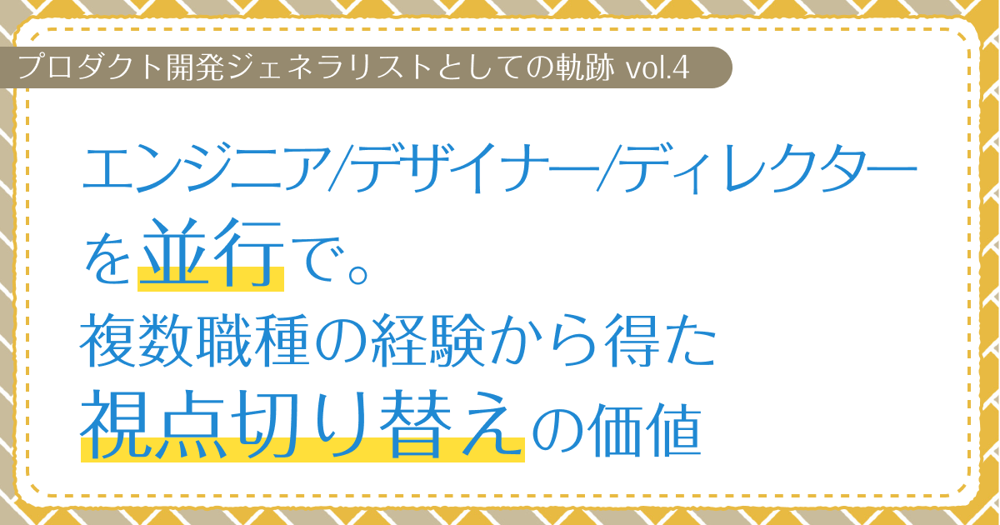

# エンジニア、デザイナー、ディレクターを並行で。複数職種の経験から得た視点切り替えの価値　【プロダクト開発ジェネラリストの軌跡 第4回】

## はじめに

### あなたは誰ですか？

初めましての人は初めまして。すでに私の記事を見ていただいたことがある人はこんにちは。  
プロダクト開発ジェネラリストのぐみです。

### 今回はどんな記事なの？

前回は、WEBアプリケーション開発を通じて学んだ緊急対応力やスピード開発の成功体験についてお話ししました。  
今回は、SNSキャンペーン制作、AR系プロジェクト、VTuberの現場でのディレクションなど、複数分野を並行してやってた時期の話です。この時期に学んだジェネラリストとしての真価について、リアルに振り返ってみますね。

<!-- TOC -->

## SNSキャンペーン制作での役割切り替え

WEBアプリケーション開発と並行して、SNSキャンペーンのWEBデザインとコーディング、バナーデザインの案件もやることになったんです。

### デザイナーとディレクターの思考切り替え

この案件で特に印象的だったのが、デザインのダメ出しがあった時のことです。普通、デザイナーとして制作物にダメ出しされると、どうしても自分の能力を否定されたような気持ちになっちゃうじゃないですか。

でも、ジェネラリストとして複数の役割を経験してたおかげで、「デザイナーの思考」と「ディレクターの思考」を意識的に切り替えられるようになってたんです。

ダメ出しを受けた時は、一度「ディレクターの視点」に切り替えて、「このデザインは本当にプロジェクトの目的に合ってる？」「ユーザーにとって分かりやすい？」って客観的に見直すんです。そうすると、指摘を「制作物への改善提案」として受け取れるようになって、自分への攻撃だと感じなくなったんですよね。

この経験で、ジェネラリストとして複数の視点を持つことの心理的なメリットを実感しました。一つの役割に固執しないで、状況に応じて思考を切り替えられると、建設的なフィードバックをすんなり受け入れられるようになるんです。

## AR系プロジェクトへの展開

当時、ARを使ったキャンペーンが流行り始めてた時期だったんです。  
でも、キャンペーンのためだけに専用アプリをインストールするのって、消費者にとってはめちゃくちゃ面倒ですよね。  
だから、アプリのインストールが不要で、ブラウザだけでAR体験ができる「WEBAR」が注目されてたんです。

今ではAR自体があんまり盛り上がってないし、WEBARもiOSの制約が厳しくなって採用事例が減っちゃいましたが、当時は新しい技術として可能性を感じてました。

### クライアントとの企画調整

AR系のプロジェクトで、とあるお菓子メーカーさんの販促用WEBコンテンツの開発を担当することになったんです。  
パッケージに貼られたQRコードを読み取ると、スマホのブラウザ上でARコンテンツが楽しめるっていう企画でした。

社長が基本的な企画提案をしてくれてたので、私は仕様の詳細を詰める段階から参加。  
クライアントと直接やり取りしながら、技術的に実現できるかどうかを検討して、具体的な機能要件をまとめていきました。  
要件のヒアリングから実装、納品まで一貫して担当できて、  
「技術力だけじゃなくて、コミュニケーション能力や調整力も含めてプロダクトを作り上げていく」っていう貴重な経験ができたんです。

### UX設計での失敗と学び

このプロジェクトでは、クライアントからのアイデアや要望を取り入れながら、私たちからも積極的に企画提案したんです。  
ただ結果として、「クイズに答える」→「AR体験をする」→「写真を撮影する」みたいに、複数の異なる体験を詰め込みすぎちゃって、  
当初目指してたシンプルで分かりやすいユーザー体験からはちょっと外れちゃった感じでした。

振り返ると、もう少しユーザー体験をシンプルに保つ提案ができたかなって反省してます。  
この経験は、その後の企画提案でめちゃくちゃ大切な学びになりましたね。

### 効率的な協業の発見

あと、キャンペーンのWEBサイトはWEBデザイナーに外注して、それを基にARの画面は私が実装を担当しました。  
自分の不得意な部分は外部の専門家に任せて、得意な部分は内製するっていう、効率的な開発の進め方を見つけられたんです。

## 並行して続けるVTuberの現場でのディレクション

WEB開発やAR開発をやりながら、VTuberの現場でのディレクション業務も並行して続けてました。

この時期は本当にカオスで、VTuber収録の日は配信準備から演出プランまで、WEB開発の案件がある日はコーディングから設計まで、生放送がある日は機材セッティングからディレクションまで、日によって全く違う分野の頭に切り替えながら仕事してたんです。

### 細部への配慮と準備力

配信の2週間前から準備が始まります。配信内容を確認して配線図を書いて、台本と配信画面のレイアウトの流れをチェック。「この場面ではカメラをどう切り替える？」「背景はどのタイミングで変更する？」みたいな細かい演出も含めて確認してました。

事前の配線確認とOBSの設定、配信・収録に必要な素材（背景画像、効果音、テロップ素材など）の管理も私の担当。モーションキャプチャの準備管理についてはUnityチームと連携しながら、「今回の企画ではどんな動きが必要？」って相談して進めてました。

### 瞬時の判断力とリカバリー力

生放送の現場は本当にスリリングでした。事前準備でトラブルや修正が発生すると、分刻みでスケジュール判断が必要になるんです。「このトラブルは何分で解決できる？」「代替案に切り替えるべき？」「演者さんにはどう説明する？」みたいな判断を瞬時に下さないといけません。

めちゃくちゃ印象に残ってるのが、放送開始5分前にメインのPCが突然フリーズした時のこと。バックアップ機への切り替え、OBS設定の移行、演者さんへの状況説明を同時並行で進めて、なんとか放送開始に間に合わせたことがありました。こういう経験を通じて、トラブルの対処能力とリカバリーの度胸が確実に身についたんです。

### 異分野経験の相乗効果

一見バラバラな業務に見えるんですが、異なる分野を同時にやることで、それぞれの経験が相互に活かされることが多かったんです。

例えば、WEB開発で身につけた「バグの原因を体系的に切り分ける」考え方を、配信トラブルの原因究明にも応用できました。逆に、VTuberの現場での「放送中に起きた問題を瞬時に判断して対処する」リアルタイム対応力は、WEB開発での急な仕様変更やサーバートラブルの時にめちゃくちゃ役立ちました。

特に「限られた時間で最適解を見つける」っていう能力は、どっちの分野でも重宝されましたね。この経験が、後のプロダクト開発でも「技術的な課題とビジネス的な制約の両方を考慮した判断」ができるようになった基盤になったと思います。

## おわりに

複数の職種を並行して担当した時期は、自分の考え方や視点が大きく変わった時期でした。
デザイナーとディレクターの思考を切り替えられるようになったことで、ダメ出しを素直に受け入れられるようになったのは、個人的にも大きな成長だったと思います。

異なる分野の経験が相互に活かされることで、一つの専門分野だけでは得られない視点を身につけることができました。

次回は、これまでの現場経験を通じて学んだことを総括して、
ジェネラリストとしての強みや課題についてお話ししたいと思います。

読んでくれてありがとうございました。次回もぜひ、お楽しみに！
