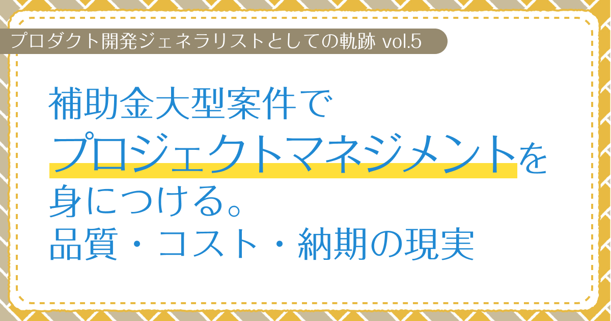

# 補助金大型案件でプロジェクトマネジメントを身につける。品質・コスト・納期の現実　【プロダクト開発ジェネラリストの軌跡 第5回】

## はじめに

### あなたは誰ですか？

初めましての人は初めまして。すでに私の記事を見ていただいたことがある人はこんにちは。  
プロダクト開発ジェネラリストのぐみです。

### 今回はどんな記事なの？

前回は、複数職種を並行して担当した時期の経験と、視点切り替えの価値についてお話ししました。  
今回は、5年間にわたって毎年新しい補助金を申請し、文化庁・観光庁の補助金を活用した大型プロジェクトを継続的に運営した経験について振り返ってみたいと思います。

このプロジェクトで、プロジェクトマネジメントの本格的なスキルを身につけることができました。

<!-- TOC -->

## 大型補助金案件への挑戦

### プロジェクトの全体像

これまでの経験を活かして、今度は文化庁・観光庁の補助金を活用した大型プロジェクトに参加することになったんです！  
三浦半島・鎌倉エリアの文化財を題材にした、デジタル歴史体験コンテンツの企画・開発プロジェクトでした。  
WEBサイト、ARマンガ、VR体験、3Dモデル、アニメーション動画、音声ガイドシステムなどなど、毎年違うタイプの制作物を作っていく感じで、1年ごとにプロジェクトが進んでいく構成だったんです。  

で、なんと最大7ヶ国語対応っていう、私にとって初めてのビッグスケール！プロジェクト自体は地域振興とか歴史文化の発信が目的だったんですが、正直その辺りはあんまり深く考えてなくて（笑）、「うわー、こんな大きな案件、どうやって回していこう？」っていうワクワクとドキドキの方が強かったですね。

最初は「私にこんな大きなプロジェクト、本当にできるかな？」って不安もあったんですが、「やってみなきゃ分からないし、面白そう！」って感じで飛び込んでみることにしました！

### プロジェクトの総合的な役割

このプロジェクトでは、プロジェクトマネージャー、エンジニア、デザイナーの3つの役割を並行して担当することになりました。  
特にプロジェクトマネージャーとしての上流工程に関わるのは、私にとって初めての体験で、とても新鮮で刺激的な挑戦でした！

## 複数制作物の進捗管理と品質保証

### ガントチャートを活用した管理手法

一番最初に頭を悩ませたのが、「うわあ、これどうやってスケジュール管理すればいいの？」っていう問題でした。

このプロジェクトでは、ARマンガ、VR体験、音声ガイド、WEBサイトなど、それぞれ制作工程も必要な人材も全然違う制作物を同時並行で進めなきゃいけなかったんです。でも、翻訳のタイミングはできるだけ合わせる必要があるっていう制約もあって、もう本当にパズルみたいでした。

そこで思いついたのが、Excelを使ったガントチャート風の管理方法です！横軸を週単位にして、縦軸に各制作物をずらっと並べることで、バラバラな性質の制作物でも進捗と納期が一目で分かるようにしたんです。

これがめちゃくちゃ効果的で、各制作物がどう関連してるのか、どの作業が遅れるとプロジェクト全体がヤバくなるのかが一目瞭然になりました。翻訳作業のタイミング調整もスムーズになって、関係者のみんなとの連携もグッと良くなったんです！

最初は「こんなに複雑な管理、私にできるかな…？」って正直ビビってたんですが、可視化してみると意外と全体の流れが見えてきて、トラブルの予兆も早めにキャッチできるようになりました。

### 関係者間の調整力

定期的な進捗同期とスケジュール調整は、プロジェクトの成功に直結する重要な要素でした。  
制作会社、翻訳者、クライアント、各寺社の関係者など、もう本当にたくさんのステークホルダーとの調整が必要だったんです！

最初は担当窓口がバラバラで、「えっと、これは誰に確認すればいいんだっけ？」って混乱することもしょっちゅうでした（笑）  
でも、だんだん「この件はあの人、あの件はこの人」っていう風に、どの分野でどの人に決定権があるのかが分かってきて、確認事項ごとにピンポイントで連絡できるようになったんです。

あと、専門家の先生方や寺院の方々にも監修をお願いすることが多かったんですが、皆さん本当にお忙しくて、返答をいただくのに時間がかかるのは当然のことでした。  
なので、「きっと修正が入るよね〜」っていう前提で実装を進める作戦に切り替えたんです！これが意外とうまくいって、スケジュール的にも余裕ができました。

正直、最初の頃は調整がうまくいかなくて、「うわー、どうしよう…」って夜中まで電話会議をすることもありました。  
でも、だんだん関係者の皆さんとのコミュニケーションのコツをつかんでいくと、信頼関係も築けて、「あ、今回はスムーズに進んでる！」って実感できるようになったんです。

## プロジェクトマネジメントで学んだこと

### コミュニケーションの質

いろんなステークホルダーの皆さんとの調整を通じて、コミュニケーションの質がプロジェクトの成功を左右するんだなーって本当に実感しました！  
定期的な進捗報告とか、分かりやすい要件定義、そして適切なフィードバックループを作ることで、関係者の皆さんとの信頼関係をちゃんと築けるようになったんです。

最初はね、技術的な話ばかりペラペラしゃべっちゃって、関係者の方々に「えーっと、何を言ってるか分からないんですが…」って困った顔をされたこともありました（笑）  
でも、だんだん相手の立場に立って説明することを覚えて、「あー、今日はスムーズに話が進んだな〜」って感じで、コミュニケーションが円滑になっていったんです！

前回お話しした「視点切り替え」が、ここでも本当に大活躍でした！  
ビジネス側と開発側の視点をパッパッと切り替えることで、クライアントさんや関係者の皆さんとの連携が格段に良くなったんです。  
技術的な課題を「こうすればこんなメリットがありますよ〜」ってビジネス的な価値として説明したり、逆にビジネス要件を「技術的にはこういう制約があるので…」って理解してもらったりすることで、「なるほど、そういうことね！」って納得してもらえる建設的な議論ができるようになりました。

### プロジェクトマネージャーとしての成長

#### 技術優先から予算管理への転換

最初の1年目は、技術的な完成度や品質ばかりに目が向いちゃって、コストのこと？正直全然考えてませんでした（笑）  
「とにかく良いものを作るぞー！」っていう気持ちで、お金のことは後回しにして突っ走ってたんです。

でも、5年間っていう長期プロジェクトを続けてるうちに、「あ、予算管理って超大事じゃん！」ってことを痛感するようになりました。  
補助金の総額から会社が受注してる予算が決まってるから、制作費をちゃんと管理しないとヤバいっていうことに気づいたんです。

補助金っていう限られた予算の中で、「このARマンガにいくら使って、外注にはいくら使って…」っていう配分を考えるのが、想像以上に頭を使う作業でした！  
技術的には「これもできる！あれもできる！」って思っても、コスト的に「いや、それは無理でしょ…」っていう選択肢は泣く泣く諦める必要があるんだなーって学びました。

プロジェクトが進むにつれて、「この機能って本当に必要なのかな？」「もっとお金をかけないで済む方法はないかな？」って常に考えるクセがついたんです。  
最初は「できることは全部やっちゃおう！」って思ってたんですが、現実的な視点も大切だよねーっていうことが分かりました。

#### 建設的な提案力と関係性の維持

コスト意識を持つようになったおかげで、「無理のない範囲で良いものを作る」っていう、より現実的で持続可能なプロジェクト運営ができるようになったんです！  
技術者としてだけじゃなくて、ビジネスパーソンとしての視点も身につけることができたと思います。

最初の頃はリソースがカツカツで、「もうしんどい」「これはできない」って正直に言ってしまい、関係者との関係が悪くなってしまう場面もありました。  

でも、さらに成長していく中で、「難しい」と直接伝えるのではなく、プロジェクトの目的に沿った形で自然に不要な要求を避ける技も身につけました。  
「この機能はプロジェクトの目的からすると優先度が低いので、まずはコアな部分から作っていきましょう」とか、「変更が入ることを想定して、柔軟な実装にしておきましょう」とか、建設的な提案をするようになったんです。

これが意外と効果的で、関係者も「なるほど、確かにそうだね」って納得してくれることが多くなりました。  
直接的な拒否よりも、プロジェクトの成功に向けた建設的な提案の方が、関係性を保ちながら良い結果を生むということを学んだんです。

### プロジェクト成功の現実的な定義

5年間のプロジェクトを通じて、「プロジェクトの成功」について新しい視点を得ることができました。

品質とコストについては、チーム内での努力とノウハウ蓄積により、毎年確実に向上させることができました。  
でも、納期については正直なところ、思うようにいかないことが多かったんです。

主な原因は、クライアント側の素材提供の遅れ、翻訳の遅れ、関係者の確認遅れ、文章の度重なる修正など、外部要因によるものがほとんどでした。  
最初は「なんで予定通りに進まないんだろう？」とイライラすることもありました。

でも、この経験を通じて「プロジェクトの成功」の定義を再考する必要があることを学んだんです。  
技術的な品質とコスト管理は自分たちでコントロールできるけれど、外部依存の納期は制御が困難だということが分かりました。

完璧な納期管理を追求するよりも、品質とコストを優先し、関係者との信頼関係を築くことの方が、長期的なプロジェクトの成功につながるということを実感しました。  
「今回は遅れたけど、来年はもっと良いものを作りましょう！」という前向きな関係性を維持できたことが、5年間継続できた理由だと思います。

### 継続的な改善の姿勢

5年間にわたってクライアントが毎年新しい補助金を申請し、1年ごとのプロジェクトを継続的に運営する中で、継続的な改善の姿勢の重要性を学びました。

技術的な改善だけでなく、プロセス改善、品質向上、ユーザー満足度向上など、様々な観点から改善を継続的に行うことで、プロジェクトの価値を最大化できました。

毎年新しいプロジェクトとして制作を続ける中で、前年度の制作物の品質や課題を踏まえて、次年度により良い制作物を作るための改善点を検討する必要がありました。  
この経験を通じて、継続的な品質向上と改善のサイクルを実践的に学ぶことができました。

「完璧なプロジェクト」なんて存在しないんだな、と実感しました。  
小さな改善を積み重ねることで、確実に良いものになっていくということを学んだんです。

## おわりに

この大型補助金案件での経験は、私のキャリアにおいて最も貴重な学びの一つでした。

プロジェクトマネジメントの本格的なスキルを身につけることができ、ジェネラリストとしての総合的な能力を大きく向上させることができました。

次回は、自社プロダクトの立ち上げについてお話ししたいと思います。