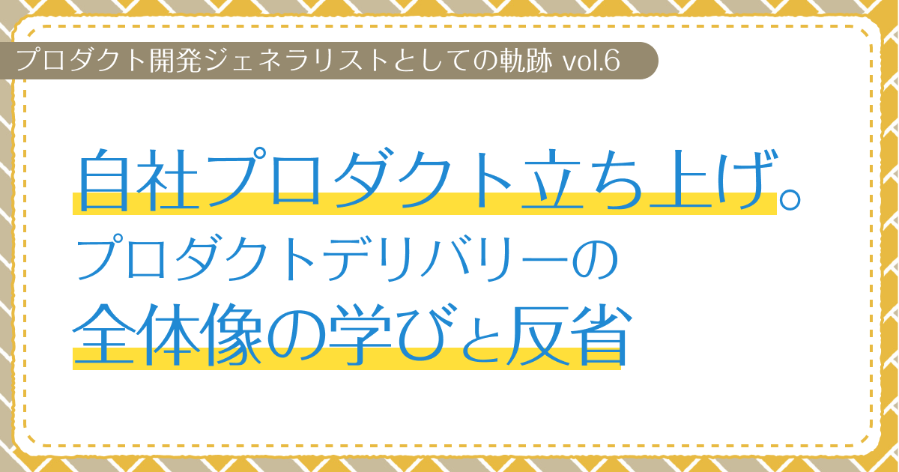

# 自社プロダクト立ち上げ。プロダクトデリバリーの全体像の学びと反省　【プロダクト開発ジェネラリストの軌跡 第6回】

## はじめに

### あなたは誰ですか？

初めましての人は初めまして。もう読んだことあるよって人はこんにちは。  
プロダクト開発ジェネラリストのぐみです。

### 今回はどんな記事なの？

前回は、大型補助金案件でのプロジェクトマネジメント経験と、品質・コスト・納期の現実についてお話ししました。  
今回は、これまでの経験を活かして自社プロダクトを立ち上げた話を、ゆるっと振り返ってみます。

クライアントワークとは全く違う世界で、プロダクト開発の全体像やPMFの重要性をグッと実感する、かなり大きな学びになりました。

**※この記事は長めですが、自社プロダクト立ち上げの全体像を一つの記事にまとめています。時間があるときにゆっくり読んでいただければと思います。**

<!-- TOC -->

## 自社プロダクト立ち上げへの挑戦

### プロダクト立ち上げプロジェクトへの参加

コロナ禍で受注案件が途切れたタイミングで、自社プロダクトの立ち上げを行うことになりました。

実は、私は学生時代にスタートアップの立ち上げ時のお手伝いもしていたので、自社プロダクトの立ち上げという新しい挑戦にも、それほど違和感はありませんでした。

メンバー3〜4人の小さな会社だったので、自社プロダクトの立ち上げに参画するのは自然な流れでした。時期的にも受託案件が減少していたため、自社プロダクト開発に集中できる時間的な余裕もあったんです。「よし、これを機に新しいことにチャレンジしてみよう！」って感じで、前向きに取り組むことにしました。

### プロダクトの概要

プロダクトのアイデアは、社長が発案してくれたものでした。

コロナ禍でのリモート授業やオンライン会議が普及する中で、カメラオフの問題や、カメラ授業での課題が浮き彫りになったんですよね。

そんなニーズに対して、顔を映さなくてもコミュニケーションが取れる仮想カメラアプリの開発を進めることにしました。

VTuber制作で培った技術を活かせる可能性もあって、「これなら今までの経験も活かせそう！」って感じで開発を進めることになったんです。

#### MVPでの実装

具体的には、カメラを映さなくてもコミュニケーションができるツールとして、スタンプを仮想カメラに映して意思疎通をできるものを作ったんです。

MVPの時には、ZoomやTeamsなどの各種ビデオ通話ツールでリアクションやアバター機能がまだ存在しない時期だったので、この機能は結構画期的だったと思います！

アバター技術は本格リリース時に導入したもので、MVPの段階では「まずはシンプルに！」ってことで、スタンプ機能に絞って開発を進めることにしました。

## MVP開発での学び

### 最小限の機能で始める重要性

最初から「まずは最小限の機能でユーザーの反応を見てみよう」という考えで開発を始めました。

「本当に必要とされている機能は何なのか、実際に使ってもらってから決めよう」
「核となる価値を最初にシンプルに伝えることが大切」

そんな風に考えて、本当にコアな機能だけに絞ったバージョンを作ることにしたんです。

当時は「MVP（Minimum Viable Product：最小実行可能製品）」という言葉は知らなかったのですが、今振り返ると、まさにMVPの考え方で進めていました。

そんな判断を繰り返しながら、MVPを完成させることができました。

まずは知り合いの方々にMVPを使ってもらって、フィードバックをもらいながら改善を重ねていったんです。

## 技術的な役割の経験

### UIUX設計とサーバー開発

自社プロダクト開発では、UIUX設計からサーバー開発まで、技術面も幅広く担当することになりました。

これまでの経験で培った「技術的な知見」と「ユーザー視点」を両方活かして、使いやすく安定したプロダクトづくりを意識して取り組みました。

技術的な制約を踏まえたUIUX設計や、ユーザビリティを意識したサーバー設計、パフォーマンスと使いやすさのバランスに気を配ったんです。

こうした幅広い領域を担当することで、多角的な視点で総合的な技術判断もしやすくなりました。

### テスト設計の考え方

プロダクトの改善アップデートのたびに既存機能の不具合を連発してしまっていたので、「これはヤバい、テストをちゃんとやらないと！」ってことで、テストの重要性に気がつきました。

ちょうどソフトウェアテストをしている友達がいたので、その人に考え方を教えてもらって、テスト計画を作ってテスト一覧表も作ったんです。

こうした取り組みを通じて、プロダクトの信頼性を高める大切さを学びました。

## ユーザーとの向き合い方

### ユーザーとのコミュニケーション戦略

ユーザーとの向き合い方は、メール問い合わせ対応やSNSでの交流、Discordサーバーでのコミュニケーションを軸に進めました。

特に無料ダウンロードできるアプリだったので、どんな人がユーザーになっているのか実際に把握するのが難しかったんです。そこで、ユーザーの声を聞くことを大事にしていました。

SNSやDiscordサーバーで実際のユーザーセグメントを把握することができて、プロダクトの方向性やマーケティングの方針にも反映できました。

### カスタマーサポートの実践

メール問い合わせをくださる方は熱量の高い良いユーザーなので、大事にすることを心がけました。

問い合わせの背景や状況をしっかり確認しつつ、複数の解決策を提案するようにしたんです。技術的な話を分かりやすく伝えたり、本音を引き出す問いかけを工夫したり、建設的なフィードバックをもらえる関係づくりを意識して取り組みました。

カスタマーサポートを通じて、ユーザーの生の声を聞くことができて、プロダクトの改善点が明確になりました。また、直接的なコミュニケーションを通じて、ユーザーとの信頼関係を築くことの重要性も実感したんです。

### ユーザーフィードバックの活かし方

ユーザーからのフィードバックは、本当にありがたいものでした。

「こういう機能が欲しい」「この部分をもっと改善してほしい」「こんな風に使いたいけどうまくできない」といった建設的な意見をたくさんいただけたんです。

環境設定のトラブルや使い方の質問も多く、同じ機能について繰り返し質問が来ることで「ここが分かりづらいんだな」と気づくことができました。そういう部分は積極的に改善していきました。

こうしたユーザー起点での改善を続けることで、プロダクトをより良いものにしていくことができました。

ユーザーの声を真摯に受け止め、一つずつ改善を重ねることで、プロダクトの価値を着実に高めていったんです。

## 現実的な成果と学び

### 継続運用の実現と現実的な成果

継続的な改善とユーザーからのフィードバックを活かすことで、小さく運用し続けることができるレベルには到達できました。

ユーザー数は約6000人、DAU（日次アクティブユーザー）は数十人という現実的な数字でした。

完全な成功ではないけれど継続運用はできていて、少数のユーザーに確かな価値を届けることができ、改善次第で伸びしろもある——そんな手応えを感じる現実的な成果につながったんです。小さくても前に進んでる感じが、うれしかったですね。

この経験から見えてきたのは、「今回はPMF（Product Market Fit：プロダクトマーケットフィット）までは至らなかった」という現実でした。継続的に改善はしていたけれど、プロダクトと市場の噛み合いが決定的には起きなかったんです。だからこそ、次に挑戦するときは、最初期の仮説検証と焦点の絞り方をもっと丁寧に設計しようと思えました。

### Core（ミッションやビジョン）,Why（誰がどんな状態にしたいのか）の重要性

今振り返ると、自社プロダクトで食べていきたいという思いはあったんですが、ミッションやビジョンをチームでちゃんと共有できていなかったなという課題がありました。

「なぜこのプロダクトを作るのか？」
「どのような価値を提供したいのか？」
「どのような未来を実現したいのか？」

そんな根本的な問いへの答えを、言葉にして資料に落とせていなかったんです。

今なら、ちゃんと言葉にして資料化しておくべきだったなって思います。ミッションやビジョンが曖昧だと、方向性や優先順位の判断もぶれがちになってしまうんですよね。

セグメントごとに伝え方が変わるのは自然なことなので、それ自体は問題ありませんでした。でも、特にしんどかったのは新機能を入れるときに「誰に向けた、何の課題解決なのか」を明文化できていなかったことでした。

ここが曖昧だと、いざ出来上がったときに「誰が使うの？」「本当に需要あるの？」ってなりがちで、開発リソースを無駄にしてしまうことも多かったんです。

## ジェネラリストとしての強み

### ジェネラリストとしての多角的視点

自社プロダクトの立ち上げを通じて、ジェネラリストとしての強みを改めて実感することができました。

技術的な視点でプロダクトの実現可能性を判断したり、
ビジネス的な視点で市場性を評価したり、
ユーザー視点で使いやすさを検討したり、
プロジェクトマネジメントの視点で開発スケジュールを管理したり——。

こんな風に多角的な視点を持つことで、一つの判断に対して色んな角度から検討できるようになって、総合的な判断がしやすくなったんです。

### マーケティングの取り組み

プロダクトの認知・獲得・継続利用につなげるため、マーケティングにも取り組みました。

プレスリリースや記事掲載を活用しつつ、公式SNSやコミュニティでの発信を地道に続けていったんです。LPや導線を整えて使い始めやすくして、各施策の効果検証と学習サイクルを回していきました。

これらの取り組みは新規ユーザーの獲得だけでなく、既存の顧客にも機能を周知することにもつながったんです。

そんな経験を通じて、プロダクトの価値を伝えるだけじゃなくて、実際の利用につなげる重要性を学ぶことができました。

ユーザーとの向き合いを通じて身につけた「ユーザー起点の思考」や「データドリブンな意思決定」は、これからのプロダクト開発でも絶対活きるはずです。今は転職活動中なんですが、その強みは次の環境でもちゃんと活かしていきたいと思っています。

## おわりに

自社プロダクトの立ち上げは、私のキャリアの中で一番挑戦的で、一番学びが多い経験でした！

プロダクト開発の全体像とPMFの重要性を深く理解できて、ジェネラリストとしての強みも再確認することができました。

### プロダクト開発からデリバリーまでの全体を捉える

この経験を通じて、プロダクト開発からデリバリーまでの全体像を捉えることができたなと思っています。

「企画・設計段階」での市場調査と要件定義
「開発・実装段階」での技術選定とMVP開発
「リリース・運用段階」でのマーケティングとユーザー獲得
「継続的改善段階」でのデータ分析とプロダクト改善

各段階の課題と対応策を実際に踏むことで、プロダクト開発の全体像を深く理解することができました。

これまでのシリーズで培ったジェネラリストとしてのスキル（技術、デザイン、プロジェクトマネジメント、コミュニケーションなど）が、自社プロダクトという「自分のプロダクト」で総合的に発揮されて、プロダクト開発の全体像を実践的に理解できたことは、本当に貴重な経験でした！

### 少人数体制の限界と役割分担の重要性

また正直なところ、PdM（仮説検証）・デザイン・開発・CS・マーケティングまでを少人数で兼務するのは無理があるとも感じました。

短期的には走り切れても、中長期では体力面でも判断・集中の面でも持続が難しくて、役割分担や開発サイクル（ペース配分）の設計の重要性を痛感したんです。

特に多岐にわたる領域の役割を兼任すると、各分野を専門的に高度化する時間が足りなくて、プロダクトデリバリーの全領域で一貫して質を引き上げることは難しいと感じました。

本シリーズ「プロダクト開発ジェネラリストの軌跡」は本記事で一区切りです。  
ここまで読んでくださった皆さま、ありがとうございました！読んでくれる人がいるから、書き続けることができましたー！

本文では書ききれなかった具体的な工夫や施策（開発進行管理、UIUX改善、CS運用、マーケティングの検証など）は、今後個別の記事で掘り下げていきます。

ここまで読んでくれて本当にありがとうございました。引き続き、別の形で発信していきます！
