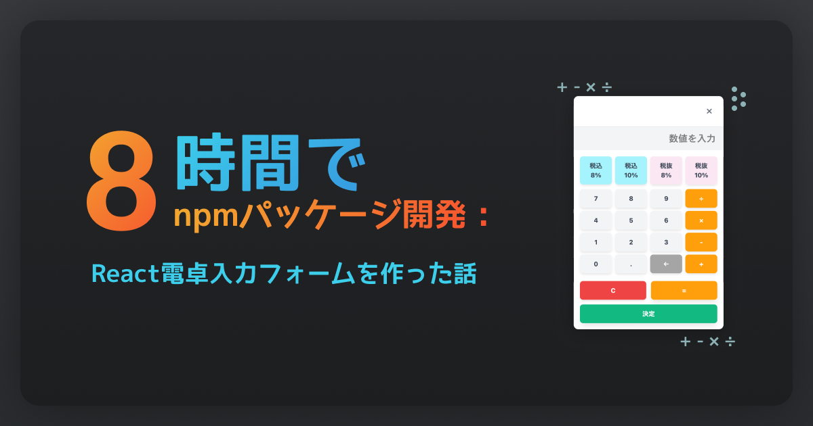

# 【npm公開まで8時間】思い立ったらすぐ動く：React電卓入力フォームを作った話

こんにちは、**個人開発者として活動している ぐみ** です。

先日、`@gumigumih/react-calculator-input-form`という、React用の電卓付き入力フォームプラグインをnpmに公開しました！

今回は、「思い立ったらすぐ動く」を合言葉に、アイデアから実装、公開まで8時間で完了させた開発プロセスと、その中で得た学びについて書いてみますね。

実は、私は過去に「やり始めるのに時間がかかる」「完璧を求めて結局放置してしまう」という経験が多くありました。今回はそんな経験を踏まえて、「まず動かす」ことを最優先に開発を進めてみたんです。

この記事では、プラグイン開発のきっかけから公開まで、実際にどのような手順で進めたのか、そして継続的に手を動かし続けるために工夫したポイントをまとめています。

## 思い立った背景と最初の一歩

実はですね、このプラグインを作ろうと思ったのは、私が開発してる2つのアプリがきっかけだったんです。

**開発時間はなんと約8時間！** 「今必要な最小限」に絞って、一気に作り切っちゃいました。

**そして、これが私の初めてのnpmパッケージなんです！** 🎉

入力コンポーネント自体は世の中にめちゃくちゃたくさんあるんですけど、「電卓みたいにその場で計算までしてくれる数値入力」って見当たらなかったんですよね。合計や税計算を毎回毎回実装する手間をなくしたくて、「入力と計算を一体化した部品」を自分で用意することにしたんです。

### 「わりまる」と「わけたべ」での共通課題

- **わりまる**: 複数人での支払い割り勘アプリ
- **わけたべ**: 料理ごとの詳細割り勘アプリ

どっちのアプリでも、金額入力のUIをいちいち一から実装してたんですよね。電卓機能とか、税計算とか、数値フォーマットとか... 似たような機能を毎回毎回作るのって、正直めっちゃ面倒だったんです。

「これ、うまく共通化できないかな？」って思ったのがそもそものきっかけでした。

この辺りから、どうやって最短で形にしたのか、その進め方を具体的に書いていこうと思います。

## 8時間の具体的な進め方

### ステップ1：目的の言語化と「やらないこと」決め

まず最初に「何を作るか」を一文でざっくり書いちゃいました。「アプリの入力部品をReactプラグインにする。機能追加は税率だけにする。」みたいな感じですね。これやっとくと迷いがめちゃくちゃ減るんです。

### ステップ2：触れるデモ完成

「わりまる」で既に作ってた電卓入力の仕組みをそのまま流用して、「入力→計算→表示」を一本で通す最小版をとりあえず作っちゃいました。ゼロから作るんじゃなくて、既存のものをうまく活用したので、割とサクッと動くものができたんです。この「まず動かす」っていうのが一番大切だったなって思います。

### ステップ3：使いやすさの調整

動くものができたので、次は使いやすさをちょっと整えてみました。オプション設定を追加して、ユーザーが自分の用途に合わせてカスタマイズできるようにしたんです。でも「完璧にしよう」とは思わずに、「最低限使える」レベルで止めておきました。

### ステップ4：説明の準備

使い方を説明する文章をサクッと書きました。でも全部は書かずに、「誰が使うか」「何ができるか」だけに絞ったんです。細かい説明は後で追加すればいいや、って割り切っちゃいました。

### ステップ5：公開

最後に、配布できる形に整えて公開しました。バグがあるかもしれないけど、「まず出してみる」ことを優先したんです。

## とりあえず手をつけるコツ

### 簡単なことから始める

最初から完璧なものを作ろうとしないで、とりあえず動くやつを作っちゃうんです。「入力→計算→表示」がちゃんと繋がってるだけの超シンプル版から始めたんですけど、これが動いた時の「おお〜！」って感じがめっちゃ良いんですよ。この瞬間があるかないかで、その後のモチベーションが全然違うんです。

### マイルストーンに分けて目標を低くする

いきなり「完璧なプラグインを作るぞ！」って思っちゃうと、何から手をつけていいか分からなくなっちゃうんですよね。なので今回は30分、3時間、5時間、6時間、8時間みたいに細かく区切って、「とりあえずここまでできたらOK！」っていう低めのハードルを設定したんです。これやると迷いが激減して、手がめっちゃ動くようになるんですよ。

### 集中してその日にやりきる

私、「今日やるって決めたら今日中にやりきっちゃう」っていうのをすごく大事にしてるんです。途中で「今日はここまで〜」って止めちゃうと、次の日に「あれ、前回何やってたっけ？」「何しようとしてたんだっけ？」ってなって、結局手が止まっちゃうんですよね。今回は8時間ぶっ通しで集中して取り組んだおかげで、迷いなく最後まで駆け抜けることができました！

## 動いて得られたこと

### 1. 手応えが生まれた

小さく始めて連続して手を動かし続けたら、こんな手応えが生まれちゃいました：

- 8時間で形にできた達成感（めっちゃ気持ちいい！）
- とりあえず手を動かすことの効果を実感（これ本当にすごいです）
- 完璧を求めすぎないことの効果を体感（これも大事だなって思いました）

### 2. 学びが得られた

作ってみて、こんな気づきがありました：

- 既にある仕組みを借りることの効率性を理解（車輪の再発明しちゃダメ）
- 小さなマイルストーンを設定することの効果を体感（これマジで効く）
- 迷ったら最低限を目指すことの重要性を実感（完璧主義は敵）
- 集中して一気にやりきることの効果を実感（途中で止めないのがコツ）

## 次にすぐやること

### 短期目標

- 誰か使ってくれたらいいな〜（ちょっとドキドキ）
- 気づいた小さな問題をその場でサクッと直す

### 長期目標

- もっとたくさんの人に使ってもらえるようにしたい
- 他の人にも「すぐ動く」のコツを伝えていきたい

## 作ってみての感想

### とりあえず手を動かすことの効果

最初は「うわ〜大変そう...」って思ってたんですけど、実際に手を動かしてみたらめっちゃ楽しかったんですよ！

**約8時間で完成できたのは、本当に楽しかったからなんです！** 集中して作業してると、気がついたら時間が経ってるっていう、あの感覚。久しぶりに味わえました。

### 完璧を求めすぎないことの大切さ

最初は「完璧なものを作らなきゃ！」って思ってたんですけど、完璧を求めすぎると、いつまで経っても完成しないんですよね〜。

「まずは動くものを作って、使ってもらいながら改善していけばいいじゃん」っていうアプローチが、結果的に一番良かったなって思います。これ、他のことにも応用できそう！

## まとめ

「思い立ったらすぐ動く」は、勢いだけで突っ走る話ではなく、最小で始めて、使いながら育てるための姿勢だと感じました。

とりあえず手を動かし続けることで、結果として8時間での公開を実現できました。

技術的な知識がなくても、「まず小さく始める」「完璧を求めすぎない」「迷ったら最低限を目指す」は、どんなことにも使える考え方だと思います。

次は、使ってもらった人の声をもとに、また小さく進んでいきます。

最後まで読んでいただき、ありがとうございました！
もし気に入っていただけましたら、ぜひシェアをお願いします。

また、ご意見・ご要望などございましたら、お気軽にコメントください。

---

📚 **関連リンク**

- [npmパッケージ](https://www.npmjs.com/package/@gumigumih/react-calculator-input-form)
- [GitHubリポジトリ](https://github.com/gumigumih/react-calculator-input-form)
- [わりまる（複数人での支払い割り勘）](https://warimaru.meggumi.com/)
- [わけたべ（料理ごとの詳細割り勘）](https://waketabe.meggumi.com/)

---

最後まで読んでいただき、ありがとうございました！
もし気に入っていただけましたら、ぜひシェアをお願いします。

また、ご意見・ご要望などございましたら、お気軽にコメントください。
