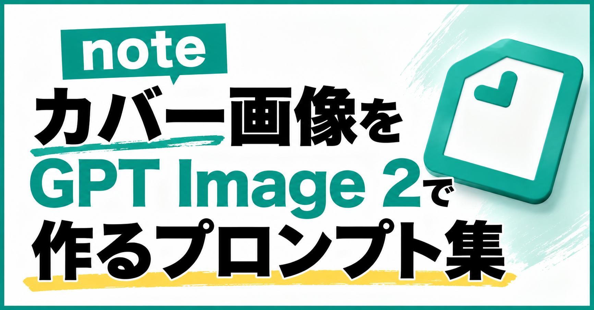

# noteカバー画像をGPT Image 2で作るプロンプト集

こんにちは、ぐみです。

**noteの記事を書き終えて、「よし、できた！」と達成感に浸っているとき。**  
ふと手が止まってしまう瞬間、ありませんか？

それが、**「カバー画像」** です。

本文を書き上げた時点で、気持ちとしてはかなり満足しています。  
しかし、いざ投稿しようとすると「あ、カバー画像も作らなきゃ」と思い出す。

タイトルをどう入れるか、  
記事の雰囲気とどう合わせるか、  
タイムラインで流れてきたときに、パッと目を引くものになっているか……。

毎回のこととなると、これが **意外と手間がかかる** んですよね。

特に、有料記事を書こうとすると、カバー画像の印象はいつも以上に気になります。

本文の内容に自信があっても、一覧で見たときの第一印象が弱いと、  
そもそも読者にクリックしてもらえないかもしれない。

無料記事なら「今回はこれでいいか」と思えても、  
有料記事だと、カバー画像も含めてちゃんと整えたい気持ちが出てきます。

そこで今回は、過去に投稿した記事のカバー画像を作り直しながら、  
**「GPT Image 2で、noteに最適なカバー画像を生成するプロンプトの型」**  
を探ってみることにしました。

この記事の前半では、実際に過去記事のカバー画像を作り直した流れを紹介します。

後半の有料部分では、すぐ使える形に整理した、

- 基本プロンプト
- 記事ジャンル別のプロンプト例
- 生成後の修正指示テンプレート
- 投稿前チェックリスト

をまとめています。

無料部分では、実際に作り直した流れと気づきを中心に紹介します。

「カバー画像づくりに毎回時間を使ってしまう」  
「有料記事の見た目をもう少し整えたい」  
という方の参考になればうれしいです。

---

## なぜ過去記事を題材にしたのか

いきなり新しい記事で試行錯誤するよりも、  
**すでに中身が完成している過去記事** をベースにする方が、検証しやすいと考えたからです。

記事のテーマやメッセージは明確なので、  
「その内容をどう視覚化するか」というカバー画像作成だけに集中できます。

今回の目的は、単に「過去の画像を直す」ことではありません。  
**さまざまなタイトルの記事を題材にして、汎用的に使えるプロンプトの黄金律を見つけること** にあります。

---

## 初期プロンプト：細部へのこだわりが裏目に？

最初は、理想のイメージを具現化しようと、かなり詳細な条件を指定していました。

- タイトルを中央に大きく配置する
- 余計な細かい文字は入れない
- 情報量を極限まで削ぎ落とす
- 図解のような説明的な構成にしない
- noteのプラットフォームに馴染む、清潔感のあるデザインにする

こうした条件をプロンプトにぎっしりと詰め込み、かなり「ガチガチ」に制御しようとしていたんです。

しかし、何度か生成を繰り返すうちに、あることに気づきました。  
**条件を細かく指定しすぎると、かえってデザインの柔軟性が失われ、どこか「硬い」印象になってしまうのです。**

---

## 「ざっくり生成 → 微調整」のサイクルが最強だった

試行錯誤の末にたどり着いたのは、  
**「最初はあえて抽象的に伝え、出てきた画像を見ながら調整する」** というスタイルでした。

AIに最初から完璧を求めるのではなく、

- 「もう少し可愛らしく」
- 「もっと洗練された雰囲気に」
- 「背景は淡いパープルで」
- 「アクセントにイラストを添えて」

といった具合に、**対話を重ねるようにブラッシュアップしていく** 方が、結果的に満足度の高いものが仕上がりました。

---

## 実際に生成した画像

ここでは、実際に過去記事のカバー画像を作り直したときの画像をまとめておきます。

完成画像だけでは、どう調整して良くなったのかが見えにくいので、途中で生成した画像も一緒に置いておきます。

## AIと共に働く時代、“待ち時間”がゴールドタイムになる理由

最初は、タイトルを大きく見せることを重視して生成しました。

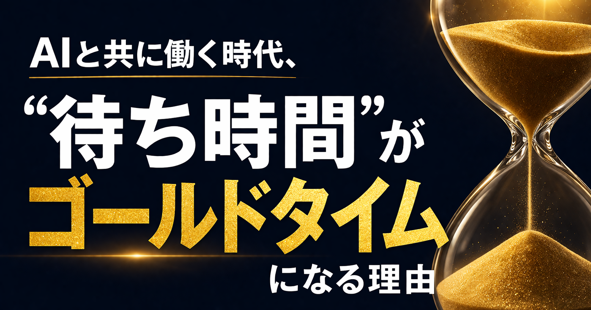

→ **「情報商材っぽく見えるので、noteに合った感じにしたい」**

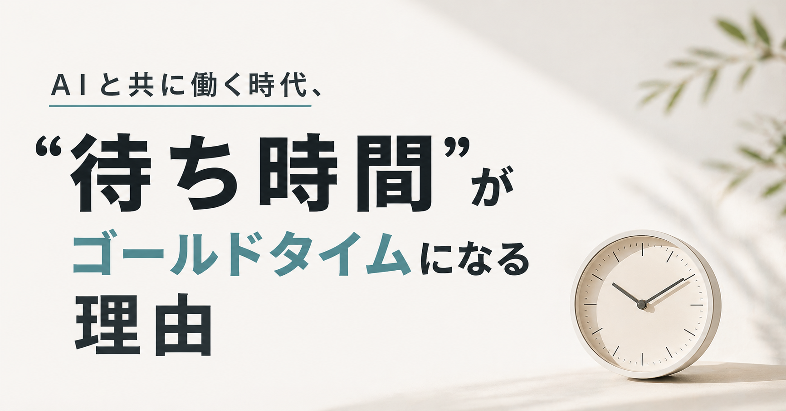

→ **「ゴールドタイムは金色にして、タイトル部分を洗練させて」**

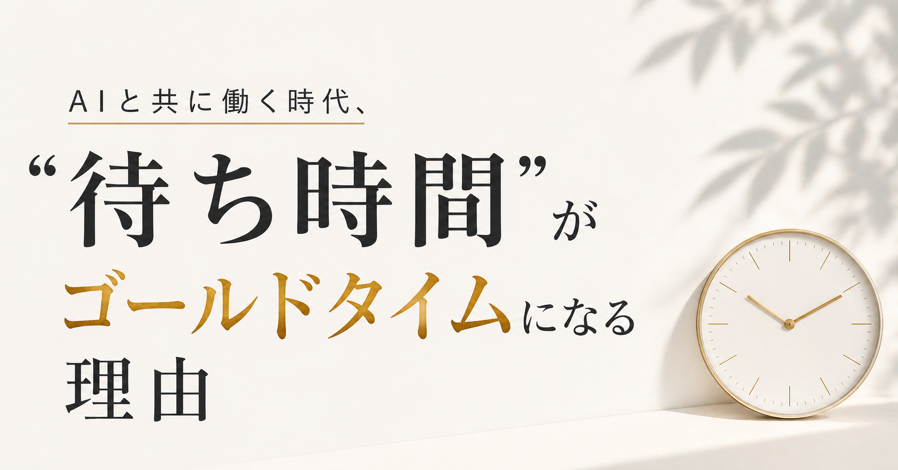

→ **「砂時計モチーフがいい」**

### 完成画像

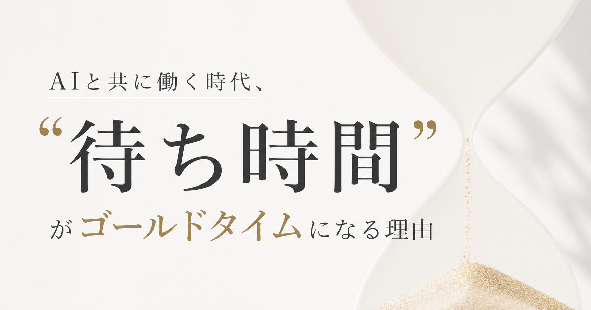

## ドキュメントは「未来のために育て続けるもの」だと思う話

こちらは、少しやわらかい読み物感を出したかった記事です。

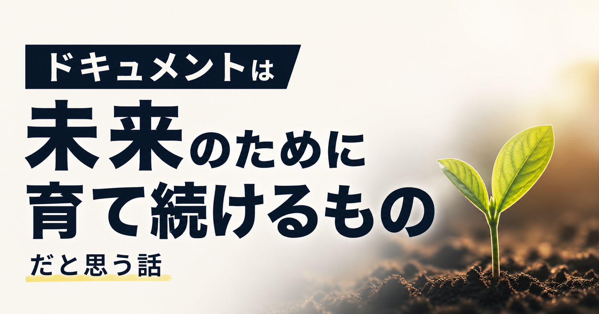

→ **「noteっぽくないので、イラストを入れたい」**

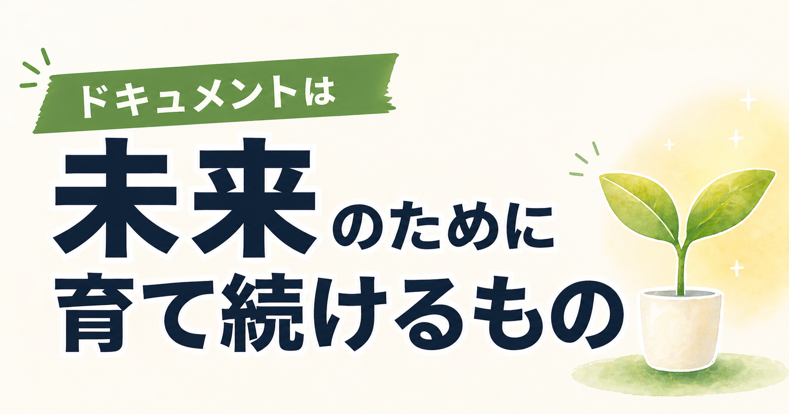

→ **「装飾をもっと入れていく？ 背景を色にする？」**

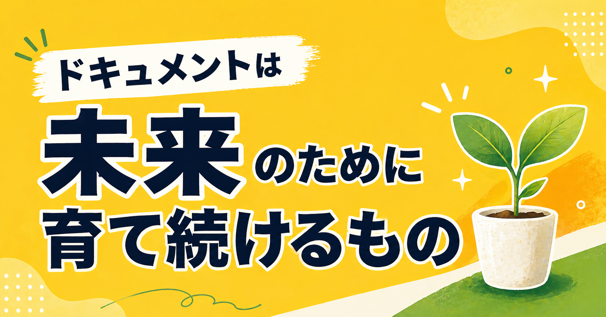

→ **「フォントをポップ体にして、『だと思う話』も追加して」**

### 完成画像

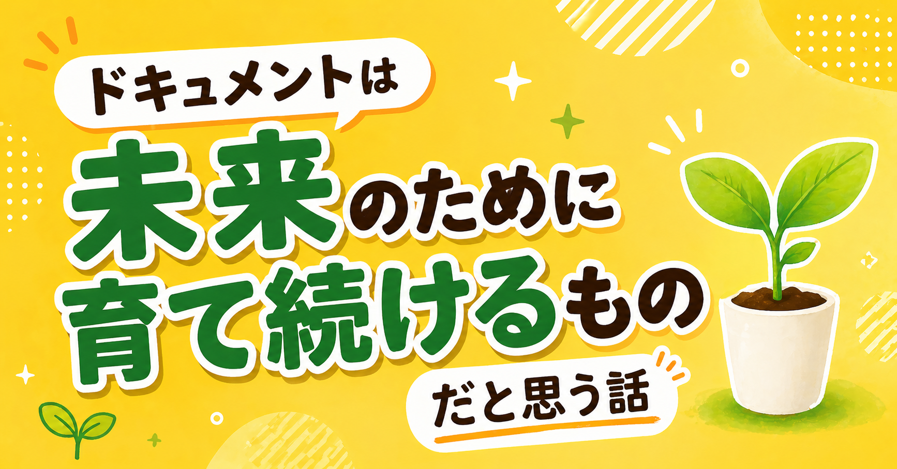


## 理想のAIプロダクト中核チームとは何か

これは、ビジネス寄りのテーマをnoteらしく見せるのが難しかった記事です。

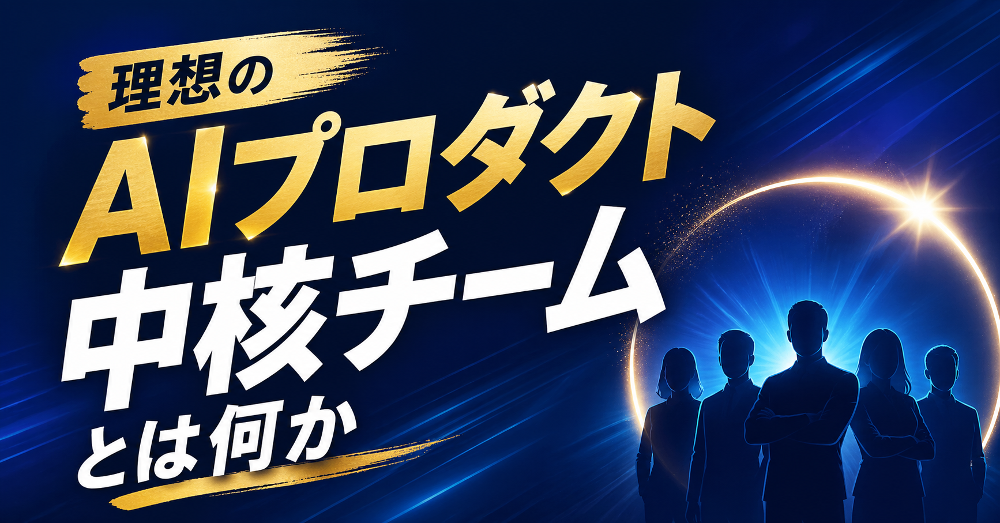

→ **「noteの記事っぽくして、」**

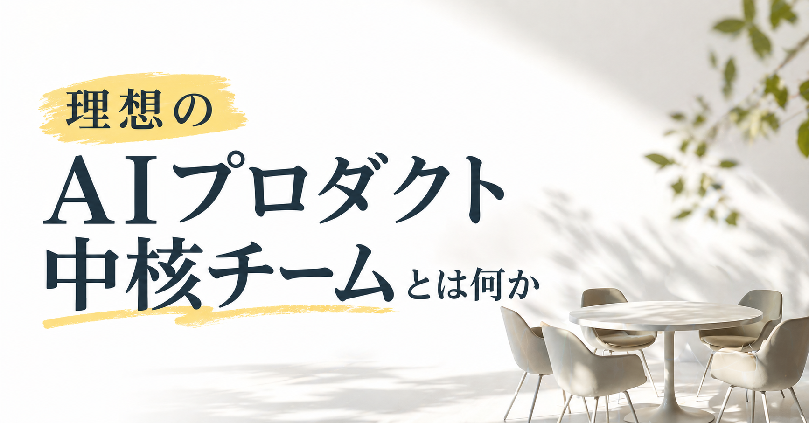

→ **「イラストを入れる方向にする、可愛い寄せにしつつ、洗練させて」**

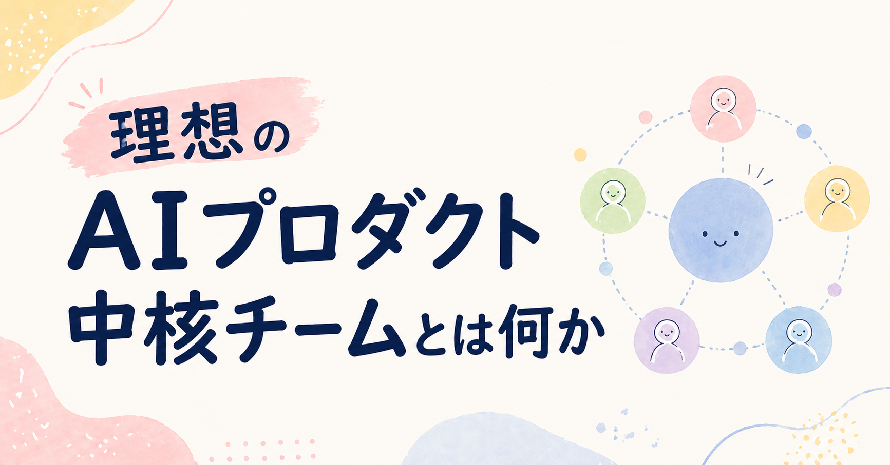

→ **「背景は薄い紫に」**

### 完成画像


---

## 最終的にたどり着いた「魔法の型」

ここから先は、実際にnoteカバーを作るときに使いやすいように、  
プロンプトの型として整理していきます。

まずは、どんな記事にも使いやすい基本形です。

<!-- note有料エリア開始位置の目安 -->

```text
note記事のカバー画像を作成してください。

【タイトル】
ここにタイトルをいれる

【サイズ】
1280 × 670 px

【目的】
noteの一覧画面で小さく表示されたときでも、
タイトルが一瞬で読めてクリックされるデザインにする

【デザイン方針】
・情報量は最小限
・タイトルを最も大きく目立たせる
・補足テキストは最小限
・「読ませる」ではなく「目を引く」ことを重視
・noteの記事らしい雰囲気にする

【NG】
・小さい文字を多く入れる
・情報を詰め込みすぎる
・図解や詳細説明を入れる
・複数コンセプトを混ぜる

```

---

## 記事ジャンル別プロンプト例

ここからは、記事の種類ごとに少しだけ調整したプロンプトです。

毎回ゼロから考えるより、  
自分の記事に近い型を選んで、タイトルだけ差し替える方がかなり楽でした。

## 体験談・エッセイ系

```text
note記事のカバー画像を作成してください。

【タイトル】
ここにタイトルをいれる

【サイズ】
1280 × 670 px

【読者に与えたい印象】
やわらかく、親しみやすく、少し感情が伝わる雰囲気

【デザイン方針】
・タイトルを大きく読みやすく配置
・背景はやさしい色合い
・人物や小物のイラストを入れて、体験談らしい温度感を出す
・情報量は少なく、余白をしっかり取る
・noteらしい自然な雰囲気にする

【NG】
・ビジネス資料のように硬くしすぎない
・文字を詰め込みすぎない
・過度に派手な広告風にしない
```

## HowTo・手順解説系

```text
note記事のカバー画像を作成してください。

【タイトル】
ここにタイトルをいれる

【サイズ】
1280 × 670 px

【読者に与えたい印象】
わかりやすく、実用的で、すぐ読んで試せそうな雰囲気

【デザイン方針】
・タイトルを最も大きく目立たせる
・背景は明るく清潔感のある色にする
・チェックリスト、ノート、PC、ペンなどのモチーフを少し入れる
・手順書っぽさは出すが、図解を詰め込みすぎない
・一覧で小さく表示されても読みやすくする

【NG】
・細かいステップや小さい文字を入れない
・複雑な図解にしない
・情報商材っぽい強い煽りにしない
```

## ビジネス・仕事術系

```text
note記事のカバー画像を作成してください。

【タイトル】
ここにタイトルをいれる

【サイズ】
1280 × 670 px

【読者に与えたい印象】
信頼感があり、落ち着いていて、仕事に役立ちそうな雰囲気

【デザイン方針】
・タイトルを大きく、読みやすく配置
・背景は白、ライトグレー、淡いブルーなど清潔感のある色
・PC、資料、チーム、付箋など仕事を連想するモチーフを控えめに入れる
・装飾は少なめにして、余白を広く取る
・noteらしい読み物感も残す

【NG】
・企業プレゼン資料の表紙のように硬くしすぎない
・派手な広告バナー風にしない
・細かい英字やグラフを大量に入れない
```

## 生成AI・ツール活用系

```text
note記事のカバー画像を作成してください。

【タイトル】
ここにタイトルをいれる

【サイズ】
1280 × 670 px

【読者に与えたい印象】
新しさ、便利さ、少しワクワクする感じ

【デザイン方針】
・タイトルを大きく読みやすく配置
・AI、チャット画面、画像生成、光、カードUIなどを連想するモチーフを入れる
・未来感は出すが、冷たすぎない雰囲気にする
・背景は淡い紫、白、ライトブルーなどを中心にする
・note記事として自然に見えるデザインにする

【NG】
・SF映画のように暗くしすぎない
・専門用語を小さく大量に入れない
・サイバー感を強くしすぎない
```

## 有料記事向け：購入前の印象を整える型

有料記事の場合は、単に目立てばいいというより、  
**「ちゃんと中身がありそう」「信頼できそう」** と思ってもらうことが大事だと感じました。

```text
note有料記事のカバー画像を作成してください。

【タイトル】
ここにタイトルをいれる

【サイズ】
1280 × 670 px

【目的】
購入前の読者に、内容の価値と信頼感が伝わる第一印象にする

【読者に与えたい印象】
実用的、信頼できる、読みやすそう、価格に見合う内容がありそう

【デザイン方針】
・タイトルを最も大きく、はっきり読めるようにする
・余白を広く取り、安っぽく見えないようにする
・強い煽り文句は入れず、落ち着いたデザインにする
・記事テーマを連想できるモチーフを1つだけ入れる
・全体として、noteの有料記事に合う上品な雰囲気にする

【NG】
・「今すぐ稼げる」などの煽り表現
・派手すぎる広告バナー風デザイン
・小さい文字を大量に入れる
・高級感を出そうとして読みにくくする
```

## 生成後の修正指示テンプレート

一発で完成させようとするより、  
出てきた画像を見ながら短い指示で直していく方がうまくいきました。

私がよく使う修正指示は、このあたりです。

```text
タイトルをもっと大きくして、一覧画面でも読みやすくしてください。
```

```text
情報商材っぽく見えるので、noteの記事に合う自然な雰囲気にしてください。
```

```text
背景をもう少し明るくして、やさしい印象にしてください。
```

```text
文字量を減らして、タイトルだけが目立つ構成にしてください。
```

```text
イラストを少し加えて、親しみやすい印象にしてください。
```

```text
全体をもう少し洗練させて、余白を広く取ってください。
```

```text
色数を減らして、落ち着いたデザインにしてください。
```

```text
タイトルの可読性を最優先にして、装飾を控えめにしてください。
```

## 投稿前チェックリスト

最後に、生成したカバー画像をnoteに設定する前に見るチェックリストです。

- タイトルは小さく表示されても読めるか
- 記事のテーマと画像の印象がずれていないか
- 情報を詰め込みすぎていないか
- 広告っぽく見えすぎていないか
- 有料記事の場合、安っぽく見えていないか
- スマホで見ても文字がつぶれていないか
- 他の記事と並んだときに、少し目に留まるか
- 自分の記事一覧に置いたとき、雰囲気が浮きすぎていないか

完璧なデザインを目指すというより、  
**「この記事を読む前の不安を少し減らせているか」** を見ると判断しやすいです。

## まとめ：詳細すぎる指定を手放して見えたこと

今回の一番の収穫は、  
**「AIに自由度を与えることで、自分では思いつかなかったデザインに出会える」**   
という発見でした。

あまり詳細に指定しすぎず、大枠の方向性だけを伝えてから、対話を重ねるように「育てていく」。  
これがGPT Image 2を使いこなすコツかもしれません。

## おわりに

「本文は書けたけど、カバー画像を作るのがちょっと重い……」  
そんな悩みは、noteを書き続けている人なら誰しも一度は感じたことがあるはず。

でも、GPT Image 2という **心強い相棒** がいれば、  
記事の最後を彩るカバー画像作りが、もっと楽しく、もっとクリエイティブな時間になるはずです。

特にこれから有料記事を書いてみたい人にとっては、  
カバー画像は「売るための飾り」というより、読者に安心してもらうための入口だと思います。

この記事のプロンプトが、最初の一歩を少し軽くする材料になればうれしいです。
