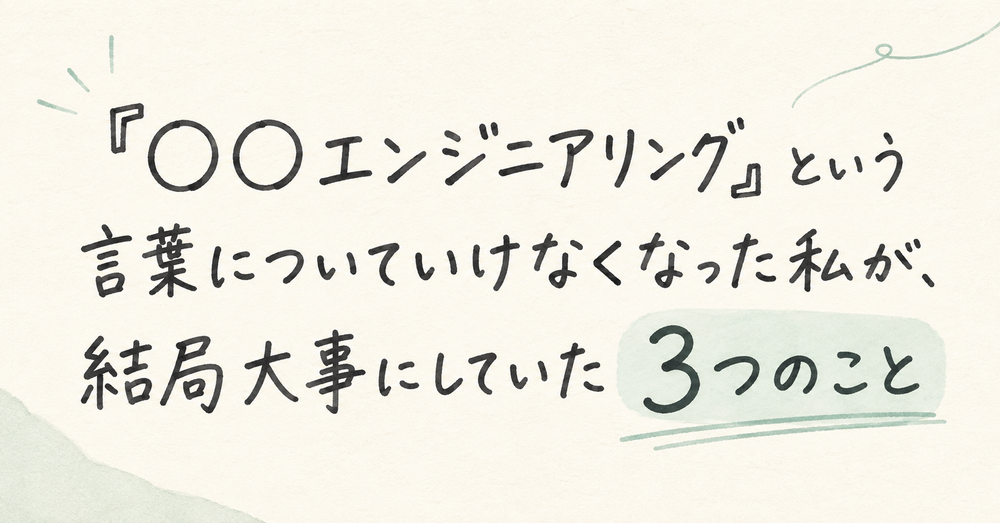

# 「〇〇エンジニアリング」という言葉についていけなくなった私が、結局大事にしていた3つのこと

AI関連のニュースを追いかけていて、正直ちょっと疲れてきました。
「プロンプトエンジニアリング」に慣れたと思ったら「コンテキストエンジニアリング」。気づけば「ハーネスエンジニアリング」、さらに「ループエンジニアリング」まで登場です。
正直、「〇〇エンジニアリング」、増えすぎ問題だと思っています😅
新しい言葉が出るたびに「勉強しなきゃ」と焦る自分と、「また名前が増えただけでは」と冷めてる自分が、いつも半分ずつ同居してる感じ。
でも、その焦りをきっかけに実務を振り返ってみたら、名前を追いかけるより大事にしていたことに気づけたので、今日はその話です。

## 気づいたら、AIとの仕事のしかたがまるっきり変わっていた

新しい用語を横目で見つつ、ふと考えました。「そういえば私自身、AIとの付き合い方ってどう変わったっけ」って。
以前は、お願いしたタスクを１回で完遂してもらえませんでした。指示を出す→結果を見る→足りない部分を指摘する→また指示を出す。この往復が当たり前だったんです。コードレビューも調査も、毎回そばに張り付いて舵取りしている感覚でした。
それが今では、１回お願いすればAI自身が「どうやったら完遂できるか」を考えながら、自律的にやりきってくれる。コードレビューを頼めば関連ファイルを自分で辿って指摘をまとめてくれるし、調査を頼めば足りない情報に気づいて勝手に追加リサーチまでしてくれます。数年前は「そこまでは無理でしょ」と思っていたことが、もう当たり前になっている。
このとき最初に感じたのは、「〇〇エンジニアリング」という名前の数じゃなくて、「自分の仕事のしかた、思ってたより早く変わってるじゃん」という素朴な驚きでした。

## 用語を整理してみたけど、答えはそこになかった。

せっかくなので、いったん用語も時系列で整理してみました。
🔗 [用語の時系列整理はこちらのZenn記事にまとめています](https://zenn.dev/gumigumih/articles/20260826_ai-engineering-terms-too-many)
ざっくり言うと、プロンプト→コンテキスト→ハーネス→ループの4つは、新しいものが古いものを置き換えているわけじゃない。AIがツールからエージェントに変わっていく過程で、まだ人間が世話をしないといけなかった部分に、順番に名前がついていっただけなんだろうな、というのが私なりの結論でした。
整理してちょっとスッキリはしたものの、正直「じゃあ明日から何をすればいいんだっけ」には、この整理、あんまり答えてくれないんですよね。用語の地図と、現場で手を動かすときの勘所は、別のレイヤーにあるものなんだと思います。

## 名前より、結局大事にしていたのはこの3つだった

用語を整理してるうちに、逆に見えてきたことがあります。私がAIにコードレビューや調査を頼むとき、実際に頭を使ってるのは「これはコンテキストエンジニアリングだ」みたいなラベル分けじゃなかったんですよね。

意識してたのはだいたいこの3つでした。

1. 指示の粒度：どこまで具体的に書けば、狙った深さでやってくれるか
2. 信頼度の置きどころ：AIの指摘をそのまま採用していい部分と、自分で裏取りする部分の線引き
3. 人間の確認ポイント：最終的にどこで自分がハンコを押すか

たとえばコードレビューを頼むときも、「このファイルの設計意図に沿ってるか見て」くらいのざっくり指示で、思った以上に的確な指摘が返ってくることもあれば、前提を細かく渡さないと的外れになることも。この塩梅を探るのが、今の私にとって一番実務的な「勉強」になってる気がします。
用語を全部覚えるよりも、「これって今、AIのエージェント化のどのへんにいて、自分がツールとして世話する範囲はどこに残ってるんだっけ」と捉えるほうが、実務ではずっと役に立つ感じ。この3つの勘所も、AIがもう一段進化したら、また形を変えていくんだろうなと思っています。

## おわりに

「〇〇エンジニアリング多すぎ」ってちょっと疲れて始めた振り返りでしたが、結局たどり着いたのは——新しい名前を追いかけるよりも、いまの持ち場で指示の粒度や信頼度をどう判断するかを磨くほうが大事、ということでした。
名前が増えるスピードの裏には、AIが自分で考えて完遂できる範囲が広がるスピードがあって、人間が世話する範囲はそのぶん静かに狭まり続けてるんだと思います。これからも新しい「〇〇エンジニアリング」は出てくると思いますが、焦らず年表として眺めつつ、自分は自分の持ち場の感覚を磨いていこうと思えた、いい振り返りになりました。

最後まで読んでいただき、ありがとうございました！気に入っていただけたら、ぜひシェアをお願いします。同じように「AIについていけない」と感じたことがある方、ぜひコメントで教えてください。

---

📚 **関連リンク**

- [用語の時系列整理はこちら（Zenn）](https://zenn.dev/gumigumih/articles/20260826_ai-engineering-terms-too-many)

## 参考

- [Context Engineering vs. Prompt Engineering Explained | IntuitionLabs](https://intuitionlabs.ai/articles/context-engineering-vs-prompt-engineering-ai)
- [Prompt vs Context vs Harness vs Loop Engineering: The 4 Shifts](https://www.aibuilderclub.com/blog/prompt-context-harness-evolution)
- [Loop Engineering vs Prompt Engineering vs Context Engineering: A 2026 Practitioner's Map](https://www.puppyone.ai/en/blog/loop-vs-prompt-vs-context-engineering-2026-map)
