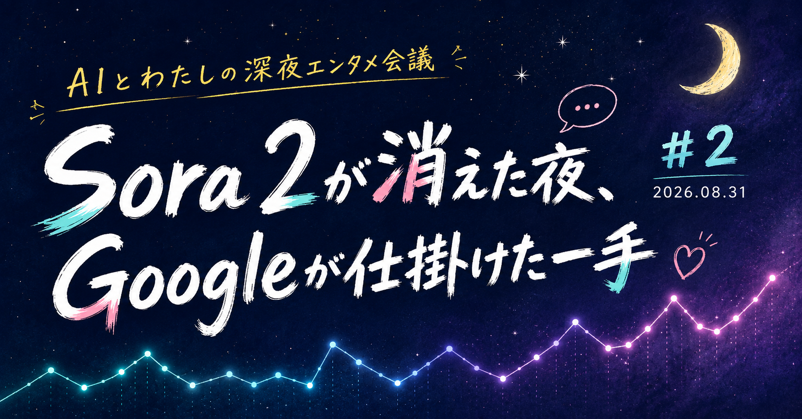

# Sora 2が消えた夜、Googleが仕掛けた一手｜AIとわたしの深夜エンタメ会議 #2

※2026年9月16日更新：Sora 2の終了理由を著作権対応と断定していた記述を修正しました。終了日程と、公開時の権利をめぐる問題は分けて記載しています。

こんばんは、ぐみです。

「AIとわたしの深夜エンタメ会議」第2回です。Googleから新しい動画生成AIが出る一方で、Sora 2はAPIの終了を控えています。同じ動画生成でも、サービスの動きはずいぶん違いますね。

今回はこの2件に、AIの使い方を公開する個人開発ゲーム、AIアイドル、キャラクターチャットを加えた5件を見ていきます。

今回のラインナップはこちら。

## 個人開発、38日でSteamに――『TASMON: Taskbar Monsters』のAI開示モデル

個人開発チーム「ProjectZeta」が、タスクバーに常駐する放置RPG『TASMON: Taskbar Monsters』を8月12日にSteamでリリースしました。キャラクターアートはGoogle Geminiで生成しつつ、プレイ中のリアルタイムAI生成は行わず、AI利用範囲を開発ログで開示しているのが特徴です。

詳しくはこちら→[ProjectZeta、タスクバー風・放置RPG × モンスター収集ゲーム『TASMON: Taskbar Monsters』をリリース - gamebiz](https://gamebiz.jp/news/430952)

公式紹介動画はこちら。

https://www.youtube.com/shorts/gyHkbNV94Zk

「AIをどこまで・どう使ったか」が開発ログに書かれています。遊ぶ側も、その説明を読んでから選べるのがいいなと感じました。

## Googleの動画生成AI「Gemini Omni 1.1 Flash」、4Kアップスケールに対応

Googleが8月27日、動画生成AI「Gemini Omni 1.1 Flash」をリリースしました。360pで下書きを作り、気に入ったものを最大4Kへ高解像度化する「アップスケール」に対応しています。動画の続きを生成する機能もあります。

詳しくはこちら→[Googleが動画生成AI「Gemini Omni 1.1 Flash」をリリース - GIGAZINE](https://gigazine.net/news/20260828-gemini-omni-1-1-flash/)

まず軽い下書きで試して、気に入ったら解像度を上げる。作りながら選べる設計が、地味に実用的だなと感じました。

## OpenAIの動画生成AI「Sora 2」、開発者向けAPIも9月に終了

日本のアニメ・ゲームのキャラクターを再現した動画が問題になった、OpenAIの動画生成AI「Sora 2」。アプリ・Web版はすでに4月に終了しており、外部ソフトから利用するためのAPIも9月24日に終了予定です。

詳しくはこちら→[Sora 2は終了した？今の状況・API移行・代替まとめ - Uravation](https://uravation.com/media/sora-2-shutdown-status-faq-2026/)

華々しく登場したサービスが1年足らずで畳まれていくのを見ると、複雑な気持ちになります。

## DMM系KOWRO、AIアイドルプロデュース『IDOL CAST』を正式リリース

DMM子会社Algomaticから独立し30億円を調達したKOWROが、8月3日にAIアイドルプロデュースサービス『IDOL CAST』を正式リリースしました。ユーザーがプロデューサーとしてAIアイドルを育て、画像・動画・音楽まで生成できます。

詳しくはこちら→[KOWRO、AIアイドルプロデュースサービス『IDOL CAST』の正式提供を開始 - PR TIMES](https://prtimes.jp/main/html/rd/p/000000004.000184101.html)

公式ティザーPVはこちら。

https://www.youtube.com/watch?v=09mvDhZtAnI

「推し活」と「生成AI」を正面から掛け合わせてきたな、という印象です。

## 韓国発「キャラぷ」、全機能を7日間無料開放

Wrtn Technologiesの日本法人が8月25日から、AIキャラクターチャット「キャラぷ」の全機能を最長7日間無料開放するキャンペーンを実施しています。対象は8000体を超えるAIキャラクターです。

詳しくはこちら→[AIチャット「キャラぷ」、すべての機能を無料で開放 - PR TIMES](https://prtimes.jp/main/html/rd/p/000000078.000119361.html)

公式CM(俳優・本郷奏多さん出演)はこちら。

https://www.youtube.com/watch?v=f5ENGjJUdFk

無料期間が終わっても、また話したい相手が見つかるか。続けて使う理由は、そのあたりにありそうです。

## この先、深掘りするのは

気になったのは、AIで作れるものが増えたあと、利用者に何を説明し、どう続けてもらうかです。

TASMONではAI利用の開示、GoogleとSora 2では制作のしやすさと権利者への対応。IDOL CASTとキャラぷでは、また会いたくなるキャラクターをどう育てるかを考えます。

ここからは、開発と企画をつなぐテクニカルPMとしての見立ても交えていきます。メンバーシップなら読み放題ですし、気になる回だけ個別に購入もできます。

<!-- ここから有料エリア（note投稿時にこの位置で「続きを読むには」の区切りを設定） -->

## 『TASMON: Taskbar Monsters』を深掘り

### ProjectZetaが38日で公開した放置RPG

開発元のProjectZetaは、企画に着手してから38日でSteamへの公開まで進めたと報告しています。

ゲーム内容は、常駐させたタスクバーの中でモンスターが自動で戦い、卵やアイテムを持ち帰ってくる放置RPGです。156種類のモンスターを集めて進化・覚醒させられ、毎週のアップデートはプレイヤーの要望を反映しているとのことです。基本プレイは無料で、一部アイテム課金があります。

キャラクターアートやアイコン、ストアページの画像はGoogleの画像生成AI「Gemini」で作成しています。ただし、生成した素材は開発者自身が確認・選定・加工し、第三者の著作物を無断利用していないか精査したうえで採用しているとのことです。プレイ中にAIがリアルタイムで何かを生成することはなく、すべて事前に用意した固定素材です。

### 「AIの使いどころを隠さない」設計は、信頼につながるか

38日という開発期間は目を引きます。短さだけではAIの効果を測れませんが、限られた人数で作るために、どの工程を任せたかは参考になります。

開発ログでは、事前に用意する画像素材、翻訳、要望の要約などに分けてAIの使い方を説明しています。プレイ中に新しい画像を生成するゲームなのか、開発時にAIで作った素材を使うゲームなのか。その違いまで分かると、遊ぶ側も判断しやすいです。

### 開示したうえで、遊ぶ人に選んでもらう

AIを使った範囲が最初から分かれば、あとから知って驚く人は減らせます。ただ、開示すれば誰も反発しない、という話ではありません。素材の権利やゲームの出来をどう見るかは、また別です。

TASMONの開発ログでいいなと思うのは、人が確認・加工した工程も書いて、読む側に判断の材料を渡しているところです。何をして、どこを人が確かめたかを説明する。その積み重ねが信頼につながるのかな、と思います。

## Google「Gemini Omni 1.1 Flash」を深掘り

### 動画と音楽の制作環境を持つGoogle

Gemini Omni 1.1 Flashは、Googleの生成AI「Gemini」ファミリーの一つです。Google DeepMindが、文字・画像・音声などを扱う技術を動画生成にも使っています。

音楽生成AI「Lyria 3.5」もFlow Musicで提供しており、動画と音楽の両方に制作環境を持っています。映像と音を扱う人にとって、この広さは気になるところです。

Google AI StudioとAPIから利用でき、無料枠で低解像度の下書きを試せます。高解像度化まで含めた費用は使い方で変わるため、無料で試せる範囲と完成版を作る費用は分けて考えたいです。

### 下書きを選んでから、解像度を上げる

まず360pで下書きを作り、気に入ったものだけ最大4Kまでアップスケールするという二段構えの設計です。フル解像度でいきなり大量生成するより、無駄な計算コストを抑えられます。

第三者評価のArenaでは、文章から動画を生成するtext-to-video部門で首位という結果も出ています。ただ、評価で好まれる映像と、自分の制作に合う映像は同じとは限りません。私は順位以上に、下書きの段階で選び直せるところに実用性を感じます。

### 作りやすさと、権利者への対応を両立できるか

Sora 2では、公開直後からキャラクターの生成をめぐって権利者との摩擦が起きました。サービス終了の原因をそれだけでは説明できませんが、動画生成AIを続けるには権利者への対応も欠かせません。

Googleには検索・広告事業でコンテンツを扱ってきた経験があります。ただ、会社が大きいから動画生成でもうまく対応できる、とまでは言えません。RunwayやMidjourneyなども含め、生成の性能と、公開後の運用を両方見ていきたいです。

## OpenAI「Sora 2」API終了を深掘り

### 公開直後に広がった、キャラクター生成への懸念

Sora 2は2025年9月30日にアプリとして公開され、日本でも翌日から利用できるようになりました。当初のキャラクターの扱いは、権利者が拒否を申し出るオプトアウト方式だったと報じられています。

日本のアニメ・ゲームのキャラクターを再現した動画がSNSに広がり、日本政府や権利者団体のCODA、MPAなどから懸念や対応を求める声が出ました。生成結果だけで、何を学習に使ったかまでは断定できません。それでも、権利者が望まない形でキャラクターが出回る問題は残ります。

OpenAIは、権利者が生成を制御する機能や、収益分配の仕組みを用意すると説明しました。

アプリ・Web版は2026年4月26日に終了しました。開発者向けAPI(Videos APIとSora 2モデル)も、2026年9月24日に終了する予定です。[OpenAIの終了案内](https://help.openai.com/en/articles/20001152-what-to-know-about-the-sora-discontinuation)にも、この日程が記載されています。

### 終了の理由と、公開時の問題は分けて考える

公開からAPIの終了予定日まで、1年に満たない期間です。参照した終了案内には、著作権対応が原因だという説明はありません。公開時に問題になったことと、サービスを終える理由は分けて考える必要があります。

公開後に権利者との調整が必要になったことは、別の教訓として読めます。すでに生成・共有された動画がある状態では、これからの生成を止めるだけで済むとは限りません。何を作れるようにするかと一緒に、権利者から申し立てがあったときの対応も設計しておく必要があります。

### キャラクターが動いて広がる前に

好きなキャラクターが動く映像は、つい見たくなります。でも、権利者にとっては、どんな場面や台詞と結びつけられるかも大切です。画像生成で議論されてきた問題が、動画でも表れたのだと思います。

GoogleのGemini Omniを含め、ほかのサービスがどんな対応を取るかは、それぞれの方針を確かめる必要があります。Sora 2から考えたいのは、性能を見せるデモと、作品やキャラクターを預かる責任を、一緒に設計できるかということです。

## KOWRO『IDOL CAST』を深掘り

### DMM.comから30億円を調達したKOWRO

『IDOL CAST』を運営するKOWROは、DMMグループの子会社Algomaticから独立する形で立ち上がった、AIエンタメスタートアップです。CEOは原田大士氏、拠点は六本木のグランドタワーです。

2026年5月、DMM.comから30億円の資金調達を実施しました。設立後初めての調達で、この資金をもとに2026年6月から本格的に事業を始めています。中核事業はAIキャラクターチャット事業と、AI翻訳を活用した日本エンタメの海外輸出事業の2本柱です。

『IDOL CAST』は7月23日に事前登録を開始し、8月3日に正式ローンチしました。基本プレイは無料、サービス内課金があるモデルで、Webブラウザ(PC・スマートフォン)から利用できます。ユーザーはプロデューサーとして、AIアイドルとの対話や画像・動画・音楽の生成を通じてアイドルを育てます。

### 「会話で育てる」体験は、続ける理由になるか

気になるのは、AIとの日々の会話でアイドルの人格を形作っていく体験です。基本無料+課金という仕組みでも、何に愛着を持ってもらうかで、続ける理由は変わります。

ソーシャルゲームの育成と、キャラクターAIとの対話を組み合わせた形ですね。コンテンツが増えたり、ほかの利用者と「推し」を共有できたりすれば、会話を続けるきっかけにもなりそうです。

ただ、正式提供の発表だけで、長く使いたくなる体験かどうかまでは分かりません。資金調達額や話題性の先で、日々の会話がどう積み重なるかを見たいです。

### 生成したアイドルを、どこまで公開できるか

画像や動画も作れるサービスなので、実在のタレントに似たキャラクターや、性的な表現をどう扱うかは気になります。これはIDOL CASTで問題が起きたという話ではなく、生成や公開のルールを見るときの論点です。

DMM.comから資金を得ていることだけで、投稿内容の確認・管理まで十分だとは判断できません。作る楽しさを広げる仕組みと、公開してよい範囲を伝える仕組み。その両方があると、利用者も安心して遊びやすくなると思います。

## Wrtn「キャラぷ」無料開放を深掘り

### 日本法人が運営する、韓国発のキャラクターチャット

「キャラぷ」を運営するのは、株式会社リートンテクノロジーズジャパンです。韓国のAIサービス企業Wrtn Technologiesの日本法人で、2023年11月に設立されました。

キャラぷ自体は2025年6月にローンチしたサービスです。ロマンス・ファンタジー・バトル・日常系など、8000体を超えるAIキャラクターとチャット形式で交流できます。ユーザー自身がオリジナルキャラクターを作成する機能もあります。

今回のキャンペーンでは、8月25日から最長7日間、通常は課金が必要な全機能を試せます。無料期間後に使う機能の料金は、別に確かめておきたいところです。

### 無料開放というキャンペーンは、ブランド認知への投資と見る

今回の無料開放は、まずサービスを知り、会話を試してもらうための投資に見えます。機能の説明を読むより、実際にキャラクターと話す方が伝わることもありますよね。

最長7日間で、8000体のなかから「また話したい」と思う相手に出会えるか。私なら、キャラクターの数に加えて、好みの相手を見つけやすいかにも注目します。無料期間中の利用が増えても、そのまま課金につながるとは限らないからです。

### 8000体のキャラクターをどう管理しているか

ユーザーがキャラクターを作れるなら、年齢に合った利用範囲や、既存キャラクターの模倣・なりすましへの対応も必要になります。

今回のキャンペーン案内だけでは、管理体制の詳しいところまでは分かりません。キャラクターを増やすほど、問題を報告しやすく、対応も受けられる仕組みが大切になりそうです。

## 今夜はこのへんで

TASMONはAIの使い方を説明し、Googleは下書きから選べる制作方法を用意しています。IDOL CASTやキャラぷは、キャラクターとの会話を続けてもらおうとしています。

作れるものが増えると、その先の「選ぶ」「公開する」「続ける」が気になってきます。Sora 2の終了も含め、サービスを長く使う側の目線で追いたい5件でした。

このマガジンでは、こういうネタを見つけるたびに深夜のテンションでまとめています。よかったら、メンバーシップで一緒に追いかけてもらえたら嬉しいです。

## 参考リンク

- [ProjectZeta、タスクバー風・放置RPG × モンスター収集ゲーム『TASMON: Taskbar Monsters』をリリース - gamebiz](https://gamebiz.jp/news/430952)
- [38日でSteamにゲームを出すことになった件 - TASMON開発ログ](https://indie.gamewith.jp/games/taskbar-monsters/devlog/IeNXhissGCzc)
- [TASMON: Taskbar Monsters - Steam](https://store.steampowered.com/app/4985540/TASMON_Taskbar_Monsters/?l=japanese)
- [Googleが動画生成AI「Gemini Omni 1.1 Flash」をリリース - GIGAZINE](https://gigazine.net/news/20260828-gemini-omni-1-1-flash/)
- [Sora 2は終了した？今の状況・API移行・代替まとめ【2026年8月】 - Uravation](https://uravation.com/media/sora-2-shutdown-status-faq-2026/)
- [Open AIの動画生成AIモデル「Sora 2」ローンチとその余波 著作権ポリシーをめぐる混乱まとめ - CGWORLD](https://cgworld.jp/flashnews/01-202510-OpenAI-Sora2.html)
- [KOWRO、AIアイドルプロデュースサービス『IDOL CAST』の正式提供を開始 - PR TIMES](https://prtimes.jp/main/html/rd/p/000000004.000184101.html)
- [生成AI時代のエンタメスタートアップKOWROが30億円の資金調達を実施し本格始動 - PR TIMES](https://prtimes.jp/main/html/rd/p/000000001.000184101.html)
- [Company | KOWRO](https://kowro.co.jp/company)
- [AIチャット「キャラぷ」、すべての機能を無料で開放―8月25日(火)開始、最長7日間 - PR TIMES](https://prtimes.jp/main/html/rd/p/000000078.000119361.html)
