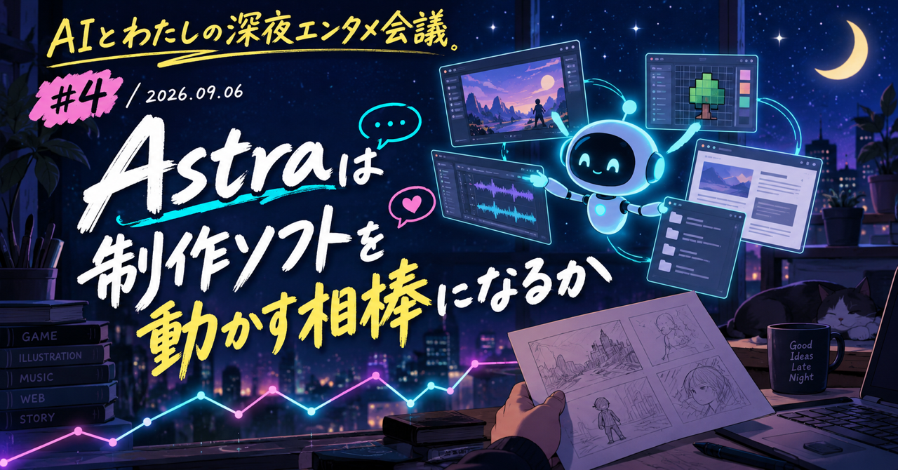

# Astraは制作ソフトを動かす相棒になるか｜AIとわたしの深夜エンタメ会議 #4

こんばんは、ぐみです。

話題のAstraを早く届けたくて、今週は日曜日に更新しました！
その代わり、次の月曜日の更新はお休みします。

ここ数日、Astraにゲームや絵や音楽を作らせた投稿が一気に流れてきました。
派手な完成画面に、つい目を奪われます。

ただし、ここで紹介するのは、投稿者が試しに動かした検証や試作の報告です。
実際の案件や商用制作で使われた例として読まないようにしたいと思います。

これまでの生成AIは、できあがった画像を受け取る使い方が中心でした。
ちょっと惜しくても、そのまま採用するか、また作り直すか。
そんな二択になりがちでした。

今回の事例で、私がいちばんテンションが上がったのはそこです。
BlenderやAseprite、ペイントソフト、GarageBandを触る。
制作ソフトの中で工程を進める様子に、次の人が手を入れられる可能性を感じたところです。

こうした試作が、いつか制作工程に入る相棒になったらどうでしょう。
作る人は何を任せて、どこで「こっちがいい」と言うのか。
そんなことを考えながら、投稿を追ってみました。

## ティザーサイトとガチャゲームを、触れる試作品にする

アニメのティザーサイトを、画像生成や素材加工込みで作った報告です。
後続の投稿では、サイトを3D回廊にした例も紹介されています。

<!-- note:embed -->
https://x.com/Vtuber7144/status/2096007353435148340?s=20
<!-- /note:embed -->

ゲームの試作では、「ガチャ演出を作って」という依頼がありました。
そこから操作できるゲームと公開用サイトまで作られたという報告です。

<!-- note:embed -->
https://x.com/gigabit_million/status/2096094717989867681
<!-- /note:embed -->

**ひとこと**: これが企画会議で見せられる試作になったら、かなり強いですよね。
仕様書を読む前に、まず一回引いてもらえる。その想像ができるのがいいです。

## ペイントソフトに入って、絵の途中を作る

初音ミクを描いたという投稿がありました。
自分で描いた線画を渡し、着彩だけを任せた事例もあります。
レイヤー作成、拡大、ペン選択までAIが操作したという報告です。

<!-- note:embed -->
https://x.com/qibiz_me/status/2096000743786627103
<!-- /note:embed -->

<!-- note:embed -->
https://x.com/taiyaki_sun/status/2096149368193839455
<!-- /note:embed -->

さらに、Asepriteで「ピクセルアート風」ではないドット絵を作ったという例も出ています。

<!-- note:embed -->
https://x.com/suemaruuuuuuX/status/2096212351502721361?s=20
<!-- /note:embed -->

AIが画面上のマウスを動かして操作する「Computer Use」で、絵を描く事例もあります。

<!-- note:embed -->
https://x.com/keitowebai/status/2096124169406775325
<!-- /note:embed -->

**ひとこと**: 線画、ラフ、色指定は人が決める。
そのうえで反復作業を任せるなら、かなり気持ちのいい分業です。

## 曲を一曲ではなく、10本のパートに分けて残す

GarageBandで曲を作るよう頼んだ事例があります。
10本のSTEM分割音源ができたという利用者報告です。
投稿者の説明では、AstraはPythonで曲のプログラムを書いたと答えたそうです。

<!-- note:embed -->
https://x.com/varts_works/status/2096194813439906228
<!-- /note:embed -->

**ひとこと**: 完成曲を一個もらうより、パート別の音源が残る方がうれしいです。
「ここ、もう少し静かに」が自分でできるようになります。

ここから先では、海外で公開された15件の試行を日本語でまとめて紹介しながら、その先に見えた制作現場の変化まで掘り下げていきます。
メンバーシップなら読み放題ですし、気になる回だけ個別に購入することもできます。

<!-- ここから有料エリア（note投稿時にこの位置で「続きを読むには」の区切りを設定） -->

## 海外の試行は、創作から日常業務まで広がっている

海外の15件をまとめた記事もありました。ただし、これは実務導入の実績一覧ではありません。
公開された試行、先行アクセスでの検証、公式デモ、レビューを集めたものです。
元の投稿をたどると、ゲームや3D空間だけではありません。画面の手直し、問い合わせの下書き、動画の粗編集、記事初稿まで並んでいました。

問い合わせの整理と顧客の声の分析は、同じ投稿にまとまっています。そのため、15事例に対して元投稿は14件です。
まとめ記事ではなく、確認できた元の投稿を用途ごとに置きます。英語の内容は、埋め込みの前に日本語で一言ずつ添えます。

### ゲームと3Dの試行

Unreal Engineの世界に、Astraを使った住人を置き、それぞれが生き延びようとする様子を試した投稿です。

<!-- note:embed -->
https://x.com/mattshumer_/status/2095596175705399482
<!-- /note:embed -->

家の画像をもとに、家具や小物を含む3D空間を組み立てた試行です。

<!-- note:embed -->
https://x.com/tomkrcha/status/2095598645190291775
<!-- /note:embed -->

家の3Dモデルを歩いて回れるUnreal Engineの空間にするデモです。完成前に空間を体験する、という見せ方を試しています。

<!-- note:embed -->
https://x.com/ChrisGPT/status/2095594374843232583
<!-- /note:embed -->

マンハッタンの街並みをUnreal Engineで作ったという3D制作の試行です。

<!-- note:embed -->
https://x.com/mattshumer_/status/2095609734845927525
<!-- /note:embed -->

ブラウザ上で動く、1回の指示から作った3Dゲームのデモです。

<!-- note:embed -->
https://x.com/theo/status/2095599934766764338
<!-- /note:embed -->

Minecraftのようなブロック状の3D世界を作らせた試行です。

<!-- note:embed -->
https://x.com/flavioAd/status/2095597137849446688
<!-- /note:embed -->

Waterlooの街を歩ける3D空間として再現したというデモです。

<!-- note:embed -->
https://x.com/danshipper/status/2095880567313092770
<!-- /note:embed -->

Unity上に街を作り、移動できる状態にした試行です。

<!-- note:embed -->
https://x.com/ChrisGPT/status/2095601996770263362
<!-- /note:embed -->

操作して遊べるアドベンチャーゲームを作らせたという報告です。

<!-- note:embed -->
https://x.com/petergostev/status/2095596341422440714
<!-- /note:embed -->

都市を育てるシミュレーションゲーム風のデモを作った投稿です。

<!-- note:embed -->
https://x.com/MatthewBerman/status/2095595893991129444
<!-- /note:embed -->

### 画面づくりと日常業務の試行

画面のデザインから実装までをつないだ、フロントエンド制作の公式デモです。

<!-- note:embed -->
https://x.com/OpenAIDevs/status/2095596149654868092
<!-- /note:embed -->

問い合わせメールの下書き作成と、顧客の声を整理する様子を同じ投稿で紹介したデモです。

<!-- note:embed -->
https://x.com/clairevo/status/2095596028523319487
<!-- /note:embed -->

### 動画と文章の試行

動画を確認し、必要な場面を抜き出して粗く組み立てる作業を試したレビューです。

<!-- note:embed -->
https://x.com/danshipper/status/2095593705214300394
<!-- /note:embed -->

取材メモをもとに記事の初稿を作らせた試行です。

<!-- note:embed -->
https://x.com/danshipper/status/2095877348314730821
<!-- /note:embed -->

**ひとこと**: 派手なゲーム制作だけの話ではないのが面白いです。
ただし、ここにあるのは公開された試行やデモです。実案件での制作実績と読み替えないようにしたいです。
自分の素材と普段のソフトで、小さく試すためのヒントとして見ています。

## この先、深掘りするのは

今回の投稿で気になったのは、完成画面の派手さだけではありません。
ゲーム、イラスト、音楽で、あとから誰かが触れる余地が残ったら。
この試作の先で、実制作の相談はどう変わるのか。その話をしてみます。

- **完成品ではなく、次に触れるものが戻る**
  - 「作って」から「どこまで直せる形で受け取る？」へ
  - 触れる試作があると、演出の相談はどう変わる？
- **ゲーム・イラスト・音楽、それぞれの分業**
  - ゲームは、操作感や間を見ながら決められる
  - イラストは、譲れない線や色の判断を残せる
  - 音楽は、完成曲のあとで尺やバランスを考えられる
- **AIに頼む前に決めておきたいこと**
  - 渡す素材、ほしい納品物、確認する人
  - 最後に「出す」と決めるのは誰か

ここから先は、「これ、実際どこまで任せていいんだろう」と考えた話です。

## いちばん大きな変化は、完成品ではなく「次に触れるもの」が戻ること

先に断っておくと、ここまでの投稿は実制作への導入事例ではありません。
ここからは、試作で見えた形が実際の仕事に持ち込まれたら、何を考える必要があるかを想像してみます。

これまでの生成AIは、画像や曲を受け取って終わる場面が多かったと思います。
気に入れば採用する。惜しければ作り直す。その二択です。

でも、今回の投稿には少し違う手触りがありました。
ペイントソフトの中で着彩を進める。Asepriteでドットを置く。GarageBandで使えるSTEMが出てくる。操作できるガチャの試作までできる。

もちろん、投稿で見える範囲だけで、すべてが後工程で編集できるとは言えません。
それでも、完成品を眺めるだけでなく、次の人が触って決めるための素材や試作へ近づいている。私はそこが大きい変化だと思いました。

実制作に持ち込むなら、発注する側の言葉も「いい感じに作って」から少し変わりそうです。
「この線画は残して、色の案を3つ見たい」
「このガチャを一回だけ引ける試作にして、気持ちよく感じる尺を決めたい」
「この曲は30秒版にできるよう、パートを分けて聴きたい」

完成物の指定だけではなく、どこをあとで自分たちが触るのかまで、最初に話せるようになります。

## ゲームは、演出を「見せてから決める」仕事に近づく

ティザーサイトやガチャ演出は、言葉と静止画だけでは共有しにくいものです。
ボタンを押してから何秒待つのか。光る順番はどうか。スキップしたときに気持ちよく終わるか。

操作できる試作が早く出れば、「もっと派手に」よりも「ここで一拍ためたい」「この音は結果の直前に置こう」と話せます。演出の相談は、イメージの伝言ゲームから、触りながら決める会話へ近づきそうです。

試作がURLになっても、公開の準備が終わるわけではありません。投稿では、公開可能な状態まで作れた例が紹介されています。商用に出すなら、仕様と運用、利用素材と公開前の確認は人が持つ必要があります。

最初は「一回引ける」「最初に戻せる」「演出を飛ばせる」くらいで十分かもしれません。小さな試作なら、何を直すかも、誰がOKを出すかも迷いにくいです。

## イラストは、譲れないところを残したまま頼める

自分で描いた線画に着彩を頼む投稿からは、全部を渡さなくても分業できる感じが見えます。
線の強さや表情、キャラクターの空気は自分で持つ。配色案や下地、影の方向のように、並べて比べたい作業を任せる。そんな切り分けです。

投稿者自身が「自分の着彩の方がよい」と感じたことも紹介していました。それはAIが失敗したというより、「ここは自分で決めたい」がはっきりした瞬間にも見えます。

完成画像を採用するかどうかだけで、話を終わらせたくありません。途中の作業を人が直せる形で受け取れるなら、実制作では修正の依頼も「もう一度作って」から「この色だけ変えたい」「この表情は線画に戻したい」へ変わりそうです。

ただ、どの事例でもレイヤー構造や編集範囲まで確認できているわけではありません。だからこそ、発注時に「何を残してほしいか」を先に言葉にする価値があります。

## 音楽は、一曲の納品より「あとで混ぜられる余白」がうれしい

GarageBandで曲を作るよう頼んだ投稿では、10本のSTEMができたという利用者報告がありました。STEMは、ドラムやベースのようにパートごとに分かれた音源です。

この形なら、完成曲を一つ受け取るのとは違う会話ができます。映像に合わせて少し短くする。声を入れる場所だけ音を薄くする。ドラムを抜いた版と比べる。自在に直せる範囲は限られていても、編集側には検討の余地が残ります。

ここでも、最終的に使う音を選ぶのは人です。ループのつながり、台詞とのぶつかり方、使った素材の条件。AIが「できました」と言った後に、聴いて決める時間はむしろ大事になります。

## 実制作に持ち込む前に、先に決めておきたい5つのこと

編集できるデータや試作を実制作で受け取るなら、プロンプトだけを渡すより、最初にこのあたりを揃えたいです。

- **渡す素材と使ってよい範囲**：線画、ロゴ、音源、仕様書のうち、何を使ってよいか。外へ出してはいけないものは何か。
- **ほしい納品物と、あとで調整できる余地**：完成画像だけでよいのか。試作URLやパート別の音源など、後から確認・調整できるものも必要か。
- **AIに任せる判断、人が決める判断**：配色案を出すところまでか、候補を選ぶところまでか。世界観や最終採用は誰が持つのか。
- **確認する節目**：ラフ、触れる試作、仮ミックスのどこで止まり、誰が見て次へ進めるか。
- **公開と権利確認の担当**：公開ボタンを押す人、利用素材を確かめる人、最終OKを出す人を曖昧にしないこと。

これはAIのためだけの発注書ではありません。人に頼むときにも、途中で何を見て、どこを直せるようにしておくかが分かると、演出の会話はずっと楽になります。

## 「作れた」より先に、誰が直して、誰が出すか

ここで紹介した海外の投稿を見ても、Astraが一言で魔法のように全部を終わらせたわけではありません。使うソフトがあり、渡す材料があり、人が直す場所があります。

だから私は、最初から公開や送信まで任せるより、自分の素材だけを使った小さな試作から始めたいです。元ファイルは残す。外に出す前に、誰かが触って確かめる。

AIが作った完成品を受け取るだけなら、まだ少し遠い道具かもしれません。でも、いつものソフトの中で、次の人が触れるものを返してくれるなら、実制作での発注や演出も変わり始めるかもしれません。
そのとき最後に「これで出そう」と言うのは、やっぱり作る側でありたいです。

## 今夜はこのへんで

Astraの投稿を並べると、絵も音楽もゲームも、人が不要になる話には見えませんでした。
むしろ、作る人が世界観、素材、完成条件を決める。
そのあとでAIが工程を一気に進める形です。

生成結果を受け取るだけなら、AIは少し遠い道具です。
いつもの制作ソフトを触り、後から直せるものを残してくれるなら話は変わります。

私ならまず、自分の素材だけでできる小さな試作から始めます。
作ることと、選ぶこと。その境目を見つけるところから、Astraとの分業が始まりそうです。

## 参考リンク

- [GPT-6 Astra: A new generation of intelligence - OpenAI](https://openai.com/index/gpt-6-astra/)
- [ChatGPT Work and Codex - OpenAI Help Center](https://help.openai.com/en/articles/20001275/)
- 本文中に埋め込んだ各X投稿（利用者報告）
