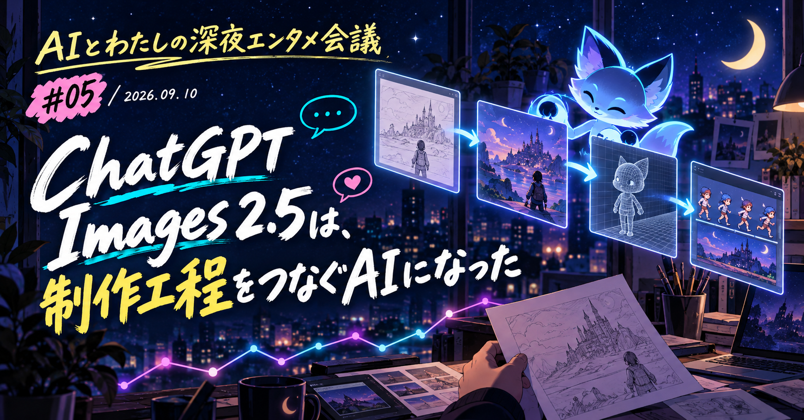

# ChatGPT Images 2.5は、制作工程をつなぐAIになった｜AIとわたしの深夜エンタメ会議 #05

こんばんは、ぐみです。

ChatGPT Images 2.5が出て、Xのタイムラインには試作がどっと流れてきました。
画像がきれい、だけでは終わらない感じです。

歩行アニメを作る人。ストップモーションをつなぐ人。
VTuberの表情差分、商品広告、Blenderへ渡す資料までありました。
「お、これ、そのまま次の作業に使えるじゃん。やるじゃん」と、素直に思いました。

今回は、2026年9月8日のOpenAI発表と、その直後に出た20件の投稿を追ってみます。
ただし、ここにあるのは投稿者それぞれの試行です。製品仕様や商用導入の実績としては扱いません。

## OpenAIが発表したImages 2.5の特徴

今回の発表で中心にあるのは、画像を一枚きれいに作ることだけではありません。参照画像をもとに、編集を続けやすくする更新です。

OpenAIは、参照画像の人物や物を保ちやすくなり、光や質感も自然になったと説明しています。
指定した箇所だけを直し、複数回の編集でも前の変更を保ちやすくなりました。
生成時間も、Images 2.0と比べて最大50％短くなったとしています。

ChatGPT側には、スケッチを参照画像にするSketch、ポスターや商品写真などのテンプレート、画像にコメントを置いて修正箇所を伝える機能が加わりました。
APIでは、速度を重視したFlareと、細かな編集を重視したSunburstの2モデルが案内されています。

[OpenAIの発表](https://openai.com/index/introducing-chatgpt-images-2-5/) ｜[Flareのモデル仕様](https://developers.openai.com/api/docs/models/gpt-image-2.5-flare) ｜[Sunburstのモデル仕様](https://developers.openai.com/api/docs/models/gpt-image-2.5-sunburst)

## 一枚絵の先で、制作工程が動き出している

まずは、気になった試作を三つの制作工程に分けて置いてみます。

### ゲーム素材は、歩かせて初めて困る

852話(hakoniwa)さんは、戦闘モーションのスプライトシートを作ったと報告しています。
ただし透過処理は一度で決まらず、別チャットで分割と位置合わせまで指示したそうです。

<!-- note:embed -->
https://x.com/8co28/status/2097423580229521849
<!-- /note:embed -->

PURESOさんも、歩行と格闘のモーションを試しています。
両足で歩くこと、衣装の特徴、複数の動きを、前世代との違いとして挙げています。

<!-- note:embed -->
https://x.com/pureso_studio/status/2097520619193868590
<!-- /note:embed -->

ひとこと: ゲーム用の絵って、一枚できれいなら終わりじゃないんですよね。
分割も透過も、動きのつながりも残る。そこまで見て、やっと素材として使えるか考えたくなります。

### 映像の前に、連番を作る人たち

Charlie Guoさんは、同じキャラクターを保つストップモーションを試しました。
Ivanaさんは36枚の画像をつなぎ、動画モデルを使わずに短い映像を作ったと報告しています。

<!-- note:embed -->
https://x.com/charlierguo/status/2097399137142772071
<!-- /note:embed -->

<!-- note:embed -->
https://x.com/ivanainai/status/2097446105906553188
<!-- /note:embed -->

Gabriel Chuaさんは、カワウソ、人物、屋台を99フレームにわたって保ったとしています。
それを小さなストップモーションに組んだそうです。

<!-- note:embed -->
https://x.com/gabrielchua/status/2097512638704197681
<!-- /note:embed -->

ひとこと: 動画を一発で出す話とは、少し違うんですよね。
静止画を次の映像工程へ渡せるか。そっちの競争も、じわっと始まっている気がします。

### 広告や配信画面では、残すものの方が大事

ぽんずさんは、元デザインの構図と世界観を保ちつつ、視点と文字を変える編集を試しました。

<!-- note:embed -->
https://x.com/ponzponz15/status/2097513870969688188
<!-- /note:embed -->

新清士さんは、ラーメン広告のPOPを作り、文字と写真の雰囲気に触れています。

<!-- note:embed -->
https://x.com/kiyoshi_shin/status/2097558667059155070
<!-- /note:embed -->

さきすたさんは、人物がライブ配信をしている画面風の画像を作りました。

<!-- note:embed -->
https://x.com/sakisuta_/status/2097558697174294896
<!-- /note:embed -->

## この先、深掘りするのは

ここからは、完成画像の出来映えではなく、制作の途中で何が起きていたのかを見ます。

- **X投稿で見えるのは、制作工程への試行まで**
  - ゲーム、映像、3Dへ画像を渡した投稿を、実装や商用導入の証明にせず読む
- **連続編集で保てたものと、崩れたもの**
  - 人物、衣装、背景、文字など、投稿者が固定しようとした対象を比べる
- **飲食店の店頭販促で問われる、実物性と確認**
  - AIで作った画像が話題になった背景を、料理の見え方と表示の責任から考える

ここから先は、もう少し細かく眺めます。
メンバーシップなら読み放題ですし、気になる回だけ個別に購入もできます。

<!-- ここから有料エリア（note投稿時にこの位置で「続きを読むには」の区切りを設定） -->

## 試作を次の工程へ渡すとき、先に確認すること

Xで見つかったのは、画像を下書きや、表情・衣装のバリエーション、構図案、素材のたたき台として使ってみた報告でした。
ゲーム、映像、3Dの次工程へ渡した人もいます。
でも、個人の試行や企業の紹介投稿だけで、制作時間や商用導入まで語るのは、まだ早いです。

### ゲーム用素材は、動きと分解で価値が決まる

スプライトシート、歩きや格闘の動き、表情のバリエーションを試した投稿には共通点があります。
キャラクターの一枚絵を作ったあと、パーツに分け、動かし、表情の違いを増やす前提です。

しとちゃ！さんは表情の違いを作り、iFacialMocapと組み合わせて、表情を動かす仕組みを試しました。

<!-- note:embed -->
https://x.com/nemumusitocha/status/2097430181095125251
<!-- /note:embed -->

Simonasさんは、Images 2.5の画像をTripo3Dで3Dデータの形式であるGLBに変換しました。
それを、ブラウザで3Dを表示できるThree.jsへ渡したと報告しています。

<!-- note:embed -->
https://x.com/SimonasLTU1/status/2097561634076016774
<!-- /note:embed -->

Higgsfield AIは、Images 2.5で生成した画像を使い、ゲーム制作ソフトUnityで対戦ゲームを作ったと紹介しています。
これはサービス提供側の紹介投稿であり、制作時間や性能の一般的な証明にはなりません。
それでも、画像をゲームの実装までつないで見せているので、使い道を想像しやすくなります。

<!-- note:embed -->
https://x.com/higgsfield_ai/status/2097470354897740109
<!-- /note:embed -->

私がいちばん気になったのは、画像生成AIの使い道が「絵を作る」だけではなくなっているところです。
下書き、キャラクター資料、分解前の素材、3Dの参照まで渡せるようになると、見るべき点も変わります。
画風だけじゃなく、次の工程へ渡しやすいか。そこも見たくなります。

### 連続編集では、何を固定したかを先に決める

Chetasluaさんは、立方体を連続編集して位置・大きさ・背景の変化を比較しました。
同じ指示を出しても、毎回まったく同じ結果になるわけではない、と投稿内で明記しています。

<!-- note:embed -->
https://x.com/chetaslua/status/2097400738096062755
<!-- /note:embed -->

AGIラボさんは、ロボットが星を拾い、持ち上げ、元に戻す9回の連続編集を比較しました。

<!-- note:embed -->
https://x.com/ctgptlb/status/2097479691368337900
<!-- /note:embed -->

关木さんは、人物、服、街、光を保ちながら、12場面の画像を試しています。
一方でZenMuxの販売案内も含む投稿です。広告文と試行結果は分けて読みたいところです。

<!-- note:embed -->
https://x.com/ZeroZ_JQ/status/2097560885606973599
<!-- /note:embed -->

-Zho-さんは、10回の連続生成後にタスクを忘れると報告しました。

<!-- note:embed -->
https://x.com/ZHO_ZHO_ZHO/status/2097573152675316038
<!-- /note:embed -->

ここで大事なのは、「一貫性がある！」と言い切ることではありません。
人物、衣装、背景、文字、構図のうち、今回の仕事で変えてはいけないものを先に決める。
そこを決めないと、たぶん始まらないんですよね。
固定条件を決めないまま連続編集を始めると、どこで失敗したのかさえ判断できません。

### 静止画をつないでも、動画そのものではない

静止画を順番につないでストップモーションにする投稿は、画像モデルの役割を少し変えています。
動画生成モデルを使わなくても、必要な静止画を揃え、別の編集工程で動かす方法です。

Will Oldgramさんは、生成したキューブ都市を、3D制作ソフトBlenderで作り直すための見た目の参考に使ったと報告しています。

<!-- note:embed -->
https://x.com/old_pgmrs_will/status/2097506064078147861
<!-- /note:embed -->

Karanさんは、戦闘機のスケッチを現実的な画像へ変え、それをAstraでBlender用の3Dモデルにしたとしています。

<!-- note:embed -->
https://x.com/karankendre/status/2097430655336620509
<!-- /note:embed -->

この使い方では、生成結果は完成映像ではありません。
構図、質感、光、立体化の方向を共有するための中間データです。
映像や3Dの担当者が直せる余地を残して渡せるなら、企画初期の会話はかなり速くなりそうです。

## 連続編集で保てたものと、崩れたもの

連続編集の投稿では、人物を保とうとする人もいれば、衣装や背景、文字、構図を保とうとする人もいます。
一方で、背景を透明にする処理が追加で必要になった例や、連続生成でスタイルが崩れたという報告もあります。
投稿を眺めていると、同じ人物や背景を保てるか確かめる試みが目立ちます。
でも、成功例だけを見て「もう大丈夫」と言うのは、ちょっと早いです。

### 商品写真を使うなら、元データの扱いを決める

Mikoさんは、参照画像を使ってAIらしさを抑えた人物写真を作る手順を紹介しています。
商品や人物を含む広告制作に応用できそうですが、商品や手順の販売案内も含む投稿です。
素材ごとに分けて指示した試作例として見ます。同じ結果を再現できる証拠にはしません。

<!-- note:embed -->
https://x.com/Mho_23/status/2097483045221917131
<!-- /note:embed -->

EPさんは、ユーザー投稿風の広告動画の冒頭用に、Images 2.5 Sunburstを使ったとしています。
こちらもHiggsfieldというサービス内での利用を紹介する投稿です。

<!-- note:embed -->
https://x.com/eptwts/status/2097477534057128376
<!-- /note:embed -->

広告で本当に必要なのは、モデルが商品を描けることだけではありません。
商品写真を使う許可があるか。ロゴや価格、画面内の文言は正しいか。人物素材の同意は取れているか。
最終稿では、こうした項目を確認できなければいけません。
生成回数を減らすほど、校正の責任まで減るわけではありません。

### 文字と図解は、読めても確認が要る

Minsang Daniel Kimさんは、文字が重ならない教育用の図を一発で作れたと投稿しています。

<!-- note:embed -->
https://x.com/msdkim0424/status/2097558747124277308
<!-- /note:embed -->

文字を画像内で扱いやすくなれば、広告POPや配信画面、教材、ゲーム内の画面の試作は速くなります。
でも、誤字、価格表記、仕様、読み順は別の話です。
人が元データと照らす工程を残せるかが、実務に入る最低条件だと思います。

## 飲食店の販促では、写真と実物の差が問題になる

2026年8月には、生成AIで作られたとみられる飲食店のメニューや店頭ポスターが、Xで「食欲が削られる」「実物と違うのでは」と話題になりました。

見た目のインパクトが強いので、ここでは画像を埋め込みません。確認したい方は[リンク先](https://www.itmedia.co.jp/news/article/2608/18/2000000580/)をご覧ください。
話題になった理由は、AIらしい見た目だけではありません。
料理は本当にこんな見た目なのか。文字や価格は合っているのか。これを店が完成品として出していいのか。
いくつもの不安が、重なっているようです。

一部分だけを直すつもりでも、料理、光、店内まで少しずつ別の絵になってしまうことがあります。
それが、違和感のある販促物につながった一因かもしれません。
元の実写が保てないと、「この料理を注文できる」という約束までぼやけちゃいます。

Images 2.5は、元の画像で大事な要素を保ちながら、指定した箇所を直すことや、連続編集で前の変更を保つことを更新点に挙げています。
商品写真を保とうとする試作、ポスターの文字や構図を差し替える試作、広告用のUIを残す試作もありました。
元写真を土台にして、一部分だけを直す使い方なら、店頭販促の作り方は少し変わっていくかもしれません。
とはいえ、これだけで店頭販促に安全に使える、とまでは言えません。

飲食店でAI画像が使われるとしても、料理そのものは実写で示し、AIは背景や構図案、装飾などに限定する方が誤解を減らせそうです。
文字、価格、商品写真は、元データと人の目で確認する工程を、やっぱり残しておきたいです。
「AIで安く作れた」より、実物を楽しみに来た人をがっかりさせない。
店頭販促では、そっちが先だと思います。

## 今夜のまとめ

20件を追ってみて、Images 2.5は何でも完成させてくれる道具ではないな、と思いました。
画像を何度も直しながら、ゲーム、映像、3D、広告、配信へ渡す。
次の工程へ渡せる画像を作る道具として、少しずつ試され始めています。

次に自分で試すなら、「何を絶対に変えないか」を一つだけ決めてみたいです。
キャラクターの服、商品の形、画面の文字、背景の光。
そこを固定して初めて、生成の速さが制作の速さにつながっていくのかな、と思います。

## 参考リンク

- [OpenAI: Introducing ChatGPT Images 2.5](https://openai.com/index/introducing-chatgpt-images-2-5/)
- [OpenAI: GPT-Image-2.5 Sunburst](https://developers.openai.com/api/docs/models/gpt-image-2.5-sunburst)
- [OpenAI: ChatGPT Images 2.5 Safety Evaluations](https://deploymentsafety.openai.com/chatgpt-images-2-5/safety-evaluations)
- [Axiosの試用記事](https://www.axios.com/2026/09/08/exclusive-hands-on-with-chatgpts-new-image-editor)
- [TechRadarの検証記事](https://www.techradar.com/ai-platforms-assistants/chatgpt/chatgpt-images-2-5-is-out-ive-been-testing-it-for-24-hours-and-these-are-the-3-new-features-youll-actually-use)
- [ITmedia NEWS: AIで作られた飲食店メニュー・ポスターへの反応](https://www.itmedia.co.jp/news/article/2608/18/2000000580/)
- [ASCII.jp: 飲食店のAI販促物が話題になった背景](https://ascii.jp/elem/000/004/427/4427098/)
