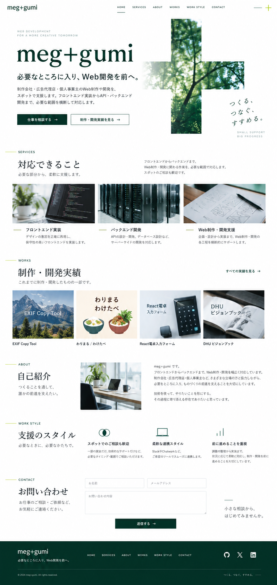
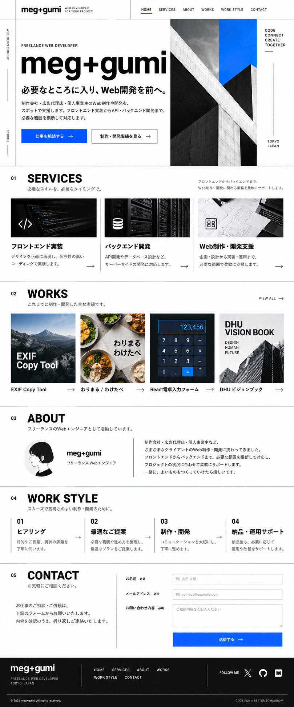
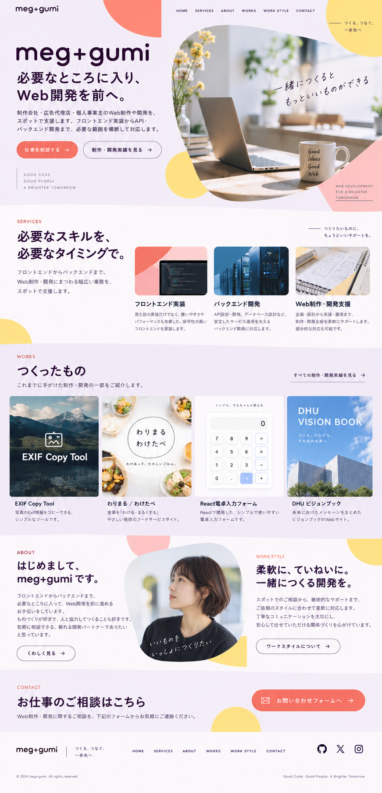
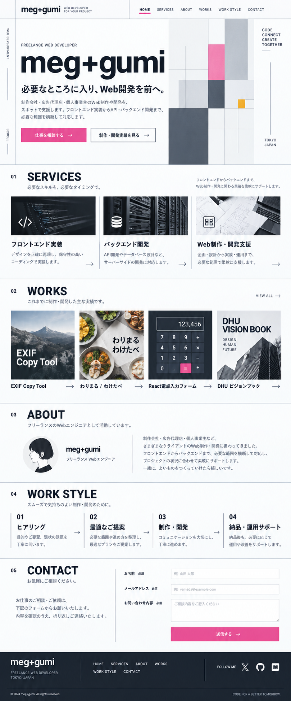
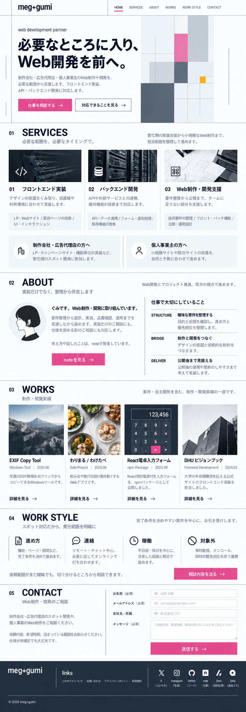
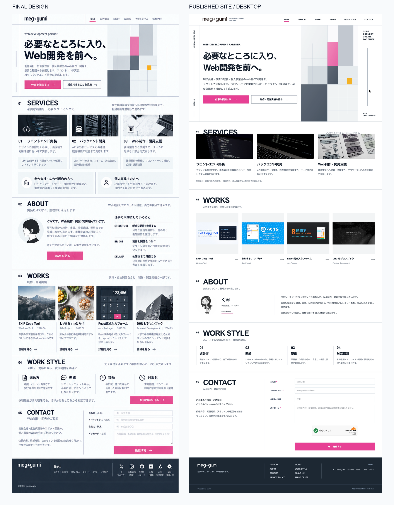
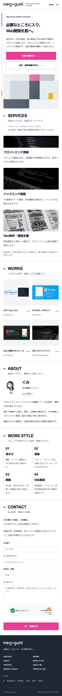

# 新しいモデルが出るたびにサイトをリニューアルしている。今回はAstraで一発だった

こんにちは、ぐみです。

私は新しいAIモデルが出るたびに、自分のポートフォリオサイトをリニューアルしています。

「また作り直すの？」と思われるかもしれません。はい、また作り直しました。もはやサイト運営というより、新しいモデルが出たときの恒例行事です。

今回はChatGPT Images 2.5で新しいデザインを作り、掲載内容も見直して、サイトをデザインごとフルリニューアルしました。デザイン3案から一つを選び、配色や文章を整えて、実装へ進めています。

実装はluna、続いてAstraで試しました。その中で驚いたのが、新しいデザインを形にする力です。lunaでは再現しきれなかったメインビジュアルが、Astraに指示し直したら一発。しかも、渡したのはPC用のデザインだけなのに、スマホ表示まで作ってくれたんです。

正直、今回めっちゃレベル高い。

## 新しいモデルを試すなら、いつもの自分のサイトで

新しいモデルが出ると、「今度はどこまでできるんだろう」と試してみたくなります。

題材はいつもの自分のサイトですが、今回はデザインから作り直しています。案を出してもらうところから実装まで試せるので、モデルが変わると何ができるようになったのか、分かりやすいんですよね。

今回も、そうやってデザインからリニューアルしてみました。

## lunaでは、メインビジュアルの再現ができなかった

これまでのモデルでも、サイトの実装はできました。

ただ、参考にしたデザインに近づけようとすると、なかなか思うようにはいかなくて。

デザイン画像と実装を見比べて、修正をお願いする。そのやり取りが何度も必要でした。

今回、最初に試したのはlunaでした。やり取りを重ねると部分的にはかなり近づくのですが、メインビジュアルは最後まで再現しきれませんでした。

lunaでもコードは書けるし、ページも作れます。ただ、私が作りたかったデザインには、もう一歩届かなかったんですよね。

## Astraに変えたら、一発で形になった

そこでAstraに切り替え、デザイン画像をもとに実装をやり直してもらいました。

レイアウトの難しいメインビジュアルを再現し、画面幅に合わせて配置を変えるレスポンシブ対応まで、一発で仕上げてくれました。

ここでいう「一発」は、Astraへ切り替えた後のデザイン再現とスマホ対応のことです。デザイン案を選ぶやり取りや、後から行ったナビゲーションの調整、公開前の確認は別にあります。

## 実際に使ったプロンプト

せっかくなので、今回の制作で実際に使ったプロンプトを載せます。

進め方は、デザイン3案を見比べて方向を決め、配色と掲載内容をブラッシュアップし、その新しいデザインでサイトを作り直す、という流れでした。

最初のデザイン依頼は、こんな内容です。

長いので記事用に一部だけ削り、改行を整理していますが、指示の骨格は当時のままです。

```text
個人ポートフォリオサイト「meg+gumi」のトップページをリデザインしてください。

まずは実装コードを変更せず、デザイン案の画像を3案作ってください。
各案はデスクトップ幅のWebサイト全体像が分かる縦長のモックアップ画像にしてください。

サイトの目的：
制作会社・広告代理店・個人事業主に向けて、スポットでWeb制作・開発を支援する個人開発者のポートフォリオです。
「相談しやすさ」と「フロントエンドからバックエンドまで任せられる信頼感」を伝えたいです。

掲載したい内容：
- ブランド名：meg+gumi
- メインコピー：必要なところに入り、Web開発を前へ。
- 説明：制作会社・広告代理店・個人事業主のWeb制作や開発を、スポットで支援します。フロントエンド実装からAPI・バックエンド開発まで、必要な範囲を横断して対応します。
- CTA：「仕事を相談する」「制作・開発実績を見る」
- ナビゲーション：HOME / SERVICES / ABOUT / WORKS / WORK STYLE / CONTACT
- サービス：フロントエンド実装、バックエンド開発、Web制作・開発支援
- 実績：EXIF Copy Tool、わりまる / わけたべ、React電卓入力フォーム、DHU ビジョンブック
- 自己紹介・対応スタイル・問い合わせフォーム・SNSリンク

以下の3案を、明確に異なる方向性で作成してください。

A. 白×深緑×ライム
余白を大きく取った、編集デザインのように落ち着いた案。深緑で信頼感を出し、ライムを小さなアクセントに使う。大きな日本語タイポグラフィと、抽象的な「＋」のビジュアルをヒーローに置く。

B. 白黒×青
白黒を基本に、鮮やかな青を最小限のアクセントとして使う。大きく力強い文字と整ったグリッドを使った、シャープで技術力が伝わる案。角丸カードや過度なグラデーションは使わない。

C. 淡いラベンダー×コーラル×イエロー
親しみやすさを出しつつ、子どもっぽくしない案。淡いラベンダーを背景に、コーラルとイエローの図形をアクセントに使う。丸みのある文字と幾何学的なコラージュで、柔らかな個人サイトらしさを出す。

共通の要件：
- 日本語テキストは読みやすく、文字化けやダミーテキストを使わない
- 架空の顧客ロゴ、実績数、売上、受賞歴、レビューは追加しない
- SaaSダッシュボード風にはしない
- スマートフォン表示も意識した余白・情報設計にする
- 実績は画像サムネイルを大きく見せ、クリックして詳細を見たくなる構成にする
- 各案について、配色・狙い・向いている印象を短く添える
```

### 最初に出してもらったデザイン3案

最初のプロンプトで出てきた3案です。プロンプト中のA・B・Cに対応しています。

#### A. 白×深緑×ライム



#### B. 白黒×青



#### C. 淡いラベンダー×コーラル×イエロー



3案を見比べて選んだのは、B案。整った配置と力強い文字はそのままに、色を既存サイトへ寄せてもらいました。

```text
添付した「白黒×青」のB案をベースに、デスクトップ幅の縦長Webサイトモックアップを1案作成してください。

レイアウト、情報の順序、力強い日本語タイポグラフィ、細い罫線、明快なグリッド、実績カードの配置はB案のまま維持してください。

配色は、既存のmeg+gumiサイトの雰囲気を引き継いでください。
- 背景：白から淡いスレートグレー
- 文字：濃いスレート #0F172A
- 罫線・補助文字：スレートグレー #64748B
- CTAなどの主アクセント：くすませたピンク #EC4899
- 小さなアクセント：アンバー #F59E0B
- 青は使わない
- ピンクとアンバーは面積を小さくし、サイト全体をカラフルにしすぎない

サイト名は「meg+gumi」。
目的は、制作会社・広告代理店・個人事業主へ、フロントエンド実装からAPI・バックエンドまでのスポット開発支援を提供する個人開発者のポートフォリオです。

必ず含める内容：
- メインコピー：「必要なところに入り、Web開発を前へ。」
- CTA：「仕事を相談する」「制作・開発実績を見る」
- サービス：「フロントエンド実装」「バックエンド開発」「Web制作・開発支援」
- 実績：「EXIF Copy Tool」「わりまる / わけたべ」「React電卓入力フォーム」「DHU ビジョンブック」
- ABOUT、WORK STYLE、CONTACT、フッター

ヒーローの建築写真は、抽象的な「＋」のグラフィック、またはWeb制作画面を連想させる控えめなビジュアルに置き換えてください。
架空の顧客ロゴ、実績数、受賞歴、根拠のない英語コピーは入れないでください。
```

色を変えると、こうなりました。ここから掲載内容も整えていきます。



### 既存サイトの内容をMarkdownにまとめる

配色が決まったところで、公開中のサイトの文言を画像生成へ渡すため、こう依頼しました。

```text
今のWEBサイトの内容をすべて画像生成に入れたいから文字列をすべてmdにして
```

掲載内容は、見出しや箇条書きで整理できるMarkdown形式の `homepage-content-for-design.md` にまとめてもらいました。

その後、文章量が多く説明っぽく見えたので、「ブラッシュアップしてください」と依頼。サービスや自己紹介、対応スタイルなどの説明を短くし、平日夜・休日中心という稼働条件は残しました。

その原稿を画像生成のチャットに添付して、次のように伝えています。

```text
この内容を変更せず、先ほどのデザイン方向で作成
```

### lunaで実装し、Astraに指示し直す

デザインと掲載内容がそろったところで、lunaで実装を始めました。このときの指示は短く、

```text
デザイン変更を適用させよう
```

でした。ただ、メインビジュアルが思うように再現されず、やり取りが続きました。そこでAstraに切り替え、あらためて指示しました。

```text
デザイン再現しつつフルリニューアルやり直してください
```

すると、Astraはメインビジュアルだけでなく、スマホ表示まで仕上げてくれました。直前までlunaでやり取りしていたぶん、この違いは大きかったです。

## 今回のサイトで大事にしたこと

今回のサイトは、AstroとTailwind CSSを使った静的サイトとして構成しました。

AstroはWebサイトを作るためのツールです。この記事では、デザインを選んで形にするまでの体験を中心に紹介しています。

デザインは白をベースに、スレート系の色と控えめなピンク、アクセントのアンバーを組み合わせました。

派手に目立つサイトというより、「ここに相談してよさそう」と感じてもらえる、落ち着いたWeb開発パートナーの雰囲気を目指しています。

ナビゲーションの順番も、ページ内のセクション順に合わせました。

`HOME → SERVICES → WORKS → ABOUT → WORK STYLE → CONTACT`

見た目と同じくらい、ページを見ている人が「次にどこを見ればいいか」で迷わないことも意識しています。

スクロール位置に合わせて、現在見ているセクションのナビゲーションをアクティブにする動きも加えました。

細かいところですが、今どこを読んでいるか分かるようにしておきたかったんです。

公開は、もともと使っていたGitHub Pagesに更新を反映しました。

## デザイン案と完成サイトを並べてみる

最終的には、B案の整った配置と力強い文字に、meg+gumiのスレート・ピンク・アンバーを組み合わせました。実績やABOUTの情報も、この間に整えています。

掲載内容やリンク先も整理した、最終デザインがこちらです。



最終デザインと、実際に公開したサイト全体のキャプチャを並べてみます。公開サイトはファーストビューだけでなく、SERVICESからCONTACT、フッターまで含めています。



左は最終デザイン、右は公開サイトのPC版全体キャプチャです。実装では実際の実績画像やプロフィールを使い、セクション順も調整しています。見比べてほしいのは、特に上部の大きな見出しと右側の幾何学グリッドです。

スマートフォンでは、同じ内容を縦に並べ替え、サービスや実績カード、問い合わせフォームまで一通り確認できる形にしています。



## 「レベルが高い」と感じた理由

今回「めっちゃレベル高い」と感じたのは、特にこの二つです。

### 難しいメインビジュアルを再現できた

サイトを開いて最初に見える部分には、左に大きな見出し、右に細い罫線と色のついたブロックを組み合わせた図形があります。lunaで再現しきれなかったこの配置を、Astraは一発で形にしてくれました。

### PC用デザインから、スマホ表示まで作れた

渡したデザイン画像は、PCサイズのものだけです。スマホ用は用意していません。それでも、スマートフォンでは要素を縦に組み替えて、最初の実装から画面幅に合った表示にしてくれました。

画面幅ごとの並び方まで細かく指定していないのに、スマホでもいい感じにできている。ここまで一度でやってくれるんだ、と思いました。

## 同じサイトを作り直すから、進化が見える

同じサイトを何度も作っているからこそ、「前はここで止まった」「今回はここまで届いた」という違いが分かります。

今回は、ChatGPT Images 2.5でデザインを作るところから、掲載内容の見直し、Astraでの実装まで、サイトを丸ごとリニューアルしました。

その中でも、lunaで再現できなかったメインビジュアルと、PC用デザインだけからのスマホ対応を、Astraが一発で仕上げてくれたことが印象に残っています。

これは今回の私の制作で感じたことです。すべての仕事で同じ結果になるとは限りません。

私には、モデルの性能表を見るより、自分のサイトを作り直してみるほうが違いを実感しやすいんですよね。

今回リニューアルしたサイトはこちらです。

[meg+gumi](https://meggumi.com/)

たぶん、次に新しいモデルが出たら、また作り直します。
