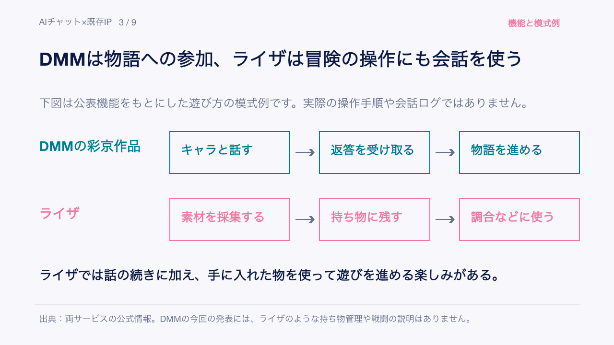
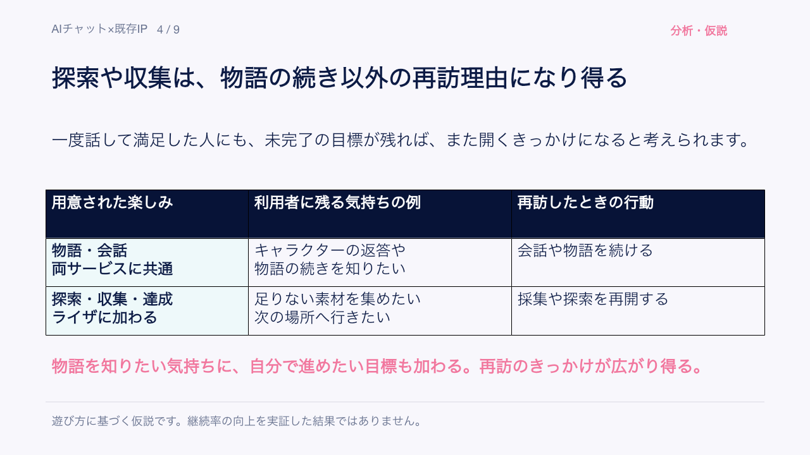
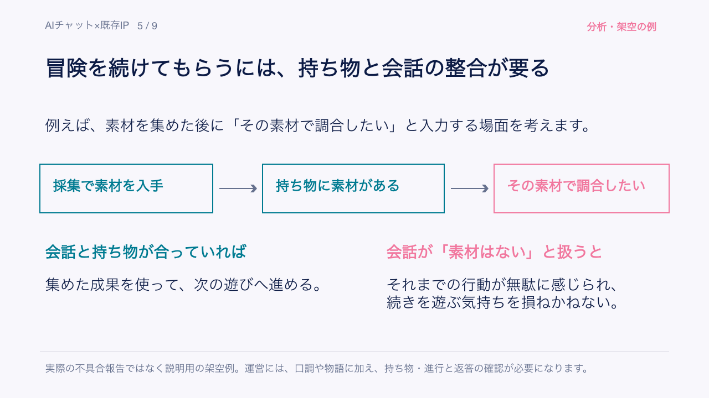

# AIはキャラクターとの会話をどう変える？｜AIとわたしの深夜エンタメ会議 #06

こんばんは、ぐみです。

今回は、9月2日から15日までのAI×エンタメ情報をまとめます。動画編集や音楽制作を助けるものから、ゲーム実況や吹替に使うものまで、作品の中でAIが関わる場面が増えてきました。

中でも気になっているのが、作品のキャラクターと直接話せるサービスです。好きなキャラと話せる楽しさは、何度も遊びたくなる体験につながるのでしょうか。

今回は二部構成です。第1部ではAI×エンタメの最新情報を6件紹介し、第2部では「AIチャット×既存IP」をテーマに、RyzaChat:AIとDMMキャラトークを比べます。記事の後半には、会社の企画検討にも使える分析スライド（PDF・PPTX）も付けています。

## 第1部：AI分野最新情報

### GPT-Live-1 API：リアルタイム会話を作品に組み込む

OpenAIが、リアルタイム音声会話向けのAPI「GPT-Live-1」を発表しました。サービスに音声会話を組み込むためのもので、話の途中で割り込まれたときの反応や、返答のテンポなどを調整する方向です。

[OpenAI公式発表](https://openai.com/index/introducing-gpt-live-1-in-the-api/)

声が自然でも、返事の間合いが合わないと話しづらいんですよね。「いつ返すか」「どこで黙るか」を調整できれば、AIキャラクターが配信するAITuberや、ゲーム内の会話にも生かせそうです。長く話しても、その間合いを保てるかが使い心地を左右します。

料金は、公式が示す音声処理部分で1分0.05ドル。組み合わせる推論モデルなどの費用は別途かかるため、会話が長くなるほど総額にも目を向けたいです。なお、声の権利や会話ログの保存条件は、今回の記事では確認できていません。

### Adobe Premiere Generative Media Tool：生成AIをタイムラインから使う

AdobeはPremiere向けに、編集画面のタイムライン上から動画や効果音を生成できるGenerative Media Toolを発表しました。編集中に素材が必要になったら、その場で生成や調整を続けられる設計です。あわせてAfter Effectsでは、作業を支援するAI Assistantの公開ベータが発表されています。

[Adobe公式ブログ](https://blog.adobe.com/en/publish/2026/09/08/generate-create-directly-in-your-timeline-with-new-ai-powered-innovations-in-premiere-after-effects) ｜[公式ヘルプ](https://helpx.adobe.com/premiere/desktop/edit-projects/edit-with-generative-ai/generative-media-tool-overview.html)

別のサービスで素材を作り、編集ソフトへ戻して確かめる。その往復が減るなら、短い動画を何本も試す作業は進めやすくなりそうです。ただ、生成のたびに人物やロゴが変わってしまえば、結局は直す手間がかかります。そこをどこまで保てるか、プランごとの費用や、来歴情報を付けるContent Credentialsの実際の運用と合わせて見ていきたいです。

### UMG × ElevenLabs：公式カタログをファン創作へ開く

Universal Music GroupとElevenLabsが、許諾済みの音楽カタログを使うAI音楽制作プラットフォームに向けた複数年契約を発表しました。権利者の許可を得た楽曲で、ファンが創作を楽しめる場を作ろうとしています。

[UMG公式発表](https://www.universalmusic.com/universal-music-group-and-elevenlabs-announce-multi-year-strategic-agreement-beginning-with-a-new-licensed-ai-music-creation-platform/) ｜[Variety報道](https://au.variety.com/2026/music/news/umg-elevenlabs-ai-powered-music-platform-licensing-40165/)

好きな音楽で創作できるなら、作ったものを誰かに見せたくもなります。だからこそ、参加アーティストや料金と一緒に、公開・商用利用の範囲も知りたいところです。収益の分配条件まで見えてくれば、権利者への還元とファンの創作をどう両立するのか、具体的に考えられます。

### EA『NHL 27』：同意した実況者の声を増やす

EAは『NHL 27』で、John Buccigross氏とDarren Pang氏の協力を得て、AI音声による実況のバリエーションを増やすと説明しています。50回以上の収録をもとにするという報道もあり、人が収録した声を、より多くの実況へ広げる使い方です。

[EA公式更新](https://www.ea.com/games/nhl/nhl-27/news) ｜[PC Gamer報道](https://www.pcgamer.com/software/ai/electronic-arts-admits-to-using-ai-voices-in-nhl-27-this-process-allows-us-to-bring-more-variety-to-the-game/)

収録した声から実況を増やせるとなると、本人が話していない内容をどこまで任せるかも気になります。協力を得たという説明の先に、報酬や監修、修正を求められる範囲まで見えてくると、使う側も受け止めやすいはずです。実況が豊かになる楽しさと、声を預ける人の納得が、うまくつながっていてほしいですね。

### Prime Video：人の吹替音声にAIで口元を合わせる

声を増やす『NHL 27』に対して、映像を声に合わせるのがPrime Videoの発表です。声優による吹替音声はそのままに、映像内の俳優の口元を合わせるAIリップシンク技術を紹介しています。『Maxton Hall』シーズン1・2の英語吹替で世界向けに提供され、12月9日配信予定のシーズン3にも導入されるとしています。

[Amazon公式発表](https://www.aboutamazon.com/news/entertainment/prime-video-lip-sync-technology) ｜[Neowin報道](https://www.neowin.net/news/amazon-prime-video-is-getting-ai-powered-dubbing-that-syncs-actors-lips-with-human-dubbed-audio/)

吹替の演技を残したまま口元の違和感を減らせるなら、作品を別の言語で楽しむ助けになりそうです。一方で、調整されるのは俳優の映像なので、俳優と声優それぞれの契約がどこまで認めているかは押さえておきたいですね。作品ごとの表示や自然さをどう測っているかも含め、今回の確認ではまだ分かっていません。

### DMMキャラトーク：既存IPをストーリー会話へ広げる

DMMキャラトークでは、彩京の『ガンバード』『戦国ブレード』の世界で、キャラクターと会話しながら物語を進めるストーリーチャットを展開しています。サービス全体には複数のシナリオやユーザーがキャラクターを作る機能があり、支払いにはDMMポイントを使います。

[PR TIMES](https://prtimes.jp/main/html/rd/p/000005121.000002581.html) ｜[DMMキャラトーク](https://chara-talk.dmm.com/)

いくつもの作品を選べる場になると、会話やシナリオのどこにお金を払うのかも、作品を選ぶ理由に関わってきそうです。ただ、選択肢が多いことと、一つひとつを楽しく遊べることは別の話。作品ごとの設定や会話品質、公開キャラクターの扱いにはまだ見えない部分があり、利用者数や継続率も公開情報だけでは判断できません。

## 第2部：AIチャット×既存IPは、キャラクターとの会話を商品にできるか

ここまで、AIが声や映像を作るニュースを見てきました。DMMキャラトークのように、その先でキャラクターがこちらの言葉に返事をしてくれると、ファンの楽しみ方も変わってきます。

以前の記事で取り上げたRyzaChat:AIも、そうした体験の一つです。ただ、同じ「キャラクターと話せる」でも、用意している遊びは違います。二つを比べながら、何を楽しんでもらい、それをどう続けるかを考えていきます。

会社での企画検討に使える分析スライド（PDF・PPTX）も付けています。物語中心の会話と、探索・収集まで楽しめる会話では、戻ってくる理由や運営の負担がどう違うのか。本文の図解と比較を、会議や企画レビューで共有できる形にまとめました。
メンバーシップでは読み放題でお楽しみいただけます。気になる回だけ個別に購入することもできます。

<!-- ここから有料エリア（note投稿時にこの位置で「続きを読むには」の区切りを設定） -->

### 好きなキャラだから試す。その次は？

好きなキャラと話せると聞けば、それだけで一度は試してみたくなります。既存IP、つまり、すでにある作品やキャラクターを使う強みは、会話が始まる前から相手に関心を持ってもらえることです。IPは知的財産の略ですが、ここでは主にこの意味で使います。

でも、一度話せてうれしかったからといって、毎月お金を払って遊び続けるとは限りません。最初の会話の後にも、また開きたくなる楽しみが残っているか。ライザとDMMを比べるときは、そこから考えたいと思います。

遊び続けてもらうには、キャラクターらしさも守りたいし、運営を続けられるだけの採算も必要です。楽しそう、で終わらせないために、遊ぶ側と作る側の両方から見てみます。

### ライザは冒険も楽しめる。DMMの彩京IPは物語・会話が中心

RyzaChat:AIは、公式サイトでフリーシナリオ型のAIチャット形式RPGとして紹介されています。『ライザのアトリエ』の世界で、ライザに話しかけながら探索・採集・調合・戦闘を進める仕組みです。公式のゲーム紹介には、持ち物の保存や通貨、スタミナの説明もあります。会話で物語を作りながら、集めたものを次の冒険に使っていけるわけです。

DMMキャラトークの彩京IPも、会話を通じて作品の世界に入る点は共通しています。こちらは『ガンバード』『戦国ブレード』のキャラクターと話し、物語に参加するストーリーチャットとして紹介されています。今回の発表には、ライザのようなゲーム要素の説明はありません。

ここからは、物語・会話を中心に楽しむ彩京IPの事例と、探索やアイテム管理まで組み込むライザを比べていきます。DMMキャラトーク全体にゲーム要素がないという話ではなく、今回紹介された遊び方の違いです。

*図：公表情報をもとに、会話から先に何を楽しめるかを整理した模式例です。実際の操作手順や会話ログではありません。*

[RyzaChat:AI公式サイト](https://ryzachat-ai.go-spiral.ai/) ／ [DMM公式発表](https://prtimes.jp/main/html/rd/p/000005121.000002581.html)

支払い方にも違いがあります。ライザには月額・年額プランと別売りの会話トークンがあり、彩京IPを提供するPinxAIではストーリーチャットにポイントを使います。詳しい料金は、後半で運営費用と合わせて見ていきます。

この違いを考える軸は、ユーザーが何を楽しみに戻ってくるかです。物語の続きが気になるのか、冒険でやり残したことがあるのか。まずは、その違いを見てみます。

### 「物語の続き」に、探索・収集・達成が加わる

DMMのように物語・会話を中心に楽しむなら、「この先どうなるか」「キャラクターがどう返すか」が気になって、また開きたくなりそうです。ライザにもその楽しみはありますが、探索や調合があるぶん、「次の場所へ行きたい」「素材を集めたい」という遊びの目標も生まれます。

話の続きを知りたい気持ちに、自分で何かを進めたい気持ちが重なる。そこに、ゲーム要素を組み込む面白さがありそうです。ただし、これは遊び方から考えた仮説で、実際に継続率が高いと確認できたわけではありません。

*図：再訪理由について、遊び方から考えられる仮説を整理しています。継続率の向上を実証した結果ではありません。*

企画を試すときも、再訪した人数だけでは、この違いは分かりません。物語を進めたのか、探索や調合を続けたのか。戻った後の行動と次の課金を合わせて見ると、どの楽しみにお金を払ってもらえたかを検討できます。

もっとも、集めたアイテムや冒険の進み具合が、その後の会話と食い違ってしまうと、続きを遊びたい気持ちも途切れそうです。ゲーム要素を足すなら、物語のつながりに加えて、持ち物や進行も会話と合っているかを確かめることになります。

*図：会話と持ち物の整合を説明する架空例です。実際のRyzaChat:AIの不具合報告ではありません。*

そして、その会話をするのは、ファンがよく知っているキャラクターです。話がつながっていても、「このキャラはそんなことを言うかな」と感じさせてしまえば、原作への期待から離れてしまう。続きを増やすほど、キャラクターらしさをどう守るかも気になってきます。

### 原作らしさは、公開後も守り続ける

この点で参考になるのが、Hasbroの「Behavioral Licensing」です。人格・設定・声に加え、安全のために振る舞いを制限する仕組みまで、AIキャラクターの管理に含めています。見た目を使う許可だけでなく、会話でどう振る舞うかまで扱う発想です。[Hasbro公式発表](https://investor.hasbro.com/news-releases/news-release-details/hasbro-launches-sixth-wall-new-ai-studio-building-next)

この発想を運営に置き換えて考えると、公開前の口調や設定の確認だけでは足りなさそうです。遊ばれる中で問題のある返答が見つかったとき、誰が止めて直し、誰が再確認するのか。禁止する内容と一緒に、修正を担う人や手順まで決めておくことが、公開後のキャラクターらしさを支えます。

そもそも、そのキャラクターを使う許諾があるかという境界もあります。DisneyがCharacter.AIに無許諾キャラクターの利用停止を求めた、という報道は、その境界が問題になった事例です。公式IPサービスの成功例とは分けて読んでおきたいところです。[Axios報道](https://www.axios.com/2025/09/30/disney-characterai-cease-desist)

DMMにもユーザーがキャラクターを作る機能がありますが、公式IPとして提供されるキャラクターと、ユーザーが作ったものでは、許諾の範囲を同じには扱えません。[DMMの発表](https://prtimes.jp/main/html/rd/p/000005121.000002581.html)を読むときも、この二つは分けて考えます。

使う許可と、原作らしさを守る体制。その両方が整っても、会話の範囲はまだ一律には決まりません。大人のファンが話すのか、子どもが遊ぶのかによっても、用意したい体験が変わるからです。

### 対象年齢から、遊び方と配信先を決める

子ども向けの例として、Hey Peppa Pigがあります。Fire Kids／Amazon Kids+で、ゲームや活動を通じてキャラクターと会話する体験です。誰に遊んでもらうかに合わせて、遊び方と配信先を一緒に考える材料になります。[WildBrain公式発表](https://investors.wildbrain.com/news/news-details/2026/WildBrain-Acquires-Personality-AI-a-Trusted-Partner-for-Bringing-Beloved-Characters-to-Life/default.aspx)

なお、先ほど紹介したBehavioral Licensingを掲げるHasbroのSixth Wallは、初期対象を13歳以上としています。幼い子ども向けのPeppaとは別の取り組みなので、安全面の設計まで同じだとは捉えないようにしたいですね。[Hasbro公式発表](https://investor.hasbro.com/news-releases/news-release-details/hasbro-launches-sixth-wall-new-ai-studio-building-next)

大人のファンが自由に話す時間と、子どもが活動を楽しむ時間では、キャラクターに期待する返答も違います。「人気キャラだから全年齢へ」と広げる前に、何歳くらいの人に、どう過ごしてもらうかを絞る。そのうえで会話の範囲やデータの扱い、困ったときの報告先を決めていくほうが、必要な運営の手間も考えやすそうです。

誰にどう遊んでもらうかによって、運営に必要な人や手間も変わります。遊び方の違いは、その体験を続けて届ける費用にもつながってくるわけです。

### 遊びの幅が広がるほど、支える運営も変わる

物語・会話を中心にする場合は、シナリオや返答の監修に運営の力を割くことになります。探索や収集も楽しんでもらうなら、そこに持ち物や進行の管理が加わります。どちらも対象年齢に応じた配慮は必要で、ゲーム要素が少ないから運営も簡単、とまでは言えません。

見る範囲が広がれば、それだけ人も時間もかかります。会話を生成する費用に、権利や監修、更新の費用も合わせて、続けて払ってもらえる料金でまかなえるか。ここで採算の話につながります。今回の資料では継続率や運用原価が分からないので、ライザとDMMのどちらが収益性に優れるかまでは判断できません。

遊ぶ側が支払う料金も、ここで具体的に見ておきます。2026年9月15日に確認した日本向けApp Storeでは、ライザの月額プラン「RyzaChat PRO (1 Month)」は980円。年額プラン「RyzaChat Pro Annual (Discount)」は6,000円で、月あたり500円の計算です。ただ、この年額商品には割引の表記があり、誰でもいつでも同じ条件で契約できるとは限りません。

月額・年額のプランに加えて、会話に使うトークンも別売りされています。掲載されている商品は340円、690円、980円、3,900円などなので、プランの金額だけを見て、遊ぶ費用のすべてとは考えないほうがよさそうです。[App Storeのアプリ内購入一覧](https://apps.apple.com/jp/app/ryzachat-ai/id6763540981)

DMMキャラトークの料金は、サービスを提供する会社によって違います。使った分だけ払うものも、一定期間の定額で使うものもあります。今回の彩京IPを提供するPinxAIでは、公式規約の料金表に、ストーリーチャットの商品「PINX-CHAT-STORY」が10〜50ポイントと載っています。[DMMの料金案内](https://support.dmm.com/chara-talk/article/49604) ／ [PinxAIの料金表（第22条）](https://all.pinxai.com/legal/service/ja)

ただ、この二つをそのまま並べても、どちらが安いかは分かりません。ライザのプラン内で遊べる量やトークンの消費量、彩京IPの作品ごとに必要なポイント数までは、今回読めた公式ページでは確認できなかったためです。同じくらい遊んだときの総額はまだ比べられませんが、続けて遊ぶ人が何にお金を払うのかは、体験と合わせて考えたいところです。

企画に持ち帰れるのは、楽しんでもらう範囲と、運営で支える範囲を一緒に決めるという考え方です。物語への参加を中心にするなら、シナリオと返答をどう楽しんでもらうか。探索や収集まで広げるなら、冒険の積み重ねをどう会話に反映するか。この順で考えると、追加する機能と、そのために必要な手間を結びつけて検討できます。

## まとめ

今回見てきたAIは、作品を作る工程を助けるところから、ファンが作品と関わる時間へも広がっています。ライザやDMMのようにキャラクターが返事をしてくれると、作品の中で自分が何をするかも、楽しみの一つになっていくんですね。

遊ぶ側としては、昨日までの物語や冒険がちゃんとつながっていて、キャラクターも原作らしくあってほしい。その期待を受け止めるところまで含めて、会話を届ける仕事になるんですよね。

「好きなキャラと話せた」の次に、「またあの続きを遊びたい」が残るか。次にこうしたサービスを見るときは、そこまで追ってみたいです。

この記事には、AIチャット×既存IPの比較をまとめたPDFとPPTXを付けています。まず読むならPDF、会議や企画レビューに合わせて編集・再利用したいときはPPTXをご利用ください。

## 参考リンク

- [OpenAI公式発表](https://openai.com/index/introducing-gpt-live-1-in-the-api/)
- [Adobe公式ブログ](https://blog.adobe.com/en/publish/2026/09/08/generate-create-directly-in-your-timeline-with-new-ai-powered-innovations-in-premiere-after-effects)
- [UMG公式発表](https://www.universalmusic.com/universal-music-group-and-elevenlabs-announce-multi-year-strategic-agreement-beginning-with-a-new-licensed-ai-music-creation-platform/)
- [EA公式更新](https://www.ea.com/games/nhl/nhl-27/news)
- [Amazon公式発表](https://www.aboutamazon.com/news/entertainment/prime-video-lip-sync-technology)
- [RyzaChat:AI公式サイト](https://ryzachat-ai.go-spiral.ai/)
- [RyzaChat:AI 日本向けApp Store・アプリ内購入一覧](https://apps.apple.com/jp/app/ryzachat-ai/id6763540981)
- [DMMキャラトーク・料金システム](https://support.dmm.com/chara-talk/article/49604)
- [PinxAI・料金表を含む公式規約](https://all.pinxai.com/legal/service/ja)
- [DMMキャラトーク PR TIMES](https://prtimes.jp/main/html/rd/p/000005121.000002581.html)
- [Hasbro公式発表](https://investor.hasbro.com/news-releases/news-release-details/hasbro-launches-sixth-wall-new-ai-studio-building-next)
- [WildBrain公式発表](https://investors.wildbrain.com/news/news-details/2026/WildBrain-Acquires-Personality-AI-a-Trusted-Partner-for-Bringing-Beloved-Characters-to-Life/default.aspx)
- [Axios報道](https://www.axios.com/2025/09/30/disney-characterai-cease-desist)
